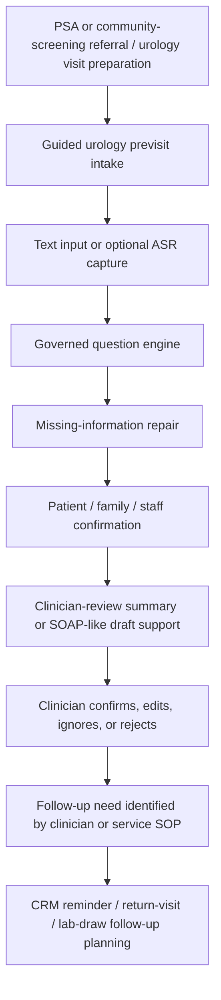

# Deep-Cultivation System Positioning

Status: accepted positioning draft

## Purpose

This note records how the existing urology previsit design should be framed after the 2026-05-19 北市聯醫 deep-cultivation meeting.

The system is no longer only a standalone demo for guided urology intake. It is now a candidate component in a Health Taiwan Deep-Cultivation smart-healthcare subproject.

The important correction is scope:

```text
urology previsit / visit-readiness / clinician-review summary / CRM follow-up support
```

not:

```text
AI triage / diagnosis / autonomous risk scoring / direct EMR writeback
```

## Positioning Statement

The existing urology previsit system should be positioned as a governed clinical workflow-improvement component under `健康台灣深耕計畫(114-118年)`.

Its role is to help PSA/community-screening and urology visit workflows collect repeated patient-reported information earlier, repair missing context, prepare a short clinician-review summary, and connect the encounter to patient-management or CRM follow-up when governance allows.

The system does not decide urgency, diagnose disease, recommend treatment, or become the hospital record system. It prepares visit context and follow-up readiness for human review.

## Health Taiwan Category Fit

| Official category | Fit for this system |
| --- | --- |
| `導入智慧科技醫療` | Primary category. Guided intake, optional ASR, adaptive question selection, clinician-review summary, auditability, and future interoperability readiness are smart-healthcare workflow tools. |
| `優化醫療工作條件` | Secondary category. The system aims to reduce repeated questioning, missing-context repair burden, and avoidable documentation preparation work. |
| `規劃多元人才培訓` | Supporting category if the proposal explicitly includes cross-domain medical AI training, IRB readiness, student participation, and clinician-engineer co-design. |
| `社會責任醫療永續` | Supporting category through community PSA screening, return-to-hospital flow, case management, CRM follow-up, MOU-based collaboration, and ESG/carbon-accounting linkage outside this system's core scope. |

## Core Problem

The meeting suggests that the strongest grant-facing problem is not "we need a stronger AI model."

The stronger problem is:

```text
Community screening and urology visits create repeated information capture,
unclear follow-up responsibility, and weak patient-management continuity.
```

Current pain points:

- patient-reported symptoms may arrive late, scattered, or incomplete
- clinic staff and physicians may ask repeated questions
- PSA/community screening needs SOP, return flow, and case management after the test
- CRM and reminders are weak or absent in ordinary outpatient workflows
- AI demos often fail because they are not tied to a real service workflow
- budget, KPI, outsourcing, IRB, and security governance must be planned before deployment

## System Objective

Build a bounded urology previsit and visit-readiness workflow that can support a future deep-cultivation subproject by:

- collecting repeated, previsit-safe urology information before clinician-led interpretation
- allowing patient, family, or staff-assisted completion with source labeling
- using optional ASR only as an input layer, not as the core clinical claim
- selecting follow-up questions within a governed urology question bank
- surfacing missing information before clinician handoff
- producing a short clinician-review summary or SOAP-like draft support
- preserving clinician authority to confirm, edit, ignore, or reject the output
- connecting eligible follow-up needs to CRM/reminder planning when governance allows
- keeping audit, privacy, and responsible-AI requirements visible from the start

## Non-Goals

This positioning does not authorize:

- autonomous triage
- urgency score, risk score, queue prioritization, or patient routing
- diagnosis or differential diagnosis
- treatment advice or medication instruction
- production clinical use
- real patient-data collection during discovery
- direct HIS / EMR / EHR writeback
- claims that the AI summary is clinically complete
- claims that this system has the same status as officially approved Health Taiwan examples

## Proposed Service Workflow



The workflow intentionally stops at clinician review and governed follow-up planning. It does not assign urgency or write into the official medical record by itself.

## Functional Modules

| Module | Grant-facing role | Boundary |
| --- | --- | --- |
| Patient input | Collect main concern, duration, urinary symptoms, bother, medicine uncertainty, language/accessibility needs | No identity details or real patient identifiers in discovery |
| Optional ASR | Reduce typing burden and support mixed-language free-form input | ASR transcript must be reviewable and correctable |
| Governed question engine | Ask only approved urology previsit questions and conditional follow-ups | No open-ended medical reasoning outside the governed question bank |
| Missing-information repair | Show gaps before handoff and support nurse/staff supplementation | Missing fields are not converted into risk labels |
| Patient/helper confirmation | Let the user review what will be handed off | Family/staff input must preserve source attribution |
| Clinician-review summary | Provide a short structured summary and SOAP-like draft support | Draft support only; clinician owns final interpretation and documentation |
| CRM follow-up support | Link confirmed follow-up needs to reminders, lab-draw prompts, return-visit tracking, or case-management status | Requires SOP, consent, privacy, and operational ownership before real use |
| Audit log | Preserve input source, question path, model/prompt/rule version, output, and review status | Auditability is required before pilot use |
| Governance readiness | Prepare for IRB, security, procurement, and future FHIR/TW Core IG discussion | Readiness is not the same as integration approval |

## Deep-Cultivation Work Packages

## Work Package 1: Guided Urology Previsit

Purpose:

- collect repeated urology visit-preparation information
- reduce missing context before physician entry
- preserve patient-friendly wording and clinician authority

Candidate outputs:

- patient-facing confirmation page
- clinician-review summary
- missing-information list
- source labels for patient, family, or staff input

## Work Package 2: Clinician-Reviewed Summary And SOAP-Like Draft Support

Purpose:

- reduce avoidable summary-writing and repeated-history burden
- provide a short reviewable layer before the encounter
- support physician review without replacing physician judgment

Boundary wording:

```text
SOAP-like draft support for clinician review
```

not:

```text
automatic clinical documentation or final SOAP note
```

## Work Package 3: CRM And Follow-Up Readiness

Purpose:

- connect screening and visit workflows to return-visit reminders, lab-draw reminders, and case-management status
- support the meeting's emphasis that screening does not end at screening
- make follow-up ownership visible

Candidate CRM items:

- return-visit reminder
- pre-visit lab-draw reminder
- missing-document or missing-answer reminder
- case-management status
- clinician-confirmed follow-up task
- patient communication channel, if approved

This work package may require vendor, procurement, security, and hospital-operational decisions. The thinking repo should define the service logic, not the vendor spec.

## Work Package 4: Responsible AI And Security Governance

Purpose:

- make auditability, privacy, and human oversight explicit
- prevent the proposal from sounding like an ungoverned AI demo

Minimum governance claims:

- human-in-the-loop review
- no AI-only diagnosis, treatment, or triage
- role-based access planning before real use
- input/output/version logging before pilot use
- clinician correction, rejection, and override tracking
- clear separation between discovery data and real patient data
- IRB and privacy review before research or patient-data workflows
- security-governance review before APP, API, CRM, or integration work
- procurement review before outsourced CRM/APP/API/platform work

## Work Package 5: Future Interoperability Readiness

Purpose:

- show maturity for future FHIR / TW Core IG / hospital-system discussion
- avoid pretending that integration is already approved

Allowed wording:

```text
future governed interoperability readiness
```

Avoid wording:

```text
direct HIS/EMR integration in the current demo
```

Future integration should be discussed only after workflow value, privacy model, responsibility, security, and hospital ownership are clarified.

## KPI Design

KPI should be written as service and governance indicators, not only software features.

| Category | Example KPI | Notes |
| --- | --- | --- |
| Visit readiness | Clinician can review the summary in under one minute | Tests whether output is short enough to matter |
| Missing information | Reduce missing key previsit fields after guided repair | Use synthetic or pilot-approved data only |
| Repeated work | Reduce repeated previsit-history questions in walkthrough or pilot | Must be measured against current workflow |
| Completion | Patient/helper/staff-assisted completion rate reaches a defined target | Target should be calibrated after workflow review |
| Staff burden | Nurse/staff burden rating remains acceptable | Prevents shifting work from physician to staff |
| Clinician usefulness | Clinician usefulness score reaches an agreed threshold | Example draft target: >4/5 after review, if reviewers accept it |
| AI boundary | Zero diagnosis, treatment, or triage claims in generated summaries | Safety KPI |
| Review control | 100% of outputs have clinician review / edit / ignore / reject status in pilot-ready design | Governance KPI |
| Auditability | 100% of generated outputs preserve input source and version metadata in pilot-ready design | Governance KPI |
| CRM readiness | Defined SOP for reminder, return-visit, lab-draw, or case-management flow | Service-flow KPI |
| Governance readiness | IRB, privacy, security, procurement, and MOU gates are listed with owners | Proposal-execution KPI |
| Interoperability readiness | FHIR/TW Core IG mapping is scoped as future readiness, not direct writeback | Avoids premature integration claims |

## Three-Year Proposal Shape

## Year 1: Governed Design And Workflow Validation

Likely deliverables:

- define PSA/community-screening to urology visit-readiness service path
- finalize governed urology previsit question bank
- create clinician-review summary format
- run synthetic-data walkthroughs
- define CRM follow-up SOP draft
- list IRB, privacy, security, procurement, and MOU gates
- evaluate clinician readability and staff burden in review sessions

## Year 2: Limited Pilot Preparation And CRM Service Prototype

Likely deliverables:

- refine patient/helper/staff-assisted workflow
- implement review-status and audit-log requirements in the demo or prototype plan
- prepare CRM reminder and follow-up workflow specification
- decide internal, outsourced, or hybrid ownership for APP/CRM/API work
- complete required governance documents before any real patient-data workflow
- prepare future FHIR/TW Core IG readiness mapping if hospital stakeholders request it

## Year 3: Evidence-Based Scale-Up Planning

Likely deliverables:

- evaluate whether the workflow reduces repeated work and improves readiness
- decide whether to extend beyond urology/PSA to other clinic workflows
- decide whether CRM follow-up should become a hospital-managed service module
- prepare integration discussion only if governance, evidence, ownership, and resources are clear
- keep diagnosis, treatment, and autonomous triage outside scope unless a separate approved program is created

## Budget Logic

Budget lines must map to KPI and work packages.

| Budget type | Only justified if the proposal includes |
| --- | --- |
| ASR or speech module | Input-burden reduction KPI and transcript-review boundary |
| APP or patient-facing tool | Completion, accessibility, and patient/helper confirmation workflow |
| CRM platform | Reminder, return-visit, lab-draw, case-management, and follow-up KPI |
| API or integration readiness | Governance readiness and future interoperability mapping |
| Vendor outsourcing | Scope, procurement path, owner, acceptance criteria, and KPI |
| Research assistant / coordinator | IRB, workflow capture, KPI tracking, and cross-unit coordination |
| Security governance | APP/API/CRM/patient-data workflow and audit requirements |
| Training | IRB training, responsible AI, clinician-engineer co-design, or cross-domain education plan |

If the KPI does not mention the work, the budget should not contain it.

## Responsible AI And Auditability

The system should be described as human-in-the-loop.

AI may assist with:

- question selection within a governed question bank
- transcript cleanup after user review
- missing-information detection
- structured summary drafting
- SOAP-like draft support for clinician review

AI must not:

- infer disease labels
- assign urgency
- tell patients what to do
- silently overwrite patient-provided statements
- hide uncertainty or missing information
- write directly into the official record without human governance

Minimum audit fields for pilot-ready design:

- data source category: synthetic, patient-reported, family-reported, staff-supplemented
- question path
- ASR transcript and user correction status, if ASR is used
- generated summary
- model / prompt / rule version
- clinician review status
- clinician edit or rejection reason, if available
- timestamp and responsible role

## Proposal Summary Paragraph

本系統已從單點 urology previsit demo，升級為健康台灣深耕計畫下的臨床流程改善型智慧醫療系統。其核心不是以 AI 取代醫師判斷，也不是建立 AI triage，而是將泌尿科看診前常見且重複的病人主訴、症狀脈絡、用藥不確定性與缺漏資訊，透過受治理的問診流程、選擇性語音輸入、缺漏修補與臨床摘要草稿，整理成醫師可快速覆核的 visit-readiness summary。同時，系統可在治理條件允許後，銜接 PSA/community screening 後續 SOP、回診提醒、抽血提醒與 CRM 個案管理流程，形成以醫護減負、智慧科技導入、病人管理連續性與負責任 AI 為核心的深耕計畫子系統。

## Review Rule

When updating the demo repo or grant draft, use this rule:

```text
If a feature sounds like diagnosis, triage, treatment, direct hospital-record integration, or production clinical use, it needs a separate governance decision before it becomes part of the design.
```
