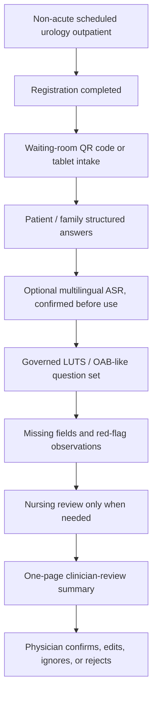

# Deep-Cultivation System Positioning

Status: accepted positioning draft with 2026-05-19 expert-review narrowing

## Purpose

This note records how the existing urology previsit design should be framed after the 2026-05-19 北市聯醫 deep-cultivation meeting.

The system is no longer only a standalone demo for guided urology intake. It is now a candidate component in a Health Taiwan Deep-Cultivation smart-healthcare subproject.

For proposal section order, KPI-to-budget writing, and the June 2 draft package, use `../discovery/DEEP_CULTIVATION_PROPOSAL_WRITING_GUIDE.md`.

For article, proposal, paper, lab-brief, and reviewer-facing tone, use `ASSERTIVE_WRITING_POLICY.md`. Write boundaries as deliberate architecture, not as defensive apology.

The important correction is scope. The original deep-cultivation positioning remains useful as a broad service frame, but the latest expert review narrows the first version and changes the proposal-facing name.

Current proposal name:

```text
泌尿科門診前問診與醫師覆核摘要支持系統
```

Safe descriptive boundary:

```text
泌尿科門診前症狀蒐集與醫師覆核摘要輔助流程
```

Current first-version scope:

```text
non-acute LUTS / OAB-like outpatient symptoms:
nocturia / frequency / urgency / leakage / voiding difficulty / weak stream
-> after-registration or waiting-room QR code / tablet patient-family intake
-> partial or complete symptom collection
-> patient-reported red-flag observations only
-> missing-field visibility
-> one-page clinician-review outpatient summary
```

CRM follow-up is parked until a future confirmed next step. ASR is only an optional multilingual input layer.

Broader proposal context:

```text
urology previsit intake / visit-readiness / clinician-reviewed summary / future governed CRM follow-up support
```

not:

```text
AI triage / diagnosis / autonomous risk scoring / direct EMR writeback
```

## Positioning Statement

The existing urology previsit system should be positioned as a governed clinical workflow-improvement component under `健康台灣深耕計畫(114-118年)`.

Its first-version role is to help non-acute urology outpatient workflows collect repeated patient-reported information earlier, repair missing context, and prepare a short clinician-review summary for physician review.

The system deliberately keeps urgency decisions, diagnosis, treatment decisions, and official hospital-record authority with clinicians and governed hospital processes. Its role is to prepare visit context for human review.

After the expert review, proposal writing should lead with `泌尿科門診前問診與醫師覆核摘要支持系統`. CRM and follow-up management may be described only as later governed phases, not current execution.

## Health Taiwan Category Fit

| Official category | Fit for this system |
| --- | --- |
| `導入智慧科技醫療` | Primary category. Guided intake, optional ASR, adaptive question selection, clinician-review summary, auditability, and future interoperability readiness are smart-healthcare workflow tools. |
| `優化醫療工作條件` | Secondary category. The system aims to reduce repeated questioning, missing-context repair burden, and avoidable documentation preparation work. |
| `規劃多元人才培訓` | Supporting category if the proposal explicitly includes cross-domain medical AI training, IRB readiness, student participation, and clinician-engineer co-design. |
| `社會責任醫療永續` | Future supporting category only if community-screening return flow, case management, CRM follow-up, MOU-based collaboration, or ESG/carbon-accounting linkage becomes a separately governed phase. |

## Core Problem

The meeting suggests that the strongest grant-facing problem is not "we need a stronger AI model."

The stronger problem is:

```text
Non-acute urology outpatient visits create repeated symptom-history capture,
incomplete previsit context, and summary-preparation burden before the physician can make a clinical judgment.
```

A 2026-05-19 meeting follow-up insight adds an operations constraint:

```text
The Health Taiwan proposal should reduce physician, nurse, and clinic-staff burden.
It should not ask medical staff to absorb extra AI research, labeling, supervision, or workflow-change burden.
```

Current pain points:

- patient-reported symptoms may arrive late, scattered, or incomplete
- clinic staff and physicians may ask repeated questions
- physicians may not have a short, source-labeled previsit summary before entering the encounter
- nurses should not become questionnaire customer support in the first version
- red-flag observations need human-review wording without becoming automated triage
- AI demos often fail because they are not tied to a real service workflow
- budget, KPI, outsourcing, IRB, and security governance must be planned before deployment
- any added AI feature can fail adoption if it creates extra clicks, training, system switching, routine labeling, or hidden nurse work

## System Objective

Build a bounded urology previsit and visit-readiness workflow that can support a future deep-cultivation subproject by:

- collecting repeated, previsit-safe urology information before clinician-led interpretation
- allowing patient, family, or staff-assisted completion with source labeling
- using optional multilingual ASR only as an input layer, not as the core clinical claim
- selecting follow-up questions within a governed urology question bank
- surfacing missing information before clinician handoff
- producing a short clinician-review summary or SOAP-structured reference summary
- preserving clinician authority to confirm, edit, ignore, or reject the output
- keeping audit, privacy, and responsible-AI requirements visible from the start
- treating clinical friction reduction as a first-class design criterion
- leaving any CRM/reminder planning to a later confirmed and governed phase

## Non-Goals

This positioning does not authorize:

- autonomous triage
- urgency score, risk score, queue prioritization, or patient routing
- diagnosis or differential diagnosis
- treatment advice or medication instruction
- production clinical use
- real patient-data collection during discovery
- direct HIS / EMR / EHR writeback
- claims that the AI summary is clinically complete
- claims that this system has the same status as officially approved Health Taiwan examples

## Proposed Service Workflow



The workflow intentionally stops at clinician review. It does not assign urgency, diagnose, recommend treatment, or write into the official medical record by itself.

## Functional Modules

| Module | Grant-facing role | Boundary |
| --- | --- | --- |
| Patient input | Collect main concern, duration, urinary symptoms, bother, medicine uncertainty, language/accessibility needs | No identity details or real patient identifiers in discovery |
| Optional multilingual ASR | Reduce typing burden and support Traditional Chinese, English, and Southeast Asian language input exploration | ASR transcript must be confirmed before entering the summary |
| Governed question engine | Ask only approved urology previsit questions and conditional follow-ups | No open-ended medical reasoning outside the governed question bank |
| Missing-information repair | Show gaps before handoff and support limited nurse/staff supplementation only when needed | Missing fields are not converted into risk labels |
| Patient/helper confirmation | Let the user review what will be handed off | Family/staff input must preserve source attribution |
| Clinician-review summary | Provide a short structured summary and SOAP-structured reference summary | Reference only; clinician owns final interpretation and documentation |
| Red-flag observation display | Show patient-reported visible blood, fever/chills, flank pain, or current inability to urinate | Observation only; no automated triage, risk label, or action recommendation |
| Future CRM follow-up support | Link confirmed follow-up needs to reminders, lab-draw prompts, return-visit tracking, or case-management status in a later phase | Parked for now; requires SOP, consent, privacy, and operational ownership before real use |
| Audit log | Preserve input source, question path, model/prompt/rule version, output, and review status | Auditability is required before pilot use |
| Governance readiness | Prepare for IRB, security, procurement, and future FHIR/TW Core IG discussion | Readiness is not the same as integration approval |

## Deep-Cultivation Work Packages

## Work Package 1: Guided Urology Previsit

Purpose:

- collect repeated urology visit-preparation information
- reduce missing context before physician entry
- preserve patient-friendly wording and clinician authority

Candidate outputs:

- patient-facing confirmation page
- clinician-review summary
- missing-information list
- source labels for patient, family, or staff input

## Work Package 2: Clinician-Reviewed Summary And SOAP-Structured Reference Summary

Purpose:

- reduce avoidable summary-writing and repeated-history burden
- provide a short reviewable layer before the encounter
- support physician review without replacing physician judgment

Boundary wording:

```text
SOAP 架構之醫師覆核參考摘要
```

not:

```text
automatic clinical documentation, EMR generation, or final SOAP note
```

## Work Package 3: Red-Flag Observation Review

Purpose:

- show patient-reported observations that may require human review
- avoid diagnosis, risk scoring, or automated triage wording
- route only to existing hospital process when such a process exists

Safe observation wording:

| Patient report | Safe display |
| --- | --- |
| Visible blood | `病人回報曾看見尿液呈紅色、茶色或血塊。請臨床人員覆核。` |
| Fever/chills | `病人回報近期發燒或畏寒。請依院內流程人工確認。` |
| Flank pain | `病人回報腰部兩側疼痛。請臨床人員覆核。` |
| Currently unable to urinate | `病人回報目前尿不出來或明顯排尿困難。請依院內流程人工確認。` |

Do not write `疑似感染`, `疑似癌症`, `建議急診`, `需要導尿`, `需要抗生素`, or `建議 CT / 膀胱鏡` in the first-version output.

## Work Package 4: Future CRM And Follow-Up Readiness

Purpose:

- keep CRM follow-up parked until there is a confirmed next step
- preserve the meeting's service-continuity signal without making it first-version scope
- require SOP, consent, privacy, procurement, and operational ownership before real use

Candidate future CRM items:

- return-visit reminder
- pre-visit lab-draw reminder
- missing-document or missing-answer reminder
- case-management status
- clinician-confirmed follow-up task
- patient communication channel, if approved

This work package may require vendor, procurement, security, and hospital-operational decisions. The thinking repo should define the service logic, not the vendor spec.

## Work Package 5: Responsible AI And Security Governance

Purpose:

- make auditability, privacy, and human oversight explicit
- prevent the proposal from sounding like an ungoverned AI demo

Minimum governance claims:

- human-in-the-loop review
- no AI-only diagnosis, treatment, or triage
- role-based access planning before real use
- input/output/version logging before pilot use
- clinician correction, rejection, and override tracking
- clear separation between discovery data and real patient data
- IRB and privacy review before research or patient-data workflows
- security-governance review before APP, API, CRM, or integration work
- procurement review before outsourced CRM/APP/API/platform work

## Work Package 6: Future Interoperability Readiness

Purpose:

- show maturity for future FHIR / TW Core IG / hospital-system discussion
- avoid pretending that integration is already approved

Allowed wording:

```text
future governed interoperability readiness
```

Avoid wording:

```text
direct HIS/EMR integration in the current demo
```

Future integration should be discussed only after workflow value, privacy model, responsibility, security, and hospital ownership are clarified.

## KPI Design

KPI should be written as service and governance indicators, not only software features.

| Category | Example KPI | Notes |
| --- | --- | --- |
| Visit readiness | Clinician can review the summary in under one minute | Tests whether output is short enough to matter |
| Missing information | Reduce missing key previsit fields after guided repair | Use synthetic or pilot-approved data only |
| Repeated work | Evaluate whether repeated previsit-history questions are reduced in walkthrough or pilot | Must be measured against current workflow |
| Completion | Patient/helper/staff-assisted completion rate reaches a defined target | Target should be calibrated after workflow review |
| Staff burden | Nurse/staff burden rating remains acceptable | Prevents shifting work from physician to staff |
| Clinician usefulness | Clinician usefulness score reaches an agreed threshold | Example draft target: >4/5 after review, if reviewers accept it |
| AI boundary | Zero diagnosis, treatment, or triage claims in generated summaries | Safety KPI |
| Review control | 100% of outputs have clinician review / edit / ignore / reject status in pilot-ready design | Governance KPI |
| Auditability | 100% of generated outputs preserve input source and version metadata in pilot-ready design | Governance KPI |
| Unsafe wording | Zero diagnosis, treatment, triage, exam-order, or EMR-writeback language in generated summaries | Safety KPI |
| ASR confirmation | Confirmed transcript or confirmed structured answer before ASR content enters summary | ASR safety KPI |
| CRM readiness | Future-only defined SOP for reminder, return-visit, lab-draw, or case-management flow | Parked until later governance |
| Governance readiness | IRB, privacy, security, procurement, and MOU gates are listed with owners | Proposal-execution KPI |
| Interoperability readiness | FHIR/TW Core IG mapping is scoped as future readiness, not direct writeback | Avoids premature integration claims |

## Three-Year Proposal Shape

## Year 1: Governed Design And Workflow Validation

Likely deliverables:

- define after-registration / waiting-room urology previsit workflow slot
- finalize governed urology previsit question bank
- create clinician-review summary format
- run synthetic-data walkthroughs
- define red-flag observation wording and human-review handling
- keep CRM follow-up as parked future scope unless hospital stakeholders explicitly reopen it
- list IRB, privacy, security, procurement, and MOU gates
- evaluate clinician readability and staff burden in review sessions

## Year 2: Limited Pilot Preparation And Optional Future CRM Specification

Likely deliverables:

- refine patient/helper/staff-assisted workflow
- implement review-status and audit-log requirements in the demo or prototype plan
- prepare CRM reminder and follow-up workflow specification only if the parked phase is reopened
- decide internal, outsourced, or hybrid ownership for APP/CRM/API work
- complete required governance documents before any real patient-data workflow
- prepare future FHIR/TW Core IG readiness mapping if hospital stakeholders request it

## Year 3: Evidence-Based Scale-Up Planning

Likely deliverables:

- evaluate whether the workflow reduces repeated work and improves readiness
- decide whether to extend beyond non-acute urology LUTS / OAB-like workflows
- decide whether CRM follow-up should become a hospital-managed service module
- prepare integration discussion only if governance, evidence, ownership, and resources are clear
- keep diagnosis, treatment, and autonomous triage outside scope unless a separate approved program is created

## Budget Logic

Budget lines must map to KPI and work packages.

| Budget type | Only justified if the proposal includes |
| --- | --- |
| ASR or speech module | Input-burden reduction KPI and transcript-review boundary |
| APP or patient-facing tool | Completion, accessibility, and patient/helper confirmation workflow |
| CRM platform | Only if the parked future phase is reopened with reminder, return-visit, lab-draw, case-management, and follow-up KPI |
| API or integration readiness | Governance readiness and future interoperability mapping |
| Vendor outsourcing | Scope, procurement path, owner, acceptance criteria, and KPI |
| Research assistant / coordinator | IRB, workflow capture, KPI tracking, and cross-unit coordination |
| Security governance | APP/API/CRM/patient-data workflow and audit requirements |
| Training | IRB training, responsible AI, clinician-engineer co-design, or cross-domain education plan |

If the KPI does not mention the work, the budget should not contain it.

## Responsible AI And Auditability

The system should be described as human-in-the-loop.

AI may assist with:

- question selection within a governed question bank
- transcript cleanup after user review
- missing-information detection
- structured summary drafting
- SOAP-structured reference summary for clinician review

AI must not:

- infer disease labels
- assign urgency
- tell patients what to do
- silently overwrite patient-provided statements
- hide uncertainty or missing information
- write directly into the official record without human governance

Minimum audit fields for pilot-ready design:

- data source category: synthetic, patient-reported, family-reported, staff-supplemented
- question path
- ASR transcript and user correction status, if ASR is used
- generated summary
- model / prompt / rule version
- clinician review status
- clinician edit or rejection reason, if available
- timestamp and responsible role

## Proposal Summary Paragraph

本子項目擬建立「泌尿科門診前問診與醫師覆核摘要支持系統」，以非急性泌尿科門診病人為初期對象，聚焦夜尿、頻尿、急尿、漏尿、排尿困難或尿流變弱等 LUTS / OAB-like 常見症狀。系統透過受治理之題庫、病人或家屬填答、缺漏欄位提示、來源標記與一頁式醫師覆核摘要，協助門診前整理主訴、症狀脈絡、困擾程度與用藥資訊完整度。AI 與 ASR 作為降低輸入負擔、輔助結構化填答與摘要整理之智慧科技工具；系統架構將診斷、治療決策、自動分流、風險評分、檢查開立與 EMR 正式寫入保留於醫師及院內治理流程。若產出 SOAP 架構內容，其定位為醫師覆核參考摘要，最終臨床判斷與正式病歷紀錄均由醫師決定。

## Review Rule

When updating the demo repo or grant draft, use this rule:

```text
If a feature sounds like diagnosis, triage, treatment, direct hospital-record integration, or production clinical use, it needs a separate governance decision before it becomes part of the design.
```
