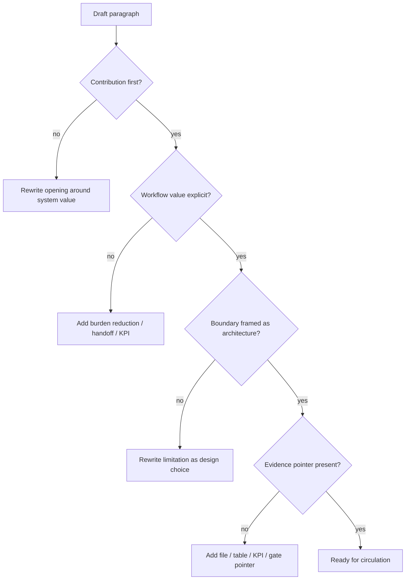

# Assertive Writing Gate

Status: active pre-circulation gate
Date: 2026-05-20

## Purpose

This gate operationalizes `../core/ASSERTIVE_WRITING_POLICY.md`.

Use it before circulating:

- Health Taiwan deep-cultivation drafts
- article drafts
- paper framing
- lab briefs
- reviewer briefs
- stakeholder summaries
- slide narratives

The goal is not to make the project sound aggressive. The goal is to make the writing clear, confident, reviewable, and free of self-weakening language.

## Scope

Apply this gate to outward-facing writing.

Do not rewrite original evidence records just because they contain cautious language. Meeting transcripts, raw source notes, quoted stakeholder language, and dated capture files may preserve the original wording.

Apply this gate to:

- current proposal sections
- executive summaries
- contribution paragraphs
- reviewer-facing descriptions
- paper introduction / contribution language
- grant response language

## Gate Rule

Every outward-facing paragraph should follow this order:

```text
contribution -> workflow value -> deliberate scope -> governance boundary -> next evidence gate
```

Do not begin with limitation language.

Do not make denial, apology, or defensive posture the organizing voice of the
document. Use direct negative wording only when legal, clinical, safety, or
exact-source precision requires it, then pair it with the affirmative operating
scope.

## Required Checks

| Check | Pass condition | Revise if |
| --- | --- | --- |
| Contribution first | The first sentence says what the system contributes. | The paragraph starts with what the system cannot do. |
| Workflow value | The paragraph names reduced burden, better handoff, visit readiness, source traceability, or governance readiness. | The paragraph only says AI, chatbot, ASR, model, or demo. |
| Boundary as architecture | Safety limits are written as deliberate design choices. | Safety limits sound like apology, weakness, or inability. |
| Positive-scope design | The paragraph is organized around capability, evidence, scope, and next gate. | The paragraph is organized around what the system is not, lacks, or cannot promise. |
| Evidence pointer | The claim points to a file, KPI, workflow map, reviewer artifact, or governance gate. | The paragraph relies on adjectives alone. |
| No self-weakening phrasing | No unnecessary `only`, `just`, `merely`, `只是`, `僅僅`, `初步而已`, or similar wording. | The sentence lowers confidence before stating value. |
| Governance alignment | Diagnosis, treatment, triage, EMR, real-data, and deployment language matches current scope. | The sentence either overclaims autonomy or apologizes for safe scope. |

## Rewrite Pattern

Use this conversion pattern:

| Draft problem | Rewrite move |
| --- | --- |
| Starts with `本系統不...` | Start with `本系統建立...` and move boundaries to the second sentence. |
| Says `只是輔助` | Replace with the precise workflow layer: `門診前資訊整理與醫師覆核摘要支持系統`. |
| Says `不能診斷` | Replace with `診斷與治療決策保留於醫師端`. |
| Says `目前沒有真實資料` | Replace with `目前採 synthetic / expert-review evidence path before governance approval`. |
| Says `只是 demo` | Replace with `governed workflow prototype for expert review and proposal evidence`. |
| Says `還需要更多研究` | Replace with the next evidence gate and KPI. |

## Proposal Paragraph Template

```text
本子計畫建立[系統/流程名稱]，在[臨床流程位置]將[病人/家屬可安全提供的資訊]整理為[醫師/護理/行政可使用的工作流產物]。此設計直接對應[工作負擔/資訊缺漏/重複問診/治理]問題，並以[具體 KPI]評估 workflow value。系統架構將[診斷/治療/正式紀錄/分流等臨床權限]保留於[醫師/院內治理流程]，下一階段以[reviewer evidence / governance gate]確認導入可行性。
```

## Paper Contribution Template

```text
We present [system/workflow] that [compresses/structures/routes] [patient-reported previsit information] into [clinician-reviewable artifacts] while preserving [clinical authority / source traceability / governance boundary]. We evaluate the design through [synthetic walkthrough / clinician review / safety wording audit / workflow-friction metric].
```

## Review Flow



## Current High-Priority Targets

| Artifact | Gate status | Next action |
| --- | --- | --- |
| `DEEP_CULTIVATION_APPLICATION_DRAFT_V0_3.md` | active outward-facing draft | Apply contribution-first wording to summary, scope, budget, and appendix sections before external circulation. |
| `DEEP_CULTIVATION_PROPOSAL_WRITING_GUIDE.md` | drafting doctrine | Keep assertive method near the top and require it before section writing. |
| `DEEP_CULTIVATION_SCORING_RUBRIC.md` | review rubric | Penalize defensive narrative when it obscures value, but preserve safety-boundary precision. |
| `DEEP_CULTIVATION_MOHW_COMPLIANCE_RUBRIC.md` | format preflight | Treat confident, reviewable narrative as a submission-readiness check. |
| `records/` source files | evidence archive | Do not rewrite raw or dated evidence for tone. Quote selectively in outward-facing drafts. |

## Pass Standard

A draft passes this gate when:

- the first paragraph states the value of the system clearly
- safety boundaries are present and precise
- safety boundaries are not written as apology
- proposal value is tied to workflow, staff burden, governance, and KPI
- the draft avoids self-weakening language unless preserving a source quote
- the reader can understand why the project is worth funding before reading the limitations
