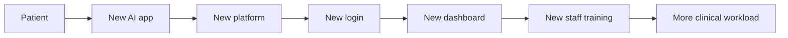
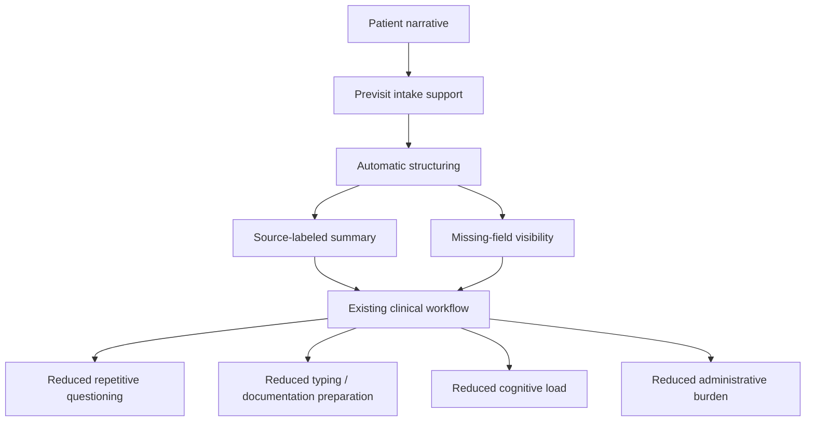

# Clinical Friction Reduction Analysis

Status: proposal-design analysis

Date: 2026-05-20

Source signal: 2026-05-19 Health Taiwan deep-cultivation meeting follow-up insight. See `../records/2026-05-19/clinical-friction-reduction-meeting-insight.md`.

## Purpose

This note translates the meeting insight into a Health Taiwan proposal design principle:

```text
The system should reduce clinical friction and workforce burden.
It should not ask medical staff to absorb extra research, labeling, supervision, or workflow-change burden.
```

This is especially important because Health Taiwan deep-cultivation is not only a research program. It is also a service and operations transformation program.

## Core Thesis

The proposal should not be framed as:

```text
Please let clinicians participate in our AI research.
```

It should be framed as:

```text
Use governed smart-healthcare tooling to reduce existing clinician and nursing workload.
```

The key adoption question becomes:

```text
Does the system reduce medical-staff friction without creating hidden work?
```

## Clinical Energy Conservation

Clinical teams already operate under limited time, attention, and staffing capacity.

If an AI system adds:

- extra clicks
- extra login steps
- extra dashboards
- extra training
- extra data labeling
- extra confirmation work
- extra exception handling
- extra responsibility ambiguity
- extra system switching

then the system may fail even if the model is accurate.

The proposal should make this explicit:

```text
Any AI-supported workflow must pay for itself by reducing more burden than it adds.
```

## Zero-Extra-Workflow Philosophy

Use this as a design rule:

```text
Do not ask medical staff to learn a new workflow unless the new workflow removes a larger existing burden.
```

Preferred direction:


Avoid:



## AI Friction Budget

Every clinical environment has a limited friction budget:

| Budget type | What it means | Design implication |
| --- | --- | --- |
| Time budget | how many extra seconds staff can spend | summary must be reviewable quickly |
| Click budget | how many additional interactions are acceptable | avoid new navigation and duplicate entry |
| Attention budget | how much new information staff can safely process | show concise, ranked, source-labeled information |
| Learning budget | how much training staff can absorb | use familiar workflow language and UI patterns |
| Responsibility budget | how much new ambiguity staff can carry | preserve clinician authority and clear escalation |
| Exception budget | how many edge cases staff can handle | define failure behavior and fallbacks |
| System-switching budget | how many tools staff can tolerate | integrate into existing review rhythm when possible |

If the system exceeds this budget, adoption risk increases.

## Proposal Language To Use

Use these phrases:

- clinical friction reduction
- healthcare workforce burden reduction
- cognitive load reduction
- documentation assistance
- previsit information compression
- clinician-reviewable summary
- nursing workflow support
- low-friction workflow insertion
- minimal behavior-change burden
- operational efficiency
- human factors and adoption realism

Avoid these phrases unless separately governed:

- AI replaces clinical judgment
- AI triage
- automated decision
- AI writes the medical record
- clinicians label data for AI
- nurse completes the AI workflow
- hospital workflow must adapt to the AI system

## Design Consequences For This Project

### 1. The Clinician View Must Be Smaller, Not Richer

The goal is not to show every answer.

The goal is:

```text
one-page clinician-review summary
```

with:

- chief concern
- timing
- key positive symptoms
- missing fields
- patient-reported red-flag observations
- source labels
- uncertainty / contradiction flags

Avoid making the clinician read:

- full transcript
- full questionnaire
- model reasoning trace
- long chat history
- risk-score explanation

### 2. Nurses Must Not Become The Default Repair Layer

The system should not silently transfer work from physicians to nurses.

Nursing involvement should be limited to:

- patient cannot complete intake
- obvious contradiction
- patient-reported red-flag observation
- missing medicine information if the clinic wants it checked
- existing local workflow requires staff confirmation

The proposal should say:

```text
護理介入以既有流程與必要人工確認為限，不以護理師補完 AI 問卷作為系統成立前提。
```

### 3. The System Should Not Treat Clinicians As AI Labelers

Clinician feedback is valuable, but the proposal should not depend on constant manual labeling by physicians.

Acceptable:

- brief accept / edit / ignore / reject review status
- small expert-review sessions
- structured feedback during pilot evaluation

Avoid:

- requiring clinicians to annotate large datasets
- requiring staff to correct model output as routine work
- asking clinics to maintain AI training labels without funded ownership

### 4. Low-Friction Integration Beats Feature Completeness

First-version success should be defined by:

```text
Can the system fit into the clinic's existing rhythm with minimal disruption?
```

not:

```text
How many AI features does it include?
```

## Friction Reduction Architecture



## Before / After Evaluation Frame

The proposal should use a before/after framing like this:

| Friction area | Before | Target after |
| --- | --- | --- |
| Repeated basic history | physician repeatedly reconstructs symptom history | previsit summary reduces repeat questions |
| Manual typing / reconstruction | clinician types or mentally reconstructs from scratch | summary provides source-labeled draft context |
| Missing information | gaps discovered during the visit | missing fields surfaced before handoff |
| Nurse burden | nurses may be asked ad hoc to clarify | nurse review limited to defined exceptions |
| Cognitive load | clinician scans scattered patient narrative | one-page reviewable summary |
| Patient explanation burden | patient repeats confusing story under time pressure | patient/family can prepare before encounter |
| System switching | staff may need separate tools | first version should avoid mandatory separate dashboard for clinicians |
| Research burden | clinicians may be asked to label or fill extra forms | evaluation uses lightweight scorecards and synthetic review first |

## Friction KPIs

Add these to the Health Taiwan proposal only after stakeholders accept the measurement route:

| KPI | Candidate measure | Boundary |
| --- | --- | --- |
| Clinician review time | median time to read summary | measures review burden, not clinical effectiveness |
| Repeated-question reduction | number of repeated basic-history questions before/after | requires baseline or walkthrough comparison |
| Clinician typing burden | estimated typing or documentation-preparation reduction | should not claim formal EMR automation |
| Nurse interruption burden | number/time of nurse interventions needed per patient | ensures work is not shifted to nursing |
| Staff training burden | time needed to learn workflow | supports low-friction adoption |
| System-switch count | number of extra systems/logins required | should be minimized |
| Exception-handling load | percentage of cases requiring manual repair | must remain acceptable |
| Clinician usefulness | 1-5 score from clinician review | adoption signal |
| Staff burden acceptability | 1-5 score from nurse/staff review | no-go signal if poor |
| Unsafe wording count | diagnosis/treatment/triage claims | must stay zero |

## Proposal-Safe Paragraph

Use this wording in the proposal draft:

```text
本子計畫以降低臨床工作摩擦與醫療人員負荷為核心原則。系統不要求醫師或護理師成為 AI 標註者，也不以增加醫護人員額外研究工作作為導入前提。第一版設計將門診前可由病人或家屬安全提供之資訊，於既有報到或候診流程中完成蒐集與確認，並整理為一頁式醫師覆核摘要；護理介入僅限於缺漏、矛盾或需依院內流程人工確認之情境。評估指標將聚焦於重複問診減少、摘要可讀時間、醫師與護理負擔、系統切換成本與安全邊界，而非單純 AI 模型能力。
```

## Design Gate

Before adding any feature, ask:

1. Does it reduce an existing burden?
2. Whose burden does it reduce?
3. Does it create hidden burden for nurses, physicians, IT, or administrators?
4. Does it require new training, login, dashboard, or routine labeling?
5. Can it be measured by a friction KPI?
6. Can it fail safely without interrupting clinic flow?

If the answer is unclear, do not make the feature core proposal scope.

## Final Recommendation

Add `clinical friction reduction` as a first-class proposal criterion.

The Health Taiwan-facing version should say:

```text
This is not an AI research burden placed on clinicians.
This is a governed smart-healthcare workflow support project designed to reduce clinician and nursing burden.
```

That framing is more faithful to the meeting insight and more likely to survive hospital review than a model-centered proposal.
