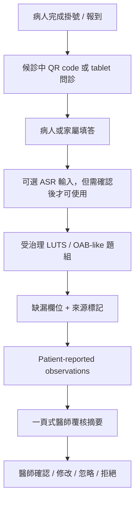

# Deep-Cultivation Application Draft v0.3

Status: official-format-aligned working draft

Date: 2026-05-20

Working title: 泌尿科門診前問診與醫師覆核摘要支持系統

Supersedes for drafting: `DEEP_CULTIVATION_APPLICATION_DRAFT_V0_2.md`

Companion files:

- `DEEP_CULTIVATION_OFFICIAL_FORMAT_CROSSWALK.md`
- `DEEP_CULTIVATION_KPI_BUDGET_ANNUAL_INTEGRATION_TABLE.md`
- `INTENDED_USE_FREEZE.md`
- `DEMO_SCOPE_FREEZE.md`
- `CLINICAL_FRICTION_REDUCTION_ANALYSIS.md`
- `DEEP_CULTIVATION_GOVERNANCE_CHECKLIST.md`
- `../core/ASSERTIVE_WRITING_POLICY.md`
- `ASSERTIVE_WRITING_GATE.md`

## Draft Boundary

This file is the current working application draft for internal proposal preparation. It translates the urology previsit system into a Health Taiwan deep-cultivation proposal structure with workflow value, governance boundaries, KPI logic, and budget traceability.

The draft deliberately keeps these workstreams under separate governance:

- final institutional submission and signature routing
- IRB application
- clinical protocol approval
- procurement specification
- production deployment planning
- real patient-data planning
- HIS / EMR integration planning

Before any external circulation, the parent proposal owner must confirm:

- latest official template
- application mode
- applicant and cooperating institutions
- institution codes
- PI/contact fields
- budget ceiling
- execution period
- signature / consent / COI requirements
- hospital-specific instructions

## Key Change From v0.2

v0.2 was an official-format skeleton.

v0.3 is a format-aligned application draft that:

- follows the archived official proposal section order
- moves staff-burden reduction into the core summary
- separates official administrative blanks from draftable technical content
- integrates KPI, budget, annual checkpoints, and governance
- applies contribution-first, non-defensive proposal writing through the assertive writing gate
- explicitly marks `陸、出國計畫書` as not applicable unless 範疇二 overseas training is added
- prepares review-response and appendix routing

## Cover Page Working Fields

| Official field | v0.3 draft value / action |
| --- | --- |
| Parent plan name | Pending parent proposal owner |
| Subproject name | 泌尿科門診前問診與醫師覆核摘要支持系統 |
| Safe descriptive wording | 泌尿科門診前症狀蒐集與醫師覆核摘要輔助流程 |
| English working title | Urology Previsit Intake and Clinician-Reviewed Summary Support System |
| County/city | likely 臺北市; parent applicant must confirm |
| Application mode | Pending parent proposal owner |
| Main category | 範疇三：導入智慧科技醫療 |
| Secondary category | 範疇一：優化醫療工作條件 |
| Optional category | 範疇二 only if training is explicitly budgeted and owned |
| Future category | 範疇四 only if community return flow / CRM is separately governed |
| Main applicant | Pending parent proposal owner |
| Cooperating institutions | Pending; do not invent |
| Execution period | Pending application route; v0.3 should not hard-code dates |
| Requested budget | Pending budget ceiling and official category mapping |
| PI / contact | Pending parent proposal owner |
| Current data boundary | synthetic / expert-review materials only until governance approval |
| Explicit exclusions | diagnosis, treatment advice, autonomous triage, risk score, queue priority, direct HIS/EMR writeback, real patient data during discovery |

## 壹、申請單位自我檢核項目表

This section must be completed by the official applicant.

Subproject preflight:

| Self-check item | Current status | v0.3 action |
| --- | --- | --- |
| Applicant eligibility | Pending | parent owner confirms institution / team eligibility |
| Official proposal format | Drafted against archived 114-115 format | re-check latest template before Word transfer |
| COI forms | Pending | institution-owned action |
| No duplicate funding statement | Pending | institution-owned action |
| Participation consent | Pending | identify actual cooperating institutions first |
| One application mode only | Pending | parent owner confirms mode |
| Scope 3 governance forms | Draft support exists | AI/cybersecurity/data owners must review |
| Budget compliance | Not itemized | use KPI-budget integration table before budget draft |

Internal evidence:

- `DEEP_CULTIVATION_OFFICIAL_FORMAT_CROSSWALK.md`
- `DEEP_CULTIVATION_MOHW_COMPLIANCE_RUBRIC.md`
- `DEEP_CULTIVATION_GOVERNANCE_CHECKLIST.md`

## 貳、計畫概要

### 一、摘要

本子計畫擬於泌尿科非急性門診導入「門診前問診與醫師覆核摘要支持系統」，以夜尿、頻尿、急尿、漏尿、排尿困難、尿流變弱等 LUTS / OAB-like 常見症狀為第一階段對象。系統於病人報到後或候診期間，透過 QR code 或 tablet 引導病人或家屬完成受治理之問診題組，並整理為一頁式、可追溯來源、可顯示缺漏欄位之醫師覆核摘要。

本子計畫核心目的在於降低門診中重複問診、資訊缺漏修補、文書準備與臨床注意力耗損。AI、ASR 與摘要工具作為降低輸入與整理負擔的智慧科技工具；系統架構將診斷、治療決策、分流判斷、風險評分、排隊優先順序與正式 EMR 紀錄保留於醫師及院內治理流程。

計畫將以醫師閱讀時間、重複問診減少可行性、缺漏欄位可見度、來源標記完整性、護理/行政額外負擔、AI/資安/資料治理完成度及 KPI-to-budget traceability 作為主要評估指標，以符合健康台灣深耕計畫「導入智慧科技醫療」與「優化醫療工作條件」之政策方向。

### 二、政策範疇對應

| Official category | v0.3 positioning |
| --- | --- |
| 範疇三：導入智慧科技醫療 | Primary. Introduces governed digital intake, optional confirmed ASR input, structured summary generation, source-labeling, auditability, version tracking, and AI/data/cybersecurity governance. |
| 範疇一：優化醫療工作條件 | Secondary. Measures whether the workflow reduces repeated questioning, documentation preparation, missing-information repair, system switching, and cognitive load. |
| 範疇二：規劃多元人才培訓 | Optional only. Include only if responsible-AI / governance / cross-disciplinary training is funded and owned. |
| 範疇四：社會責任醫療永續 | Future only. Include only if community screening return flow, CRM follow-up, or continuity-of-care SOP is reopened and governed. |

### 三、核心問題

非急性泌尿科門診中，常見 LUTS / OAB-like 症狀需要重複蒐集主訴、時間軸、症狀嚴重度、困擾程度、用藥資訊與病人最想詢問的問題。這些資訊若在進診間後才整理，會增加醫師理解成本，也可能讓護理或行政人員承擔臨時補問與例外處理負擔。

本子計畫要解決的是：

```text
如何在不增加醫療人員額外負荷的前提下，
把病人門診前可安全回報的資訊，
整理成醫師可以快速覆核、可追溯來源、可保留缺漏與不確定性的工作流產物。
```

### 四、計畫目標

1. 建立非急性泌尿科門診前問診流程。
2. 建立受治理之 LUTS / OAB-like 題庫與條件式追問邏輯。
3. 建立病人、家屬、工作人員協助、ASR-confirmed 的來源標記。
4. 建立缺漏欄位、不確定性與回答矛盾的可見化方式。
5. 建立 patient-reported red-flag observations 的安全呈現方式。
6. 建立一頁式醫師覆核摘要。
7. 建立 optional multilingual ASR input 的確認流程。
8. 建立 clinical friction reduction 評估框架。
9. 建立 AI、資安、資料治理與 future FHIR / TW Core IG readiness 文件。
10. 建立 KPI、預算、年度查核點與治理責任之對應表。

## 參、申請單位簡介

This section must be finalized by the parent proposal owner.

Subproject role draft:

| Role | Draft responsibility |
| --- | --- |
| 主提機構 | Owns official submission, eligibility, budget, institutional approval, and parent KPI |
| 泌尿科臨床團隊 | Reviews target population, question scope, summary format, unsafe wording, and workflow slot |
| 護理 / 門診行政團隊 | Reviews waiting-room feasibility, exception handling, staff burden, and staff-assist boundary |
| 資訊 / 資安 / 個資治理單位 | Reviews security, access, retention, audit logs, ASR/data handling, and future integration readiness |
| AI / 工程團隊 | Maintains synthetic demo, versioned question logic, summary-generation design, test artifacts, and evidence package |
| IRB / 研究治理支援 | Determines whether future work is research, QI, service improvement, or mixed |
| 行政 / 採購窗口 | Reviews vendor, procurement, equipment, outsourcing, and post-project ownership |

Institution history, signed commitments, and named partner claims should be added after the hospital owner confirms the official participants and supporting documents.

## 肆、計畫規劃

### 一、第一版適用範圍

```text
非急性、已排定泌尿科門診、主訴為夜尿、頻尿、急尿、漏尿、
排尿困難或尿流變弱的成人病人。
```

First-version scope boundaries:

- emergency / acute triage remains under existing clinical workflow
- diagnosis remains physician authority
- treatment and medication decisions remain physician authority
- queue priority remains outside the current workflow-support layer
- formal EMR generation remains under official hospital-record governance
- HIS/EMR integration requires a separately approved integration path
- real patient-data deployment requires prior governance approval

### 二、Workflow Slot

Working hypothesis:



Clinical-friction condition:

```text
The workflow is acceptable only if it reduces net staff burden and does not require clinicians or nurses to perform routine AI labeling, duplicate entry, or major workflow retraining.
```

### 三、System Modules

| Module | First-version content | Boundary |
| --- | --- | --- |
| Patient / family intake | chief concern, timing, bother, LUTS / OAB-like symptoms, medicine-list completeness, concern for clinician | diagnosis and medical advice remain with clinicians |
| Optional ASR | exploratory input layer | confirmed transcript/structured answer required before summary |
| Governed question bank | core questions plus approved triggered modules | clinical questioning remains inside the approved bank |
| Missing-field display | unknown, missing, contradictory, or skipped items | risk scoring remains outside first-version scope |
| Source labeling | patient / family / staff-assisted / ASR-confirmed | visible in clinician summary |
| Observation display | visible blood, fever/chills, flank pain, unable to urinate | human-review observation wording |
| Clinician-review summary | one-page summary; optional SOAP-structured reference | clinician-review reference, with official record authority preserved |
| Audit/version trace | question set, summary schema, rule/model/prompt version, review status | required before pilot-ready claim |
| Future CRM readiness | reminder / return-flow logic if reopened | future governed phase |
| Future interoperability readiness | FHIR / TW Core IG mapping if relevant | future governed integration-readiness path |

### 四、Implementation Work Packages

| Work package | Deliverable | Owner needed |
| --- | --- | --- |
| WP1 Intended use and scope freeze | `INTENDED_USE_FREEZE.md`, `DEMO_SCOPE_FREEZE.md` | project owner + clinical reviewer |
| WP2 Official-format proposal package | v0.3 draft, crosswalk, KPI-budget-checkpoint table | proposal writer + parent owner |
| WP3 Workflow and UI evidence | patient flow, clinician summary, reviewer packet | AI/engineering + clinic reviewer |
| WP4 Question governance | final first-version question set and triggered modules | urology clinician |
| WP5 Summary and auditability | one-page summary, source trace, review status | AI/engineering + clinician |
| WP6 Clinical friction evaluation | extra clicks, system switching, staff burden, training burden | clinic staff + evaluator |
| WP7 Governance package | AI, cybersecurity, data, privacy, IRB, procurement checklist | hospital governance owners |
| WP8 Budget and annual checkpoints | KPI-to-budget and annual checkpoint integration | proposal owner + budget owner |

### 五、Risk And Fallback

| Risk | Fallback / control |
| --- | --- |
| workflow adds staff work | run clinical-friction review before pilot claim |
| ASR inaccurate | require confirmation; allow manual text flow |
| summary overclaims | unsafe wording test; clinician-review label |
| missing information remains high | show missing-field list; do not hide uncertainty |
| governance owner unclear | keep real-data and integration claims out |
| budget not mapped to KPI | remove budget line |
| CRM scope expands | keep CRM parked unless SOP, owner, consent, KPI, and budget exist |

## 伍、效益評估

Use `DEEP_CULTIVATION_KPI_BUDGET_ANNUAL_INTEGRATION_TABLE.md` as the source table.

### 一、KPI Table

| 範疇 | 績效指標 | 衡量或量化基準定義 | 現況數據 | 第一階段 / draft target |
| --- | --- | --- | --- | --- |
| 範疇三 | 醫師覆核摘要閱讀時間 | clinician reads one-page synthetic summary and records time | not yet measured | median <=60 seconds design target; report actual |
| 範疇三 / 一 | 重複問診減少可行性 | compare repeated basic questions before/after workflow once approved | not yet measured | baseline definition completed; target pending pilot |
| 範疇三 | 缺漏欄位可見度 | synthetic key missing fields are surfaced | not yet measured | >=90% on synthetic review, or failures listed |
| 範疇三 | 來源標記完整性 | every summary line has source category | partial design | 100% in synthetic outputs |
| 範疇三 / 一 | Clinical friction budget | extra clicks/logins/system switches/training/exception handling remain acceptable | not yet measured | no unacceptable friction in walkthrough |
| 範疇三 | Unsafe clinical wording count | no diagnosis/treatment/final triage/EMR-writeback terms | target zero | 0 in safety test set |
| 範疇三 | ASR confirmation safety | no unconfirmed ASR content enters summary | optional | 0 unconfirmed ASR content used |
| 範疇三 | AI/data/cybersecurity governance readiness | responsible owners and checklist gaps visible | draft only | owner table and checklist drafted |
| 範疇一 / 三 | KPI-to-budget traceability | all core budget lines map to KPI and checkpoint | not complete | 100% core budget lines mapped before formal budget |

### 二、年度查核點摘要

| Stage | Work content | Checkpoint | Evidence | Completion state |
| --- | --- | --- | --- | --- |
| 115 prep | proposal prep and governance preflight | v0.3 package, intended-use freeze, demo-scope freeze, KPI-budget table, governance owner questions | files in `discovery/` | in progress |
| 116 design | workflow design and synthetic validation | workflow slot, approved question bank, summary schema, staff-burden review, safety wording test | scorecards, walkthrough report | pending owner confirmation |
| 117 limited evaluation | only if governance approval exists | baseline workflow capture, limited workflow test, safety monitoring | approved protocol/QI plan and audit logs | conditional |
| 118 scale decision | scale / integrate / stop decision | evidence review, maintenance plan, CRM/interoperability/procurement decision | final decision record | conditional |

### 三、Expected Benefits

Expected benefits should be written as measurable workflow outcomes:

- improved visit readiness
- reduced repeated basic symptom collection
- clearer missing-information handoff
- shorter clinician pre-read time for common LUTS / OAB-like symptoms
- better source traceability in previsit summaries
- staff-burden visibility before technology expansion
- governance-ready foundation for future smart-healthcare work

Claims reserved for later governed evidence:

- clinical effectiveness
- diagnostic accuracy
- treatment improvement
- cancer detection improvement
- autonomous triage performance
- production HIS/EMR integration
- current CRM retention effect

## 陸、出國計畫書

Not applicable in v0.3.

Use this wording unless the parent proposal adds a funded 範疇二 overseas training item:

```text
本子計畫未編列出國計畫。若後續母計畫於範疇二另列人才培訓、國外研習或標竿參訪，應由母計畫依官方格式另行填列，並與本子計畫之智慧醫療治理或跨域人才培訓 KPI 明確連結。
```

## 柒、經費規劃

Use `DEEP_CULTIVATION_KPI_BUDGET_ANNUAL_INTEGRATION_TABLE.md` before itemizing.

### 一、Budget Rule

```text
No KPI, no core budget line.
No owner, no operational claim.
No governance gate, no real patient data or system integration.
```

### 二、Candidate Budget Buckets

| Budget bucket | v0.3 recommendation |
| --- | --- |
| Project coordination / RA | supports reviewer sessions, KPI capture, governance documents, and proposal evidence maintenance |
| Clinician/staff review sessions | supports evaluation and workflow review while keeping clinicians out of routine AI labeling work |
| Web/tablet intake prototype | justified after waiting-room QR/tablet slot is accepted |
| Summary-generation implementation | justified by read-time/source-label KPI |
| Optional ASR evaluation | justified by explicit input-burden or multilingual-accessibility KPI |
| AI/data/cybersecurity governance review | supports Scope 3 credibility through assigned owner or external review |
| FHIR / TW Core IG mapping | future readiness only unless integration is explicitly requested |
| CRM/reminder module | parked; do not budget in v0.3 unless CRM phase is reopened |
| HIS/EMR integration | excluded from current scope |

### 三、Budget Narrative Template

```text
因本子計畫需驗證門診前問診流程是否能降低重複問診與臨床工作摩擦，故編列[工作項目]支援[系統/流程/評估]。該項經費對應 KPI 為[指標]，衡量方式為[方法]，由[負責角色]於[年度查核點]提供[證據文件]。
```

Example:

```text
因本子計畫需驗證醫師是否能於 60 秒內閱讀一頁式覆核摘要，故編列摘要畫面建置與 reviewer session 相關工作。該項經費對應 KPI 為「醫師覆核摘要閱讀時間」與「醫師 useful rating」，衡量方式為合成案例 reviewer scorecard，由泌尿科臨床團隊與計畫協調人於第一年度查核點提供評估紀錄。
```

## 捌、人力配置表

Names must be filled by the official applicant.

| Category / role | Name | Current position | Specific work in this subproject |
| --- | --- | --- | --- |
| PI / subproject owner | Pending | Pending | clinical and proposal accountability |
| Urology clinical lead | Pending | Pending | question set, summary review, safety wording |
| Nursing/outpatient workflow reviewer | Pending | Pending | staff burden, waiting-room fit, exception handling |
| IT/security reviewer | Pending | Pending | security, access, future integration readiness |
| Data/AI governance reviewer | Pending | Pending | AI lifecycle, transparency, auditability, data governance |
| Engineer / AI system designer | Pending | Pending | demo, structured intake, summary, logs, versioning |
| RA / coordinator | Pending | Pending | reviewer sessions, KPI evidence, documentation |
| Procurement/admin contact | Pending | Pending | vendor and budget route |

## 玖、其他

Recommended appendices for internal review:

| Appendix | Include? | Reason |
| --- | --- | --- |
| Intended-use freeze | yes | clarifies what the system is and is not |
| Demo-scope freeze | yes | prevents scope drift |
| Official-format crosswalk | yes | shows submission-readiness gaps |
| KPI-budget-annual integration table | yes | connects value, cost, owner, and checkpoint |
| Governance checklist | yes | Scope 3 smart-healthcare readiness |
| Synthetic demo screenshots or reviewer packet | maybe | only if it helps explain workflow |
| Wanfang `萬小芳` benchmark note | no as full appendix; cite only if useful | benchmark for workflow lesson, not product scope |
| Full meeting transcript | no by default | keep internal unless requested |
| Raw source/archive files | no by default | use source manifest and selected references |

## 拾、公職人員利益衝突迴避自主檢核表

Institution-owned. This repo should not fill or simulate the form.

v0.3 action:

```text
Parent proposal owner confirms whether applicant or cooperating entities require COI disclosure, identity relationship disclosure, signatures, and scans.
```

## 拾壹、未有重複申請計畫之聲明切結書

Institution-owned. This repo should not fill or simulate the form.

v0.3 action:

```text
Parent proposal owner verifies that the proposed work, budget, and participating institutions do not duplicate other funded applications.
```

## 拾貳、參與計畫同意書

Institution-owned. This depends on the final partner list.

v0.3 action:

```text
Partner participation claims should be added after the parent proposal owner confirms which departments, institutions, vendors, or external teams must sign participation documents.
```

## 拾參、審查意見回復表

Prepare this empty table for later:

| 委員意見 | 執行單位回復 | 修正位置 |
| --- | --- | --- |
| Pending | Pending | Pending |

Use `DEEP_CULTIVATION_SCORING_RUBRIC.md` and `DEEP_CULTIVATION_MOHW_COMPLIANCE_RUBRIC.md` before responding to reviewers.

## Immediate v0.3 Review Questions

Ask these before transferring to the parent Word template:

1. Is the title `泌尿科門診前問診與醫師覆核摘要支持系統` acceptable?
2. Is the first workflow slot `報到後 / 候診中 / QR code or tablet` realistic?
3. Does `醫師覆核用 SOAP 架構參考摘要` sound safe, or too close to automatic EMR writing?
4. Does the hospital want v0.3 as a full subproject draft or a one-page outline first?
5. Who owns the budget ceiling and official budget categories?
6. Who owns AI, cybersecurity, data governance, privacy, IRB/QI, and procurement review?
7. Is CRM still parked, or must a future-phase paragraph remain?
8. Is FHIR / TW Core IG only future readiness, or does the proposal require a mapping task now?

## Reviewer-Safe One-Sentence Pitch

```text
本子計畫先於非急性泌尿科門診導入低摩擦、受治理的門診前症狀蒐集與醫師覆核摘要流程，評估是否能減少重複問診、提升資料完整性並降低臨床工作負擔，同時建立未來智慧醫療、資料治理與病人管理延伸所需的安全邊界。
```
