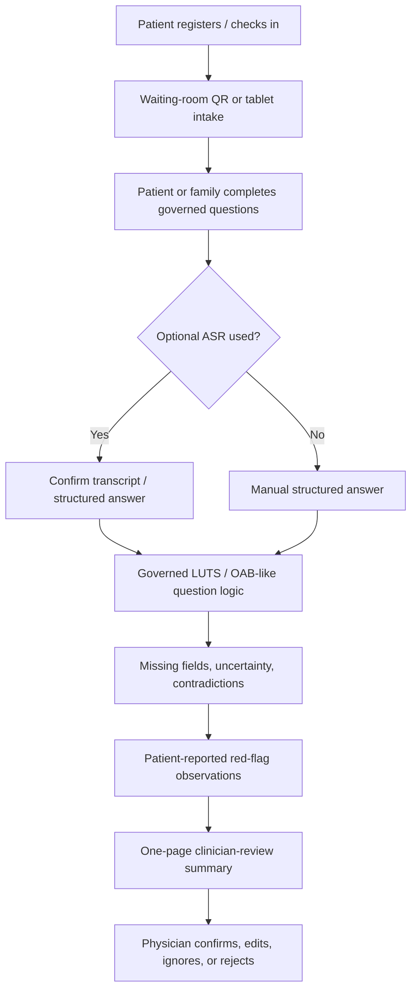
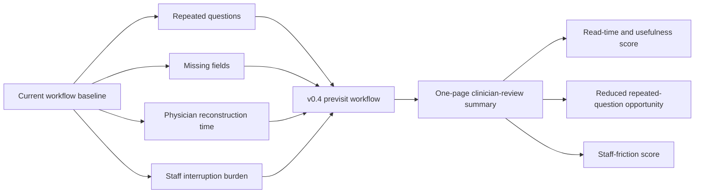
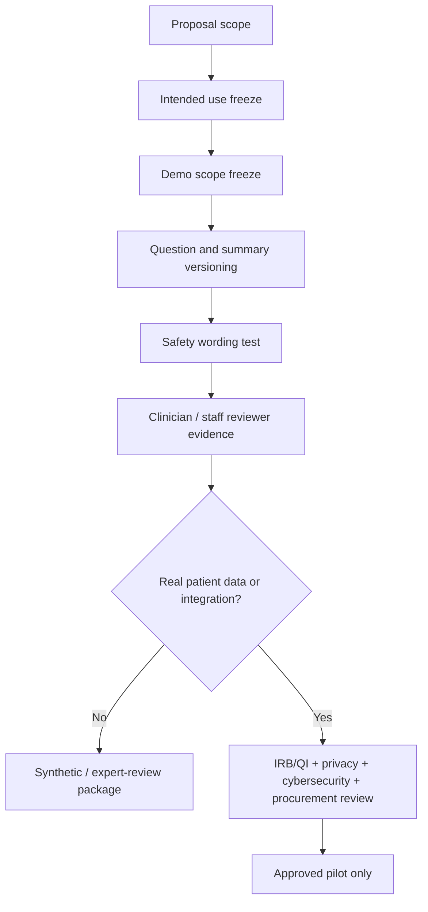

# Deep-Cultivation Application Draft v0.4

Status: precedent-integrated official-package draft

Date: 2026-05-21

Repo version target: `v0.4.0`

Working title: 泌尿科門診前問診與醫師覆核摘要支持系統

Supersedes for drafting: `DEEP_CULTIVATION_APPLICATION_DRAFT_V0_3.md`

Precedent used:

- `../records/2026-05-21/a2-0048-smart-healthcare-center-precedent/README.md`

## v0.4 Position

v0.4 keeps the v0.3 clinical scope and upgrades the proposal packaging with lessons from the A2-0048 precedent.

Core decision:

```text
Keep the narrow urology previsit workflow.
Adopt the precedent's official-format discipline.
Do not inherit the precedent's scope breadth or clinical-decision language.
```

The current project remains:

```text
非急性泌尿科門診前症狀蒐集
-> 缺漏與來源可見化
-> 一頁式醫師覆核摘要
-> 低摩擦 workflow evaluation
```

It is not:

```text
AI diagnosis / autonomous triage / treatment recommendation / queue priority /
automatic EMR writeback / production HIS integration / first-phase CRM follow-up
```

## Key Upgrade From v0.3

v0.3 already established the correct scope. v0.4 adds formal application structure:

- official package checklist
- category-to-claim map
- owner and responsibility table
- baseline measurement plan
- KPI-to-budget-to-checkpoint table
- annual checkpoint package
- governance workstream paragraph
- review-response table
- predecessor-learning decision record inside the draft itself

## One-Sentence Proposal Framing

```text
本子計畫於非急性泌尿科門診導入低摩擦、受治理的門診前症狀蒐集與醫師覆核摘要流程，將病人可安全回報之症狀資訊於候診期間整理為可追溯、可覆核、可顯示缺漏的一頁式工作流產物，並以醫師閱讀時間、重複問診減少、缺漏欄位可見度與醫護工作負荷降低作為主要驗收指標。
```

## Official Package Checklist

Use this checklist before transferring into the parent Word template.

| Package item | v0.4 handling | Owner needed | Evidence location |
| --- | --- | --- | --- |
| Cover page fields | keep blanks visible; do not invent applicant, budget, period or partners | parent proposal owner | this file |
| Self-check table | draft preflight status; official applicant completes legal/signature items | parent proposal owner | `DEEP_CULTIVATION_OFFICIAL_FORMAT_CROSSWALK.md` |
| Proposal abstract | use workflow and workforce-burden language | proposal writer | this file |
| Applicant introduction | parent-owned; subproject role table included | parent proposal owner | this file |
| Project planning | use narrow urology workflow and work packages | clinical + workflow owners | this file |
| Benefit evaluation | KPI, baseline, target and evidence table included | evaluator + clinical owner | this file |
| Overseas plan | not included unless parent proposal owns Category 2 travel | parent proposal owner | this file |
| Budget planning | budget lines must map to KPI and checkpoint | budget owner | this file + KPI table |
| Human resources table | role-based table ready; names pending | parent proposal owner | this file |
| Other / IRB | governance route stated; no real patient data before approval | IRB/QI owner | this file |
| COI / no duplicate funding / consent | institution-owned | parent proposal owner | official forms |
| Review-response table | prepared in draft | proposal writer | this file |

## Category-To-Claim Map

| Official category | v0.4 claim | KPI evidence | Budget logic |
| --- | --- | --- | --- |
| 範疇三：導入智慧科技醫療 | primary category; governed digital intake, optional confirmed ASR, structured summary, audit/version control and future interoperability readiness | summary read time, source-label completeness, unsafe wording count, governance checklist | prototype, summary-generation, governance review, audit/version work |
| 範疇一：優化醫療工作條件 | secondary category; reduce repeated questioning, missing-information repair and cognitive/documentation load | repeated-question count, staff-friction score, clinician usefulness rating | reviewer sessions, workflow analysis, human factors evaluation |
| 範疇二：規劃多元人才培育 | optional only; include if responsible-AI or workflow training is funded and owned | training completion and role-readiness evidence | training budget only with named owner |
| 範疇四：社會責任醫療永續 | future only; CRM/follow-up/community continuity remains parked | future SOP and owner decision | no first-phase core budget unless reopened |

## Scope Freeze

### Included In v0.4

- non-acute adult urology outpatient workflow
- LUTS / OAB-like first scope: nocturia, frequency, urgency, leakage, voiding difficulty, weak stream
- QR code or tablet intake after registration or during waiting
- patient/family/staff-assisted source labels
- optional ASR only after confirmation
- missing-field display
- patient-reported red-flag observations as observations, not triage
- one-page clinician-review summary
- audit trail and version tracking
- synthetic and expert-review evidence before real patient data

### Excluded From v0.4

- autonomous diagnosis
- treatment advice
- medication recommendation
- final triage or queue-priority decision
- automatic EMR writing
- production HIS/EMR/EHR integration
- first-phase CRM follow-up
- broad multi-department expansion
- claims of clinical effectiveness before approved evaluation

## Workflow Architecture



## Owner And Responsibility Table

This table should be transferred into the official manpower section once names are confirmed.

| Role | Required responsibility | Named person / unit | Current status |
| --- | --- | --- | --- |
| Parent proposal owner | applicant route, official mode, budget ceiling, signatures and final Word submission | Pending | must confirm |
| Subproject PI / owner | clinical accountability and proposal-level decision making | Pending | must confirm |
| Urology clinical lead | target population, question set, red-flag observation wording, summary acceptance | Pending | must confirm |
| Outpatient nursing reviewer | waiting-room workflow, exception handling, staff-assist boundary | Pending | must confirm |
| Outpatient administrative reviewer | check-in slot, QR/tablet feasibility, patient flow and support load | Pending | must confirm |
| IT/security owner | access control, logging, retention, endpoint/device/security review | Pending | must confirm |
| Data/AI governance owner | AI lifecycle, model/prompt/rule versioning, transparency and auditability | Pending | must confirm |
| IRB/QI governance owner | research vs service/QI route, real patient-data approval path | Pending | must confirm |
| Engineering owner | intake flow, summary schema, test artifacts, versioned implementation evidence | Pending | must confirm |
| Evaluation owner | baseline survey, read-time test, staff-friction scorecard, KPI evidence | Pending | must confirm |
| Budget/procurement owner | budget category, vendor/internal split, procurement route | Pending | must confirm |
| Proposal coordinator | document control, changelog, reviewer-response tracking, attachment pack | Pending | must confirm |

## Baseline Measurement Plan

The A2-0048 precedent makes baseline measurement visible. v0.4 adopts that discipline.

### Baseline Questions

| Baseline item | Measurement | Why it matters |
| --- | --- | --- |
| Current chief-complaint reconstruction time | timed observation or clinician estimate | tests whether summary can reduce physician cognitive load |
| Repeated basic history questions | count repeated LUTS/OAB-like questions in current flow | tests workflow burden reduction |
| Missing key information | count missing timing, severity, bother, medication and concern fields | tests visit-readiness |
| Nurse/staff intervention burden | staff estimate of extra explanation, repair, or interruption | prevents hidden workload transfer |
| System switching / login burden | count extra systems or screens required | tests deployment friction |
| Clinician summary read time | timed review of one-page synthetic summaries | tests whether the output is usable |
| Unsafe wording count | count diagnosis/treatment/triage/EMR-writeback phrases | protects clinical boundary |

### Baseline-To-After Evaluation Diagram



## KPI, Budget And Checkpoint Table

This is the v0.4 proposal-facing integration table.

| Work package | KPI | Baseline | Draft target | Budget bucket | Evidence artifact | Checkpoint |
| --- | --- | --- | --- | --- | --- | --- |
| Official proposal package | completeness of official sections | incomplete parent fields | all blanks explicit; no invented institutional claims | proposal coordination | official-format crosswalk | before parent transfer |
| Workflow slot confirmation | workflow accepted or revised | unconfirmed | registration/waiting-room slot confirmed | workflow review session | workflow decision record | 115 prep / 116 design |
| Question governance | approved first-version question set | draft only | clinician-reviewed LUTS/OAB-like question set | clinical review | question governance record | 116 design |
| Summary schema | clinician read time | not measured | median <=60 seconds in synthetic review, report actual | summary UI / generation work | scorecard | 116 design |
| Source traceability | source-label completeness | partial design | 100% summary lines source-labeled in synthetic outputs | data model / summary schema | audit sample | 116 design |
| Missing-field repair | key missing-field visibility | not measured | >=90% synthetic missing fields surfaced or failures listed | form/rule implementation | missing-field report | 116 design |
| Staff friction | extra workflow burden | not measured | no unacceptable duplicate entry, login, training or exception burden | human factors / reviewer sessions | friction scorecard | 116 design |
| ASR input | confirmation safety | optional | 0 unconfirmed ASR content enters summary | ASR evaluation only if funded | ASR confirmation test | conditional |
| Safety wording | unsafe clinical wording count | target zero | 0 diagnosis/treatment/final-triage/EMR-writeback terms | safety review/test work | safety checklist | every release |
| Governance readiness | AI/data/security owner table | pending | owners or pending-owner fields visible | governance review | governance checklist | before pilot claim |
| Budget discipline | KPI-to-budget traceability | incomplete | 100% core budget lines map to KPI, owner and checkpoint | budget coordination | KPI-budget table | before formal budget |

## Budget Narrative

Use this paragraph in the budget section:

```text
本子計畫經費編列以可驗收之門診流程改善為核心。各項工作需對應明確 KPI、年度查核點與負責角色；核心經費優先支持門診前問診流程建置、醫師覆核摘要產出、來源標記與缺漏欄位可見化、臨床工作摩擦評估、AI/資料/資安治理與 reviewer evidence 產出。未對應降低重複問診、縮短醫師閱讀時間、提升門診前資訊完整性、降低醫護額外負擔或完成治理要求者，不列為本階段核心經費。
```

Budget buckets:

| Budget bucket | Include in v0.4? | Rule |
| --- | --- | --- |
| Proposal coordination / RA | yes if budget allows | supports KPI evidence and document control |
| Clinician/staff reviewer sessions | yes | evaluation support, not routine AI labeling |
| Web/tablet intake workflow | yes after slot confirmation | tied to completion and friction KPI |
| Summary-generation implementation | yes | tied to read-time and traceability KPI |
| Optional ASR | conditional | include only with input-burden or multilingual KPI |
| Governance/security review | yes | needed for Scope 3 credibility |
| FHIR/TW Core IG mapping | future readiness only | no production integration claim |
| CRM/reminder module | no | parked unless future phase reopened |
| HIS/EMR integration | no | outside v0.4 |

## Annual Checkpoint Table

| Stage | Work content | Planned evidence | Progress logic |
| --- | --- | --- | --- |
| 115 prep | package alignment, owner questions, precedent-integrated v0.4 draft | v0.4 draft, official checklist, owner table, version log | proposal-ready structure before parent transfer |
| 116 design | workflow slot, question set, summary schema, synthetic walkthrough, staff-friction review | workflow map, clinician scorecard, safety test, missing-field report | governed design before real deployment |
| 117 limited evaluation | only if approved; baseline and limited workflow test | approved QI/IRB route, audit log, before/after worksheet | evidence-driven continuation |
| 118 scale decision | decide scale, integration, CRM or stop | evaluation report, maintenance plan, procurement/integration decision | no expansion without evidence |

## Governance Paragraph

Use this paragraph in the project planning or governance section:

```text
本子計畫採 responsible clinical AI workflow governance。系統輸出定位為醫師覆核用工作流產物，並以來源標記、版本控管、缺漏欄位顯示、ASR 確認、操作紀錄與審查狀態保留可追溯性。第一階段不直接寫入正式 EMR，不進行自主診斷、治療建議、最終分流或排隊優先順序判斷；若後續進入真實病人資料、HIS/EMR 介接、CRM follow-up 或跨院資料交換，須另行完成 IRB/QI、個資、資安、AI 治理、採購與院內流程審查。
```

## Governance Flow



## Review-Response Table

Prepare this table before external review. Keep responses confident and specific.

| Likely reviewer question | Response direction | Draft location to update |
| --- | --- | --- |
| Why start with urology only? | The scope is deliberately narrow to validate workflow value, safety boundaries and clinician adoption before expansion. | `貳、計畫概要`; `肆、計畫規劃` |
| Is this AI triage? | The system is a previsit information-compression and clinician-review summary layer; it does not assign final triage, diagnosis or queue priority. | scope boundary; governance paragraph |
| How does it reduce staff burden? | It targets repeated history-taking, missing-field repair, summary preparation and avoidable staff interruptions; these are measured with baseline and reviewer scorecards. | KPI table; baseline plan |
| Who owns the workflow? | v0.4 requires named clinical, nursing/outpatient, IT/security, AI/data governance, evaluation and budget owners before formal submission. | owner table |
| Why not integrate HIS/EMR now? | Integration is future readiness; first stage proves low-friction workflow and governance without creating production-record risk. | governance paragraph; budget rule |
| Why include ASR? | ASR is optional and only enters the summary after confirmation; it is funded only if tied to input-burden or multilingual-accessibility KPI. | budget table; system modules |
| What evidence will be delivered? | summary read-time, usefulness rating, source-label completeness, missing-field visibility, unsafe-wording count and staff-friction score. | KPI table |
| How does this learn from precedent proposals? | It adopts official-format discipline, KPI-budget-checkpoint mapping, owner visibility and governance while keeping a narrower safer scope. | v0.4 position; precedent note |

## Precedent Integration Decision

What v0.4 learns from A2-0048:

- formal section completeness matters
- owner mapping matters
- baseline measurement matters
- KPI, budget and annual checkpoints must be integrated
- AI/data/cybersecurity governance must be visible
- review-response tables should be prepared early

What v0.4 rejects from A2-0048:

- excessive module sprawl
- autonomous or near-autonomous clinical decision language
- large unsupported savings claims
- AI second brain as the main message
- template errors or internal draft residue

## Immediate Next Actions Before Parent Transfer

1. Confirm parent applicant, mode, period, budget ceiling and partner list.
2. Confirm whether this is submitted as a subproject, work package or appendix inside a larger proposal.
3. Name the clinical lead, workflow reviewer, IT/security owner, AI/data governance owner, evaluation owner and budget owner.
4. Choose target reviewer count for synthetic summary review.
5. Decide whether ASR is included as funded work or kept as optional demo capability.
6. Decide whether Category 2 training is included; if not, leave overseas plan blank.
7. Keep CRM, HIS/EMR and FHIR as future readiness unless the parent proposal explicitly reopens them.
8. Transfer v0.4 into the official Word template only after the official template and administrative fields are confirmed.

