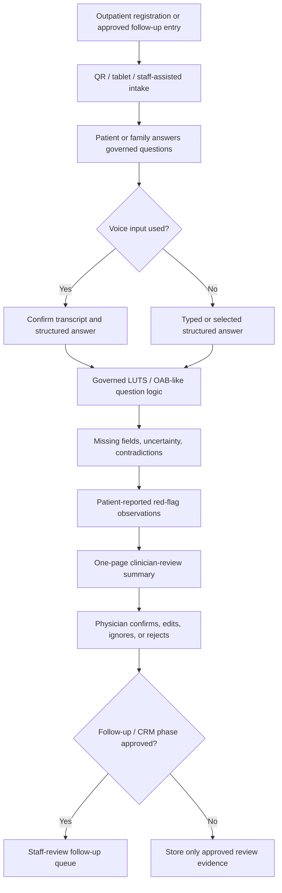

# Deep-Cultivation Application Draft v0.5

Status: 2026-06-02 discussion draft

2026-06-19 supersession note:

```text
This v0.5 file remains historical. CRM is fully out of Jason / 陽明交大 current
package. Use the 2026-06-19 AI-only expert-review packet for current planning.
```

Date: 2026-05-29

Repo version target: `v0.5.0`

Working title: 泌尿科門診前問診與醫師覆核摘要支持系統

Supersedes for active discussion: `DEEP_CULTIVATION_APPLICATION_DRAFT_V0_4.md`

Meeting source:

- `../records/2026-05-29/prof-wu-xinyi-proposal-meeting-capture.md`

Reference proposal:

- `../records/2026-05-29/xinyi-outpatient-proposal-reference/README.md`

## v0.5 Decision

v0.5 turns the 2026-05-29 Prof. Wu meeting constraints into active proposal controls.

```text
三年期
總經費新臺幣 1,000 萬元整
每一項經費均需對應 KPI
討論版控制在 20 頁以內
2026-06-02 前可供討論
```

## v0.5 Position

This proposal supports a governed outpatient workflow:

```text
非急性泌尿科門診前或篩檢後追蹤情境
-> 病人 / 家屬 / 工作人員協助完成低摩擦症狀蒐集
-> 缺漏欄位與來源標記可見化
-> 一頁式醫師覆核摘要
-> staff-review follow-up or CRM-ready queue when separately approved
-> KPI-backed evaluation and governance record
```

The contribution is practical service-system modernization. AI, ASR, APP, CRM, dashboard, and API work are support layers. The clinical authority remains with clinicians by design.

## Page-Control Budget For A 20-Page Discussion Version

| Section | Target pages | Content control |
| --- | ---: | --- |
| 1. Cover and abstract | 1 | title, applicant placeholders, three-year NT$10M constraint, one-paragraph thesis |
| 2. Policy fit and current clinical workflow problem | 2 | Health Taiwan categories, outpatient burden, repeated history, missing information, follow-up friction |
| 3. Project objectives and target population | 2 | non-acute LUTS / OAB-like outpatients and optional screening-follow-up users |
| 4. Service workflow and system architecture | 3 | intake, source labeling, summary, follow-up queue, governance gates, Mermaid diagram |
| 5. Work packages | 3 | workflow review, question governance, summary schema, security/governance, evaluation |
| 6. Organization and owners | 1.5 | role-based responsibility table with pending owner fields visible |
| 7. Data, privacy, security, and clinical governance | 2 | IRB/QI route, no real data before approval, no autonomous clinical decisions |
| 8. KPI and annual checkpoints | 2.5 | measurable KPI by year and evidence artifacts |
| 9. Budget and KPI mapping | 2 | NT$10M table with every item tied to KPI and checkpoint |
| 10. Attachments and review-response readiness | 1 | selected evidence packet, open owner questions, likely reviewer responses |

Hard control:

```text
Keep each paragraph tied to workflow value, KPI, governance, budget, or owner clarity. Supporting context belongs in an appendix so the 20-page discussion version stays decision-ready.
```

## One-Paragraph Proposal Abstract

本子計畫於信義生醫 / 院外門診部相關泌尿科服務情境導入門診前症狀蒐集與醫師覆核摘要支持流程，將病人可安全回報之主訴、症狀期間、困擾程度、排尿型態、用藥與追蹤需求，整理為具來源標記、缺漏欄位顯示與醫師覆核狀態的一頁式工作流產物。計畫以三年新臺幣 1,000 萬元為上限，將經費配置到流程建置、臨床與工作人員 reviewer evidence、AI / 資料 / 資安治理、低摩擦部署與年度 KPI 評估，並以摘要可讀時間、資訊完整性、工作摩擦降低、follow-up 可追蹤性與治理成熟度作為主要驗收指標。

## Official Category-To-Claim Map

| Official category | v0.5 claim | KPI evidence | Budget implication |
| --- | --- | --- | --- |
| 範疇三：導入智慧科技醫療 | governed digital intake, optional confirmed ASR, clinician-review summary, audit/version control, CRM-ready field design | prototype readiness, source-label completeness, unsafe wording count, governance gate completion | system workflow, summary schema, governance, security review |
| 範疇一：優化醫療工作條件 | reduce repeated history-taking, missing-information repair, avoidable staff interruption, and summary-preparation burden | read time, repeated-question opportunity, staff-friction score, usefulness rating | reviewer sessions, workflow analysis, human factors evaluation |
| 範疇二：規劃多元人才培育 | cross-disciplinary clinical-AI, privacy, IRB/QI, cybersecurity, and workflow-governance training if parent proposal funds it | training completion, role-readiness record | training and documentation only with named owner |
| 範疇四：社會責任醫療永續 | optional bridge to screening follow-up and equitable outpatient access, only if the parent proposal owns the service route | follow-up queue completeness, partner workflow decision | no core budget unless CRM / follow-up phase is reopened |

## Scope Freeze

### v0.5 Core Operating Scope

- non-acute adult urology outpatient or approved screening-follow-up workflow
- LUTS / OAB-like first scope: nocturia, frequency, urgency, leakage, voiding difficulty, weak stream
- QR code, tablet, or staff-assisted intake after registration, during waiting, or in an approved follow-up workflow
- patient / family / staff-assisted source labels
- optional ASR only after user confirmation
- missing-field and uncertainty display
- patient-reported red-flag observations for clinician review under the approved triage policy
- one-page clinician-review summary
- CRM-ready follow-up field design if the parent proposal reopens CRM
- audit trail, version tracking, and safety wording review
- synthetic, expert-review, and approved QI/IRB evidence before real patient data

### Future Readiness And Separate Activation Gates

- clinician-owned diagnosis
- physician-owned treatment advice
- physician-owned medication recommendation
- institution-owned triage and queue-priority policy
- governed EMR writeback pathway
- production HIS/EMR/EHR integration path
- FHIR / TW Core IG production integration path
- multi-department expansion path
- clinical-effectiveness validation path
- CRM reminders or messaging after owner, consent, privacy, procurement, and security gates are named

## Service Workflow



## Work Packages

| Work package | Purpose | Primary KPI | Evidence artifact |
| --- | --- | --- | --- |
| WP1 Proposal and workflow governance | transfer v0.5 into parent proposal format and confirm owners | official blanks visible, 20-page discussion draft complete | proposal checklist, owner table |
| WP2 Clinical question governance | confirm first-version questions and safe red-flag observation wording | approved question set and unsafe wording count = 0 | question governance record |
| WP3 Intake and summary workflow | implement or specify low-friction intake and one-page summary | summary read time <=60 seconds in synthetic review, source labels 100% | synthetic walkthrough and scorecard |
| WP4 Staff and outpatient workflow review | test whether the process reduces friction rather than creating new work | no unacceptable duplicate entry, login, or exception burden | staff-friction scorecard |
| WP5 Security, privacy, AI/data governance | prepare governance for APP/API/ASR/CRM-ready design | governance checklist complete, owners named or pending fields explicit | governance checklist and security review note |
| WP6 KPI evidence and annual reporting | produce measurable before/after and readiness evidence | KPI-to-budget traceability 100% | KPI evidence workbook and checkpoint report |
| WP7 Optional ASR / CRM readiness | include only when tied to input-burden or follow-up KPI | 0 unconfirmed ASR content enters summary; follow-up fields mapped if reopened | ASR confirmation test, CRM field map |

## Owner And Responsibility Table

| Role | Required responsibility | Named person / unit | Current status |
| --- | --- | --- | --- |
| Parent proposal owner | official route, final Word/PDF submission, signatures, partner relationship | Pending | must confirm |
| Budget owner | official budget category, annual split, procurement route | Pending | must confirm before formal budget |
| Subproject PI / owner | clinical and proposal-level accountability | Pending | must confirm |
| Urology clinical lead | target group, questions, red-flag observation wording, summary acceptance | Pending | must confirm |
| Outpatient workflow reviewer | registration, waiting-room, staff-assist, exception handling | Pending | must confirm |
| Nursing / care-team reviewer | staff workload, patient assistance, follow-up burden | Pending | must confirm |
| IT/security owner | access control, device/API/security review, audit log | Pending | must confirm before pilot |
| AI/data governance owner | model/prompt/rule versioning, data retention, transparency | Pending | must confirm before real-data claim |
| IRB/QI owner | research vs QI/service route and real patient-data approval | Pending | must confirm before patient-data work |
| Engineering owner | intake, summary schema, versioned implementation evidence | Pending | can be internal, outsourced, or hybrid |
| Evaluation owner | baseline, scorecards, KPI evidence, annual report | Pending | must confirm |
| Proposal coordinator | changelog, review response, attachment pack, page control | Pending | active for v0.5 |

## KPI Table

| KPI | Baseline | Year 1 target | Year 2 target | Year 3 target | Evidence |
| --- | --- | --- | --- | --- | --- |
| 20-page discussion package | v0.4 overcomplete internal package | v0.5 discussion draft <=20 pages | parent-format update if approved | final report package if executed | proposal file and review log |
| Question governance | draft only | first-version LUTS/OAB-like question set reviewed | revised after approved pilot/walkthrough | maintained with version log | question governance record |
| Summary read time | measurement scheduled | <=60 seconds in synthetic clinician review, report actual | measure in approved workflow | maintain or improve after revisions | timed scorecard |
| Clinician usefulness | measurement scheduled | median >=4/5 or revise | measure in approved workflow | final usefulness report | clinician scorecard |
| Source-label completeness | partial design | 100% of synthetic summary lines source-labeled | 100% in approved workflow samples | 100% in final evidence sample | audit sample |
| Missing-field visibility | measurement scheduled | >=90% synthetic missing key fields surfaced with exception log | approved workflow measurement | final exception-aware report | missing-field report |
| Unsafe wording count | target zero | 0 diagnosis/treatment/final-triage/EMR-writeback phrases in test set | 0 unresolved safety wording incidents | 0 unresolved safety wording incidents | safety checklist |
| Staff friction | measurement scheduled | staff workflow review completed | approved workflow meets click, login, training, and exception-load budget | burden trend documented | staff-friction scorecard |
| ASR confirmation safety | optional | 0 unconfirmed ASR content enters summary if ASR is funded | maintain in pilot if used | maintain in scale decision if used | ASR confirmation test |
| Governance readiness | draft checklist | AI/data/cybersecurity/IRB/procurement owners named or pending fields explicit | approvals completed before real-data pilot | maintenance owner named | governance checklist |
| Budget traceability | incomplete | 100% budget lines map to KPI, owner, evidence, checkpoint | updated during execution | final expense-to-KPI report | KPI-budget table |

## Three-Year Budget Allocation

Working ceiling: NT$10,000,000.

Annual working split:

```text
Year 1: NT$4,000,000
Year 2: NT$3,200,000
Year 3: NT$2,800,000
Total:  NT$10,000,000
```

This split is a discussion allocation. The parent budget owner may revise accounting categories.

| Budget bucket | Year 1 | Year 2 | Year 3 | Total | KPI link | Evidence / owner |
| --- | ---: | ---: | ---: | ---: | --- | --- |
| Proposal coordination, PM, RA, KPI evidence | 900,000 | 1,050,000 | 1,050,000 | 3,000,000 | 20-page package, KPI evidence, annual reporting | coordinator, evaluator |
| Intake / summary workflow and CRM-ready field design | 1,250,000 | 650,000 | 300,000 | 2,200,000 | summary read time, source labels, missing fields | engineering owner |
| Clinician, nurse, and outpatient workflow reviewer sessions | 400,000 | 400,000 | 300,000 | 1,100,000 | usefulness, staff friction, workflow fit | clinical and workflow owners |
| Security, privacy, AI/data governance, auditability | 450,000 | 300,000 | 150,000 | 900,000 | governance checklist, unsafe wording, audit trail | IT/security, AI/data governance |
| Evaluation, baseline, QI/IRB preparation, limited pilot evidence | 250,000 | 400,000 | 350,000 | 1,000,000 | baseline, approved workflow measurement, final report | evaluation and IRB/QI owners |
| Conditional equipment / ASR / intake station support | 450,000 | 200,000 | 50,000 | 700,000 | ASR confirmation, workflow slot feasibility | budget and workflow owners |
| Training, documentation, dissemination, review-response package | 150,000 | 100,000 | 250,000 | 500,000 | training completion, review-response readiness | proposal owner |
| Administration and contingency within legal accounting rules | 150,000 | 100,000 | 350,000 | 600,000 | expense-to-KPI traceability maintained | budget owner |
| Total | 4,000,000 | 3,200,000 | 2,800,000 | 10,000,000 | 100% mapped | parent budget owner |

## Budget Narrative

本子計畫經費編列以可驗收的門診流程改善為核心。所有經費均對應明確 KPI、年度查核點、負責角色與證據文件；核心支出優先支持門診前問診流程建置、醫師覆核摘要產出、來源標記與缺漏欄位可見化、臨床與工作人員 reviewer evidence、AI / 資料 / 資安治理、KPI 評估與討論版文件控管。v0.5 核心經費集中投入能支持降低重複問診、縮短摘要閱讀時間、提升門診前資訊完整性、降低醫護與行政額外負擔、並完成治理要求的工作項目。

## Annual Checkpoints

| Stage | Main goal | Deliverables | Gate |
| --- | --- | --- | --- |
| 2026-06-02 discussion | align budget, page limit, owners, and scope | v0.5 draft, KPI-budget table, reference analysis | Prof. Wu / parent owner discussion |
| Year 1 setup | governed design and reviewer evidence | intended use, owner table, question set, summary schema, synthetic walkthrough, security checklist | no real patient data before approval |
| Year 2 approved workflow evaluation | limited workflow evidence if approved | baseline, clinician scorecards, staff-friction review, ASR confirmation if used | IRB/QI/privacy/security/procurement gates |
| Year 3 scale / maintain / stop decision | decide continuation based on evidence | final KPI report, maintenance plan, integration or CRM decision | no scale-up without evidence and owner |

## Review-Response Table

| Likely reviewer question | Response direction |
| --- | --- |
| Why is the budget NT$10,000,000? | The budget is the three-year working ceiling given by Prof. Wu; v0.5 maps every bucket to KPI, evidence, and owner. |
| How does the system reduce staff burden? | It targets repeated history-taking, missing-field repair, summary preparation, and follow-up visibility, measured by read time and staff-friction scorecards. |
| How is clinician authority preserved? | The system produces clinician-review workflow evidence; diagnosis, treatment, final triage, queue priority, and EMR writeback remain under the approved clinical and institutional workflow. |
| Why include ASR? | ASR is optional and funded only if it supports input burden or accessibility KPI; no unconfirmed voice content enters the summary. |
| How is HIS/EMR readiness handled? | Integration is a future-readiness path. v0.5 first establishes low-friction workflow value, governance, owner clarity, and KPI evidence. |
| How does the attached reference affect this draft? | It contributes structure, KPI, budget, and page-discipline patterns; v0.5 adopts those proposal mechanics while keeping a focused previsit workflow scope. |

## 2026-06-02 Readiness Checklist

- [ ] Confirm whether v0.5 is a standalone subproject, work package, or appendix.
- [ ] Confirm parent applicant, official mode, proposal period, and partner list.
- [ ] Confirm whether NT$4.0M / 3.2M / 2.8M annual split is acceptable.
- [ ] Confirm allowed accounting categories and procurement threshold.
- [ ] Name or mark pending the clinical, workflow, security, AI/data, evaluation, and budget owners.
- [ ] Decide whether ASR is funded or demo-only.
- [ ] Decide whether CRM is reopened as funded work or future readiness.
- [ ] Confirm real patient-data route: no data, QI/service, or IRB research.
- [ ] Transfer only the 20-page discussion package into the parent format.
