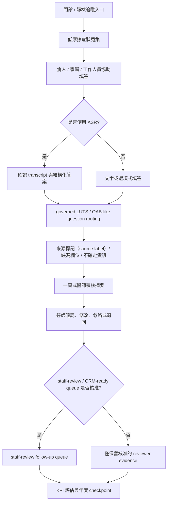

# 健康台灣深耕計畫申請討論稿 v0.6

狀態：2026-06-02 填報討論稿

2026-06-19 supersession note:

```text
本 v0.6 保留為歷史討論稿。CRM 已依 2026-06-19 owner update 完全排除於
Jason / 陽明交大目前 package 之外。後續請使用 AI-only v0.8 planning：
泌尿科門診前問診與醫師覆核摘要支持系統，三年 NT$10,000,000 作為
AI 問診與摘要 package 討論額度。
```

日期：2026-05-31

Repo 版本目標：`v0.6.0`

工作題名：泌尿科門診前問診與醫師覆核摘要支持系統

本輪討論取代文件：`DEEP_CULTIVATION_APPLICATION_DRAFT_V0_5.md`

會議來源：

- `../records/2026-05-29/prof-wu-xinyi-proposal-meeting-capture.md`

參考提案：

- `../records/2026-05-29/xinyi-outpatient-proposal-reference/README.md`

## v0.6 決策

v0.6 將 v0.5 的三年期、總經費新臺幣 1,000 萬元、KPI-to-budget、20 頁討論稿控制，升級為更接近正式填報的章節骨架。

本版採用下列設計：

```text
類別主打：範疇三：導入智慧科技醫療
副支援：範疇一：優化醫療工作條件
骨架參考：子計畫三「數位化肌肉骨骼功能評估與居家追蹤計畫」的填報結構
內容核心：門診前問診與醫師覆核摘要支持
總經費：三年新臺幣 1,000 萬元整，先作討論配置
填報規則：技術、CRM、ASR、預算均需綁回 workflow、KPI、owner、governance
```

本版不改變臨床邊界：目前不是自動診斷、不是治療建議、不是自動分流、不是 queue priority，也不是自動或正式 HIS/EMR 寫入。真實病患資料使用、CRM follow-up 啟用、HIS/EMR 串接與任何臨床流程導入，均需留在完成院內治理、資安、資料治理、IRB/QI、採購與臨床責任確認後的流程。

## 子計畫三骨架使用原則

子計畫三適合作為填報骨架，不適合作為臨床內容來源。

| 採用項目 | 本子計畫使用方式 |
| --- | --- |
| 封面即揭露題名、單位、期間、總經費 | 第 1 頁放入題名、主責單位 placeholder、三年期、NT$10M、範疇三 / 範疇一定位 |
| 以服務系統而非單一技術作為主體 | 寫成門診 / 篩檢追蹤入口到低摩擦症狀蒐集、來源標記（source label）/ 缺漏欄位、一頁式醫師覆核摘要、staff-review / CRM-ready queue、KPI 評估的完整流程 |
| 三年期執行矩陣 | 第 1 年建置與 reviewer evidence、第 2 年核准後 workflow evaluation、第 3 年延伸 / 維持 / 停止決策 |
| 組織與人力分工 | 保留角色責任表，但姓名、單位、職稱須由 parent proposal owner 確認 |
| 隱私、資安、資料治理獨立成章 | 將 AI governance、資安治理、資料治理、IRB/QI、採購、FHIR/TW Core IG readiness 放在 KPI 與預算之前 |
| KPI 與預算接近文件尾端 | 每項經費均連到 KPI、owner、evidence、procurement note，正式前補齊正式會計科目、單價、數量與年度 |

| 不採用項目 | 原因 |
| --- | --- |
| 肌肉骨骼、ROM、步態、疼痛地圖等臨床內容 | 不屬於泌尿科門診前問診範圍 |
| 自動風險分級、強制轉診、直接 HIS / FHIR 輸出 | 需要院內政策、IT、資安、資料治理、採購與臨床責任確認 |
| 未經引用的盛行率、臨床相關係數、citywide user number | 本子計畫只寫已有 evidence 或可驗證的 draft target |
| 直接把平台寫成 production deployment | 現階段是 proposal discussion package，不是正式臨床部署核准 |

## v0.6 一頁定位

本子計畫於信義生醫 / 院外門診部相關泌尿科服務情境，建立門診前或篩檢後追蹤的症狀蒐集與醫師覆核摘要支持流程。系統以低摩擦問診、來源標記（source label）、缺漏欄位可見化、一頁式醫師覆核摘要、staff-review / CRM-ready queue 與治理紀錄為核心，協助醫師更快掌握病人主訴、症狀脈絡與追問方向，同時降低重複問診、文書準備、缺欄補問與 follow-up 整理負擔。三年期新臺幣 1,000 萬元先作討論配置，所有技術、ASR、APP、CRM、API、治理與人力支出均需對應可驗收 KPI、負責 owner、證據文件與年度 checkpoint。

## 類別與 claim 對照

| 申請類別 | 本版定位 | 可驗收 KPI | 預算意義 |
| --- | --- | --- | --- |
| 主打：範疇三：導入智慧科技醫療 | 建立 governed digital intake、ASR optional confirmation、clinician-review summary、audit/version control、CRM-ready field design | source label 100%、unsafe wording = 0、governance owner named、summary read time <= 60 秒 | workflow 系統設計、summary schema、AI / 資安 / 資料治理、auditability |
| 副支援：範疇一：優化醫療工作條件 | 降低重複問診、缺漏補問、摘要整理與 staff follow-up 摩擦 | clinician usefulness >= 4/5、missing-field visibility >= 90%、staff-friction review completed | reviewer sessions、workflow analysis、human factors evaluation |
| 條件式支援：範疇二：規劃多元人才培訓 | 僅在 parent proposal 指定訓練 owner 與預算時納入 | training completion、role-readiness record | training / documentation，不作核心 claim |
| 條件式支援：範疇四：社會責任醫療永續 | 僅在 parent proposal 重啟 PSA/community screening follow-up 或 CRM 服務路徑時納入 | follow-up queue completeness、partner workflow decision | 無 owner 與 KPI 時不列核心預算 |

## 20 頁討論稿章節配置

| 章節 | 目標頁數 | 填報重點 |
| --- | ---: | --- |
| 1. 封面與摘要 | 1 | 題名、申請單位 placeholder、三年 NT$10M、範疇三主打 / 範疇一副支援、one-paragraph thesis |
| 2. 政策適配與臨床 workflow 痛點 | 2 | 健康台灣深耕計畫、門診資訊摩擦、重複問診、缺欄補問、follow-up 斷點 |
| 3. 目標族群與服務入口 | 2 | 非急性 LUTS / OAB-like 門診病人、PSA / screening follow-up optional、報到後 / 候診中 / 核准追蹤流程 |
| 4. 服務流程與系統架構 | 3 | 門診 / 篩檢追蹤入口 -> 低摩擦症狀蒐集 -> 來源標記（source label）/ 缺漏欄位 -> 一頁式醫師覆核摘要 -> staff-review / CRM-ready queue -> KPI 評估 |
| 5. 治理章節 | 2.5 | AI governance、資安治理、資料治理、IRB/QI、採購、FHIR/TW Core IG readiness；治理不是附件 |
| 6. 工作項目 | 2.5 | workflow review、clinical question governance、summary schema、ASR optional、CRM-ready field design、KPI evidence |
| 7. 組織與 owner | 1.5 | PI、clinical lead、workflow owner、IT/security、AI/data governance、budget、evaluation、proposal coordinator |
| 8. KPI 與年度 checkpoint | 2.5 | summary read time、source label、unsafe wording、missing-field visibility、clinician usefulness、governance owner |
| 9. 經費規劃與 KPI mapping | 2 | NT$10M 討論配置；正式會計科目 / 單價 / 數量 / 年度 / KPI / owner / evidence / procurement note |
| 10. 附件與 review-response readiness | 1 | 推薦附件、不可附內容、open owner questions、likely reviewer response |

硬性控制：

```text
每一段都要連回 workflow value、KPI、governance、owner 或 budget。補充技術細節放附件，不讓 20 頁討論稿變成 AI 技術展示。
```

## 服務流程



## 目標族群與第一版範圍

第一版以非急性成人泌尿科門診或經核准的篩檢後追蹤流程為主。

優先症狀群：

- 夜尿、頻尿、尿急、漏尿
- 小便困難、尿流變弱
- PSA / screening follow-up only if parent proposal owns that service route

第一版輸出：

- 一頁式醫師覆核摘要
- 來源標記（source label）：病人、家屬、工作人員協助、ASR-confirmed
- 缺漏欄位與不確定資訊可見化
- patient-reported red-flag observations，供臨床人員依既有 SOP 評估
- CRM-ready follow-up fields，僅在 owner、consent、privacy、procurement、security gates 命名後啟用

## 前置治理章節

治理章節應放在 KPI 與預算之前，因為本子計畫主打範疇三，治理本身就是可審查價值。

| 治理層次 | 填報重點 | 目前填法 |
| --- | --- | --- |
| AI governance | AI 僅支援結構化、缺漏提示、summary drafting、versioning、human-in-the-loop、錯誤處理與 monitoring | 寫成第一版設計要求；owner pending |
| 資安治理 | role-based access、audit log、network exposure、vendor security、incident response | 若 APP / API / ASR / CRM 進入預算，必須有 IT/security owner |
| 資料治理 | data classification、data minimization、consent、retention、deletion、de-identification、access control | 真實病患資料 route 未確認前，只能寫 synthetic / reviewer evidence |
| IRB/QI | 判定研究、QI、service improvement 或 mixed route | 未確認前不寫 real-patient pilot claim |
| 採購治理 | vendor scope、acceptance criteria、資料處理、維護責任、procurement threshold | 正式前由 budget / procurement owner 確認 |
| FHIR/TW Core IG readiness | 有資料交換 claim 時才寫 mapping；第一版可寫 future readiness | 不寫 current HIS/EMR production integration |

提案安全治理句：

```text
本子計畫於第一版即納入 AI governance、資安治理與資料治理設計，包含人機協作邊界、資料最小化、source label、版本紀錄、醫師覆核、錯誤處理、未來 FHIR/TW Core IG readiness 與實際導入前之 IRB/QI、個資、資安與採購審查。真實病患資料、HIS/EMR 連接、診斷、治療建議與自動分流權限，均保留於完成治理審查後的院內流程與臨床責任架構。
```

## 明確不寫成第一版 claim

- 不寫自動診斷。
- 不寫治療建議。
- 不寫自動分流或 queue priority。
- 不寫自動開立檢查、藥物或處置。
- 不寫自動 HIS / EMR / EHR writeback。
- 不寫 production clinical-use approval。
- 不寫 broad citywide scale before site ownership exists。
- 不寫 CRM reminders 或 messaging 已可上線，除非 owner、consent、privacy、procurement、security gates 已命名。

## 工作包

| 工作包 | 目的 | 主要 KPI | 證據文件 |
| --- | --- | --- | --- |
| WP1 填報與 workflow governance | 將 v0.6 轉入 parent proposal format，確認子計畫身份與 owner | 20 頁討論稿完成；official blanks visible | proposal checklist、owner table |
| WP2 Clinical question governance | 確認第一版 LUTS / OAB-like 問題與 red-flag observation wording | unsafe wording = 0 | question governance record |
| WP3 低摩擦 intake 與 summary workflow | 建立門診前填答、缺漏提示與一頁式摘要 | summary read time <= 60 秒；source label 100% | synthetic walkthrough、reviewer scorecard |
| WP4 Staff burden 與 outpatient workflow review | 驗證流程減少摩擦，不把負擔轉嫁給護理或櫃台 | clinician usefulness >= 4/5；staff-friction review completed | staff-friction scorecard |
| WP5 AI / 資安 / 資料治理 | 提前建立 governance route | governance owner named | governance checklist、security review note |
| WP6 KPI evidence 與年度 checkpoint | 建立可查核的 KPI evidence workbook | KPI-to-budget traceability 100% | KPI evidence workbook、checkpoint report |
| WP7 Optional ASR / CRM readiness | 只有在 KPI 與 owner 成立時納入 | 0 unconfirmed ASR content enters summary；CRM field map reviewed | ASR confirmation test、CRM field map |

## Owner 與責任表

| 角色 | 責任 | 已命名人員 / 單位 | 目前狀態 |
| --- | --- | --- | --- |
| Parent proposal owner | 正式提報 route、Word/PDF、簽核、合作單位 | 待確認 | 正式轉入 parent proposal 前確認 |
| Budget owner | 正式會計科目、年度拆分、採購 route | 待確認 | 正式預算前確認 |
| Subproject PI / owner | 子計畫臨床與提案責任 | 待確認 | 正式送件前確認 |
| Urology clinical lead | 目標族群、問題集、red-flag observation wording、summary acceptance | 待確認 | reviewer session 前確認 |
| Outpatient workflow owner | 報到、候診、staff assist、exception handling | 待確認 | workflow slot 確認前指定 |
| Nursing / care-team reviewer | staff workload、病人協助、follow-up burden | 待確認 | staff-friction review 前指定 |
| IT/security owner | access control、device/API/security review、audit log | 待確認 | pilot 或 real-data claim 前確認 |
| AI/data governance owner | model/prompt/rule versioning、retention、transparency | 待確認 | real-data claim 前確認 |
| IRB/QI owner | research vs QI/service route、real patient-data approval | 待確認 | patient-data work 前確認 |
| Engineering owner | intake、summary schema、versioned implementation evidence | 待確認 | internal / outsourced / hybrid route 需另定 |
| Evaluation owner | baseline、scorecards、KPI evidence、annual report | 待確認 | KPI measurement 前指定 |
| Proposal coordinator | changelog、review response、attachment pack、page control | 待確認 | v0.6 討論版目前需要此角色 |

## KPI 表

| KPI | baseline / 目前狀態 | 第一年目標 | 第二年目標 | 第三年目標 | 證據 |
| --- | --- | --- | --- | --- | --- |
| summary read time | measurement scheduled | <= 60 秒 in synthetic clinician review，並回報 actual | measure in approved workflow if allowed | maintain or improve after revisions | timed reviewer scorecard |
| source label completeness | partial design | 100% synthetic summary lines have source label | 100% approved workflow samples if allowed | 100% final evidence sample | audit sample |
| unsafe wording count | target zero | 0 diagnosis / treatment / final triage / EMR writeback phrases in test set | 0 unresolved safety wording incidents | 0 unresolved safety wording incidents | safety checklist |
| missing-field visibility | measurement scheduled | >= 90% synthetic key missing fields surfaced，或列出 exception log | approved workflow measurement if allowed | final exception-aware report | missing-field report |
| clinician usefulness | measurement scheduled | median >= 4/5 or revise | measure in approved workflow if allowed | final usefulness report | clinician scorecard |
| governance owner named | owner table pending | AI/data/cybersecurity/IRB/procurement owners named or pending fields explicit | approvals completed before real-data pilot | maintenance owner named | governance checklist |
| KPI-to-budget traceability | completion gate active | 100% core budget lines map to KPI、owner、evidence、checkpoint | updated during execution | final expense-to-KPI report | KPI-budget table |

## 三年經費討論配置

工作上限：新臺幣 10,000,000 元。

年度討論拆分：

```text
第 1 年：NT$4,000,000
第 2 年：NT$3,200,000
第 3 年：NT$2,800,000
總計：NT$10,000,000
```

此拆分是討論配置。正式送件前需由 parent budget owner 將每一列轉成正式會計科目、單價、數量、年度、KPI、owner、evidence 與 procurement note。

| 預算項目 | 第一年 | 第二年 | 第三年 | 合計 | KPI | owner | evidence | procurement note |
| --- | ---: | ---: | ---: | ---: | --- | --- | --- | --- |
| Proposal coordination、PM、RA、KPI evidence | 900,000 | 1,050,000 | 1,050,000 | 3,000,000 | 20 頁討論稿、annual KPI evidence、checkpoint reporting | proposal coordinator / evaluation owner | proposal file、KPI workbook、checkpoint report | 正式前拆成 allowed personnel / service category |
| Intake / summary workflow 與 CRM-ready field design | 1,250,000 | 650,000 | 300,000 | 2,200,000 | summary read time、source label、missing-field visibility | engineering owner | summary schema、synthetic walkthrough、audit sample | vendor / internal / hybrid route pending |
| Clinician、nurse、outpatient workflow reviewer sessions | 400,000 | 400,000 | 300,000 | 1,100,000 | clinician usefulness、staff-friction review、workflow-slot decision | clinical / workflow owners | reviewer scorecards、meeting records | 確認 reviewer support 是否可列支 |
| Security、privacy、AI/data governance、auditability | 450,000 | 300,000 | 150,000 | 900,000 | governance owner named、unsafe wording = 0、audit trail readiness | IT/security、AI/data governance | governance checklist、security review note | 若委外需 vendor security requirement |
| Evaluation、baseline、IRB/QI preparation、limited pilot evidence | 250,000 | 400,000 | 350,000 | 1,000,000 | baseline、approved workflow measurement、final evidence report | evaluation、IRB/QI owners | baseline worksheet、protocol / QI note、evaluation report | real patient-data route pending |
| Conditional equipment / ASR / intake station support | 450,000 | 200,000 | 50,000 | 700,000 | 0 unconfirmed ASR content enters summary、workflow slot feasibility | budget / workflow owners | ASR confirmation test、site-readiness note | tablets、microphones、ASR service must pass procurement and security review |
| Training、documentation、dissemination、review-response package | 150,000 | 100,000 | 250,000 | 500,000 | training completion、review-response readiness | proposal owner | training record、review-response table | only if parent owner funds training / dissemination |
| Administration and contingency within legal accounting rules | 150,000 | 100,000 | 350,000 | 600,000 | expense-to-KPI traceability maintained | budget owner | budget traceability audit | negative-list and accounting-category check required |
| 總計 | 4,000,000 | 3,200,000 | 2,800,000 | 10,000,000 | 100% mapped | parent budget owner | KPI-budget table | official accounting categories pending |

### 正式預算表欄位

正式前應把上表轉成下列表格；目前金額只作討論配置，不作正式會計分類。

| 預算項目 | 討論配置金額 | 正式會計科目 | 單價 | 數量 | 年度 | KPI | owner | evidence | procurement note |
| --- | ---: | --- | --- | --- | --- | --- | --- | --- | --- |
| Proposal coordination、PM、RA、KPI evidence | 3,000,000 | 待正式會計科目確認 | 待確認 | 待確認 | 第 1-3 年 | 20 頁討論稿、annual KPI evidence、checkpoint reporting | proposal coordinator / evaluation owner | proposal file、KPI workbook、checkpoint report | 正式前拆成 allowed personnel / service category |
| Intake / summary workflow 與 CRM-ready field design | 2,200,000 | 待正式會計科目確認 | 待確認 | 待確認 | 第 1-3 年 | summary read time <= 60 秒、source label 100%、missing-field visibility >= 90% | engineering owner | summary schema、synthetic walkthrough、audit sample | vendor / internal / hybrid route pending |
| Clinician、nurse、outpatient workflow reviewer sessions | 1,100,000 | 待正式會計科目確認 | 待確認 | 待確認 | 第 1-3 年 | clinician usefulness >= 4/5、staff-friction review、workflow-slot decision | clinical / workflow owners | reviewer scorecards、meeting records | 確認 reviewer support 是否可列支 |
| Security、privacy、AI/data governance、auditability | 900,000 | 待正式會計科目確認 | 待確認 | 待確認 | 第 1-3 年 | governance owner named、unsafe wording = 0、audit trail readiness | IT/security、AI/data governance | governance checklist、security review note | 若委外需 vendor security requirement |
| Evaluation、baseline、IRB/QI preparation、limited pilot evidence | 1,000,000 | 待正式會計科目確認 | 待確認 | 待確認 | 第 1-3 年 | baseline、approved workflow measurement、final evidence report | evaluation、IRB/QI owners | baseline worksheet、protocol / QI note、evaluation report | real patient-data route pending |
| Conditional equipment / ASR / intake station support | 700,000 | 待正式會計科目確認 | 待確認 | 待確認 | 第 1-3 年 | 0 unconfirmed ASR content enters summary、workflow slot feasibility | budget / workflow owners | ASR confirmation test、site-readiness note | tablets、microphones、ASR service must pass procurement and security review |
| Training、documentation、dissemination、review-response package | 500,000 | 待正式會計科目確認 | 待確認 | 待確認 | 第 1-3 年 | training completion、review-response readiness | proposal owner | training record、review-response table | only if parent owner funds training / dissemination |
| Administration and contingency within legal accounting rules | 600,000 | 待正式會計科目確認 | 待確認 | 待確認 | 第 1-3 年 | expense-to-KPI traceability maintained | budget owner | budget traceability audit | negative-list and accounting-category check required |

### 正式填報前必補欄位

| 欄位 | 目前填法 | 正式前需要 |
| --- | --- | --- |
| 正式會計科目 | 待正式會計科目確認 | parent budget owner / hospital admin 確認 |
| 單價 | 目前僅為討論配置 | 單價、計算基礎、可支用標準 |
| 數量 | 目前僅為討論配置 | 人月、場次、件數、設備數、服務期間 |
| 年度 | 第 1 年 / 第 2 年 / 第 3 年 | 對齊正式 116-118 或 parent proposal 年度 |
| KPI | 已列 target | 加入 formula、numerator、denominator、measurement period |
| owner | role-based pending | 命名單位或負責角色 |
| evidence | draft artifact | 明確 evidence file / form / scorecard |
| procurement note | pending | threshold、vendor route、negative-list、capital/current category |

## 年度 checkpoint

| 階段 | 主要目標 | deliverables | gate |
| --- | --- | --- | --- |
| 2026-06-02 discussion | 對齊 category、骨架、scope、budget、owner、governance | v0.6 draft、KPI-budget table、reference analysis | Prof. Wu / parent owner discussion |
| 第 1 年 setup | 完成 governed design 與 reviewer evidence | intended use、owner table、question set、summary schema、synthetic walkthrough、security checklist | no real patient data before approval |
| 第 2 年 approved workflow evaluation | 若通過治理，執行 limited workflow evidence | baseline、clinician scorecards、staff-friction review、ASR confirmation if used | IRB/QI、privacy、security、procurement gates |
| Year 3 延伸 / 維持 / 停止決策 | 依 evidence 決定延伸、維持或停止 | final KPI report、maintenance plan、integration or CRM decision | no scale-up without evidence and owner |

## 審查回覆準備表

| 審查問題 | 回覆方向 |
| --- | --- |
| 為什麼主打範疇三？ | 本計畫的主要產出是 governed digital intake、clinician-review summary、AI/data/security governance、audit/version readiness；這是智慧醫療導入能力。 |
| 為什麼副支援範疇一？ | 工作流改善直接降低重複問診、缺欄補問、summary preparation 與 follow-up 整理負擔。 |
| 為什麼參考子計畫三？ | 參考的是填報骨架：封面、服務系統、三年矩陣、組織、治理、KPI、預算；臨床內容與自動 routing claim 不搬用。 |
| 如何保留臨床權責？ | 系統產出醫師覆核用 workflow evidence；診斷、治療建議、自動分流、queue priority、正式 EMR writeback 均保留於院內核准流程。 |
| 為什麼包含 ASR？ | ASR 是 optional input-burden support；只有確認後的 transcript / structured answer 可進入摘要。 |
| CRM 是否為第一版功能？ | CRM 先作 CRM-ready field design；follow-up queue 需 owner、consent、privacy、procurement、security gates 命名後才啟用。 |
| FHIR/TW Core IG 如何處理？ | 第一版寫 future readiness；只有在資料交換 claim 成立且 IT/data owner 確認後才進入 mapping 或 implementation。 |

## 2026-06-02 準備清單

- [ ] 確認 v0.6 是 standalone subproject、work package 或 appendix。
- [ ] 確認 parent applicant、official mode、proposal period、partner list。
- [ ] 確認 category design：主打範疇三，副支援範疇一。
- [ ] 確認 parent proposal 是否接受子計畫三骨架作為 section model。
- [ ] 確認 NT$4.0M / 3.2M / 2.8M 年度拆分是否可接受。
- [ ] 確認 official accounting categories、unit price logic、quantity logic、procurement threshold。
- [ ] 命名或明確標示 clinical、workflow、security、AI/data、IRB/QI、evaluation、budget owners。
- [ ] 決定 ASR 是 funded item 或 demo-only。
- [ ] 決定 CRM 維持 CRM-ready only，或成為 funded follow-up work。
- [ ] 確認 real patient-data route：no data、QI/service、IRB research 或 mixed route。
- [ ] owner 確認後，只將 20 頁討論稿轉入 parent format。
