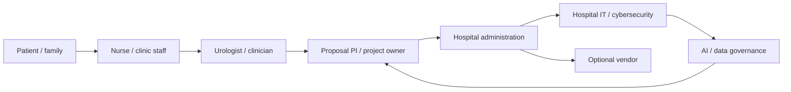
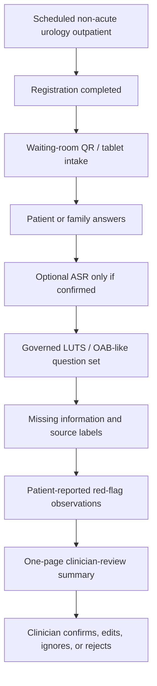
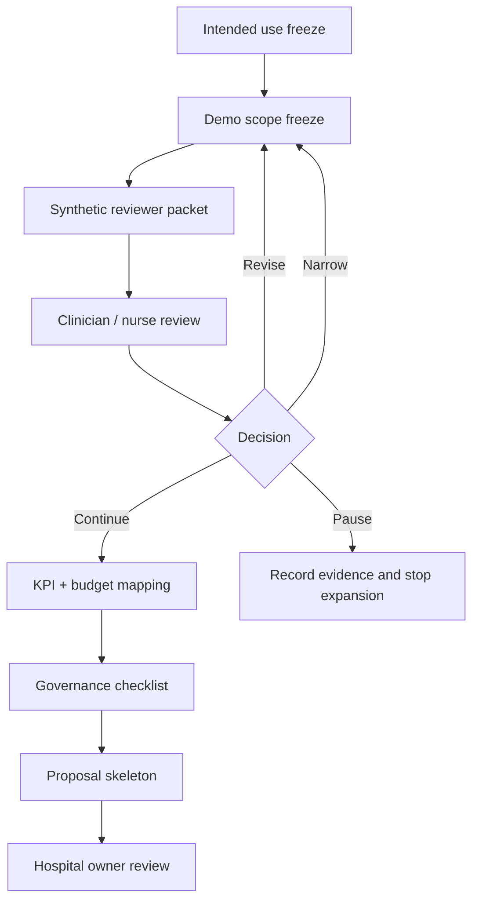
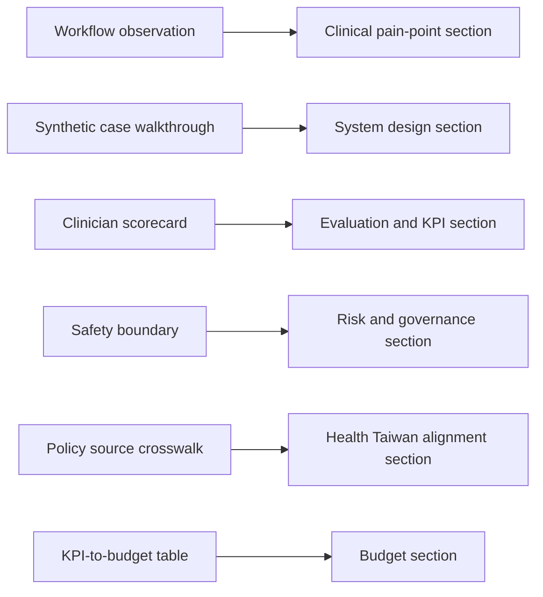

# Deep-Cultivation Postdoctoral Next-Step Review

Status: strategy review and next-step plan

Date: 2026-05-20

2026-06-19 owner update:

```text
This strategy review is historical context. Current planning is AI-only:
泌尿科門診前問診與醫師覆核摘要支持系統. CRM is fully out of Jason / 陽明交大
current package.
```

Role frame: postdoctoral researcher reviewing whether the urology previsit system should be shaped for a Health Taiwan Deep-Cultivation proposal.

## Purpose

This note answers:

```text
If this system is designed for a Health Taiwan Deep-Cultivation proposal,
what should the next step be?
```

It is not a new product scope. It is a proposal-facing strategy review that checks the suggested plan against:

- the current repo boundary
- the existing deep-cultivation positioning
- official Health Taiwan policy language
- realistic hospital deployment constraints
- clinical AI governance expectations

## Source Context

Official source spot-check on 2026-05-20:

| Source | Useful fact for this review |
| --- | --- |
| `https://htsprout.nhri.org.tw/dhplan.html` | Health Taiwan Deep-Cultivation Plan is organized around four categories: improving medical working conditions, talent cultivation, smart healthcare, and sustainable/social-responsibility healthcare. It is a five-year plan with a long-term deep-cultivation perspective, concrete strategies, and performance indicators. |
| `https://htsprout.nhri.org.tw/ApplyFlow.html` | The plan is staged: first stage runs from the 114 approved-plan date to the end of 115; second stage runs 116-118. The site also states a second-stage solicitation is expected in 115 Q4 for new applicants. |
| `https://aicenter.mohw.gov.tw/AC/cp-7200-82982-208.html` | Scope 3 smart-healthcare drafting must address cybersecurity governance, data governance, AI governance, and FHIR / TW Core IG readiness. |
| `https://www.mohw.gov.tw/cp-2704-86226-1.html` | The 115-04-27 first-stage results emphasize workflow improvement, technology reducing ineffective labor, cross-institution collaboration, FHIR exchange, and smart-healthcare services rather than model novelty alone. |

Local canonical files to keep using:

- `../core/DEEP_CULTIVATION_SYSTEM_POSITIONING.md`
- `DEEP_CULTIVATION_PROPOSAL_WRITING_GUIDE.md`
- `DEEP_CULTIVATION_SUBPROJECT_UROLOGY_PREVISIT_V0_1.md`
- `DEEP_CULTIVATION_SCORING_RUBRIC.md`
- `DEEP_CULTIVATION_MOHW_COMPLIANCE_RUBRIC.md`
- `../core/SAFETY_BOUNDARY.md`
- `../core/EVALUATION.md`
- `../core/FAILURE_ANALYSIS.md`

## Executive Judgment

The suggested direction is mostly correct.

Adopt the core proposal logic:

```text
workflow transformation project
not AI demo
```

But do not adopt every proposed feature or phrase literally.

Recommended adoption ratio:

```text
Adopt core strategy: high
Adopt specific feature expansion: selective
Adopt broad CRM / HIS / FHIR / vital-aware claims now: low
```

The right proposal posture is:

```text
泌尿科門診前問診與醫師覆核摘要支持系統
```

not:

```text
AI triage
AI diagnosis
AI screening
full hospital app
production HIS / EMR integration
CRM platform implementation
```

## Clinical Friction Reduction Update

The 2026-05-19 meeting follow-up adds an important correction from a hospital-operations perspective:

```text
Health Taiwan deep-cultivation should not ask medical staff to do more work for an AI research project.
It should use smart healthcare tools to reduce existing physician, nurse, and clinic-staff burden.
```

This means the proposal should treat `clinical friction reduction` as a first-class criterion, not a secondary benefit.

Use this decision rule:

```text
If a feature increases clicks, training, system switching, supervision, exception handling,
or routine clinician labeling without removing a larger burden, it should not become core scope.
```

The system should be designed as:

```text
Low-friction AI-mediated clinical workflow support for healthcare workforce burden reduction.
```

not:

```text
An AI research workflow that requires clinicians and nurses to feed or supervise the model.
```

See `CLINICAL_FRICTION_REDUCTION_ANALYSIS.md` for the full proposal-facing analysis.

## What To Adopt

### Adopt As Core

| Suggested idea | Decision | Reason |
| --- | --- | --- |
| Reframe as workflow transformation, not AI demo | Adopt | Matches official Health Taiwan emphasis on system reform, smart healthcare, working-condition improvement, and KPI. |
| Use safe naming instead of `AI triage` | Adopt | Already aligned with current accepted title: `泌尿科門診前問診與醫師覆核摘要支持系統`. |
| Single department / single workflow / single risk level | Adopt | Matches current `Revise + Narrow` decision and protects safety/governance. |
| Focus first on non-acute outpatient previsit intake | Adopt | Best fit for clinician-review summary without autonomous decision-making. |
| Define human review policy | Adopt | Already required by safety boundary and should be proposal-visible. |
| Define failure strategy | Adopt | Health Taiwan review will care about what happens when the system fails, not only when it works. |
| Use workflow KPIs | Adopt | Official proposal logic requires concrete measurable indicators and budget-to-KPI mapping. |
| Explicitly measure clinical friction and workforce burden | Adopt | The system must prove it reduces work rather than transferring burden to physicians, nurses, or clinic staff. |
| Build role-specific surfaces | Adopt conceptually | Patient, nurse, clinician, and management views should be defined even if demo UI remains limited. |
| Establish governance package | Adopt | Scope 3 smart-healthcare guidance explicitly stresses AI, cybersecurity, and data governance. |

### Adopt With Modification

| Suggested idea | Modified decision | Reason |
| --- | --- | --- |
| `Vital-aware AI Intake Support Platform` | Use only as future wording if vitals are actually in the workflow | Vitals integration should not be the proposal headline unless the hospital workflow includes measurement, ownership, and data source. |
| `AI-assisted Previsit Intake and Clinical Workflow Support System` | Useful English description, but Chinese proposal title should remain narrower | The current Chinese title is safer and already accepted by the repo's expert-review narrowing. |
| Include blood urine, flank pain, severe symptoms in first MVP | Treat only as patient-reported red-flag observations | These should not become first-version main pathways or automated triage. |
| CRM reminders and follow-up | Keep as future governed readiness | CRM is valuable but parked until SOP, consent, ownership, procurement, and data governance are defined. |
| FHIR / TW Core IG | Frame as future interoperability readiness | Official guidance expects readiness, but current demo should not claim real integration. |
| AI learns from override patterns | Defer until governance approval | Clinician edits can be sensitive clinical data; automatic learning needs IRB/privacy/governance review. |
| Three-year roadmap | Keep, but split Year 1 evidence from Year 2 pilot readiness | Do not imply clinical effectiveness before a governed pilot. |

### Defer Or Reject For Current Version

| Idea | Decision |
| --- | --- |
| Autonomous triage | Reject for current scope |
| Diagnosis or differential diagnosis | Reject |
| Treatment or medication recommendation | Reject |
| Real patient deployment before governance | Reject |
| Direct EMR writeback | Reject |
| Production HIS integration | Reject |
| Broad multi-department rollout | Defer |
| Full CRM implementation | Defer |
| Patient-facing risk score | Reject |
| Queue prioritization | Reject |

## Strategic Design For The Proposal

### Official Proposal Positioning

Use:

```text
本子計畫擬建置「泌尿科門診前問診與醫師覆核摘要支持系統」，
以非急性泌尿科門診病人為初期對象，透過受治理之題庫、
病人或家屬填答、缺漏欄位提示、來源標記與一頁式醫師覆核摘要，
協助門診前整理主訴與症狀脈絡，評估是否能減少重複問診、
提升資料完整性，並建立未來智慧醫療導入所需之 AI、資安與資料治理基礎。
```

Avoid:

```text
AI 幫你分流
AI 判斷該看哪科
AI 診斷泌尿疾病
AI 自動產生正式病歷
AI 自動決定是否急診
```

### Health Taiwan Category Mapping

| Category | Proposal fit | How to write it |
| --- | --- | --- |
| 範疇三：導入智慧科技醫療 | Primary | Guided intake, governed question engine, optional ASR, summary generation, audit logging, AI/data/cybersecurity governance. |
| 範疇一：優化醫療工作條件 | Secondary | Reduce repeated basic history-taking, missing-information repair, and avoidable summary-preparation burden. |
| 範疇二：規劃多元人才培訓 | Supporting only if planned | Clinician-engineer co-design, responsible-AI training, IRB/data-governance training, student participation. |
| 範疇四：社會責任醫療永續 | Future supporting | Community screening return flow, case management, or CRM follow-up only if separately governed. |

### Proposal Storyline

Use this sequence:

```text
1. Hospital outpatient workflows have repeated previsit information gaps.
2. Non-acute urology LUTS / OAB-like visits are a safe and bounded first case.
3. A waiting-room QR/tablet intake can collect repeated patient-reported context.
4. AI and ASR support input and summary preparation, but do not make decisions.
5. The output is a short clinician-review summary with uncertainty and source trace.
6. The project is evaluated by workflow value, safety, governance, and adoption realism.
7. Future CRM/interoperability follows only after evidence and governance gates.
```

## Next-Step Plan

### Gate 0: Parent Proposal And Eligibility Clarification

Before more feature design, clarify:

- formal applicant
- application mode
- whether this is part of an existing first-stage execution, second-stage continuation, or second-stage new application
- proposal owner
- hospital unit owner
- budget owner
- IT/security reviewer
- clinical workflow owner

Output:

```text
one-page applicant / owner / route note
```

### Gate 1: Intended Use Freeze

Write or extract a concise intended-use statement.

Minimum content:

- target department: urology
- target setting: scheduled non-acute outpatient visit
- target moment: after registration / waiting room
- target user: patient or family, with optional staff assistance
- target symptom group: non-acute LUTS / OAB-like symptoms
- output: clinician-review summary
- explicit non-use: diagnosis, treatment, triage, formal EMR note, emergency workflow

Output:

```text
Intended Use + Non-Use one-pager
```

### Gate 2: Demo Scope Freeze

Freeze the June / next review demo scope.

Recommended freeze:

```text
Included:
- three to five synthetic cases
- guided LUTS / OAB-like intake
- patient/family source labeling
- missing-information list
- red-flag observation wording
- one-page clinician-review summary
- audit/version metadata design

Excluded:
- real patient data
- autonomous triage
- diagnosis
- treatment advice
- queue priority
- direct HIS / EMR integration
- CRM implementation
- production LINE / APP deployment
```

Output:

```text
Demo Scope Freeze note
```

### Gate 3: Workflow Evidence Package

Prepare materials for clinician/nurse review:

- current workflow map
- proposed workflow map
- stakeholder map
- summary sample
- missing-field sample
- failure-mode table
- role-responsibility table
- 10-minute review scorecard

Output:

```text
Phase 0 reviewer packet
```

### Gate 4: Governance Package

The proposal should have a visible governance package even before pilot.

Minimum package:

- clinical boundary
- AI boundary
- data boundary
- cybersecurity boundary
- access-control assumptions
- audit-log fields
- version-governance fields
- human review policy
- escalation policy
- procurement / outsourcing boundary

Output:

```text
Clinical AI Boundary + Governance Checklist
```

### Gate 5: KPI And Budget Mapping

Every budget line should map to a KPI.

| Work package | KPI | Budget logic |
| --- | --- | --- |
| Guided intake | completion rate, missing-field reduction | patient-facing form / tablet / QR workflow |
| Optional ASR | confirmed transcript rate, input burden reduction | ASR service only if language/accessibility KPI exists |
| Summary generation | clinician read time, usefulness score, correction rate | engineering and review work |
| Governance | zero unsafe wording, 100% source trace | AI/data/security governance time |
| Review sessions | clinician/nurse usefulness and burden scores | coordinator and evaluation budget |
| Future CRM readiness | SOP completed, owner identified | no implementation budget unless phase is reopened |

Output:

```text
KPI-to-budget table
```

## Suggested 30-Day Roadmap

| Time box | Primary work | Exit evidence |
| --- | --- | --- |
| Days 1-3 | Intended use, non-use, demo scope freeze | signed-off or internally accepted one-page boundary |
| Days 4-7 | Update reviewer packet and synthetic cases | three to five review-ready synthetic flows |
| Week 2 | Clinician/nurse review session | filled scorecard and revise/narrow/continue decision |
| Week 3 | Governance and KPI-to-budget mapping | governance checklist and KPI table |
| Week 4 | Proposal skeleton refinement | draft sections for workflow, technical method, governance, KPI, budget |

## Key Mermaid Diagrams

### Stakeholder Map



### Proposal-Safe Workflow



### Governance Gate Roadmap



### Evidence-To-Proposal Mapping



## Missing Artifacts

Several suggested documents already exist in this repo, but three gaps remain.

| Suggested artifact | Current repo status | Next action |
| --- | --- | --- |
| Intended Use Document | partially spread across positioning, safety, proposal guide | extract a one-page intended-use freeze before next hospital-facing draft |
| Clinical Boundary Document | mostly exists in `../core/SAFETY_BOUNDARY.md` | add Health Taiwan / proposal wording only if needed |
| Workflow Architecture Spec | mostly exists in `../core/WORKFLOW_LOGIC.md` and proposal guide | create reviewer-facing simplified map if needed |
| Failure Mode & Safety Analysis | exists in `../core/FAILURE_ANALYSIS.md` | add deep-cultivation scoring link if needed |
| Demo Scope Freeze | missing as a standalone artifact | create next; this is the most useful new file |
| Version Governance Register | partially represented in audit/version language | define concrete version fields before pilot-ready claim |

## Postdoctoral-Level Research Framing

The stronger research question is:

```text
How can AI safely compress previsit patient narratives into clinician-reviewable workflow artifacts under real-world hospital constraints?
```

For Health Taiwan, translate that into a service-system claim:

```text
以受治理之 AI 輔助問診與摘要流程，改善非急性泌尿科門診前資料完整性與醫師覆核效率，
並建立可查核、可治理、可擴充之智慧醫療工作流程基礎。
```

This is stronger than:

```text
We built a medical chatbot.
```

## Final Recommendation

Proceed, but only under a narrow, governable proposal design.

The immediate next step should not be adding more AI features. The immediate next step should be:

```text
1. freeze intended use
2. freeze demo scope
3. prepare reviewer evidence
4. define governance gates
5. map KPI to budget
```

The first credible Health Taiwan version is not a powerful medical AI. It is a low-risk, clinician-reviewed workflow-support system that can prove it reduces friction without increasing clinical ambiguity.
