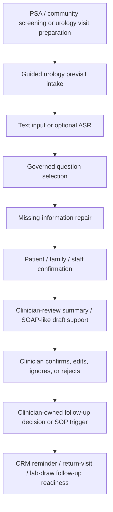

# Deep-Cultivation Proposal Writing Guide

Status: working guide

## Purpose

This guide answers:

```text
深耕計畫的提案撰寫，需要寫什麼？
```

Use it when drafting the Health Taiwan deep-cultivation section for the urology previsit / visit-readiness system.

The proposal should not read like an AI model report. It should read like a healthcare workflow-improvement plan that uses AI, ASR, APP, CRM, and governance to reduce real clinical burden while preserving clinician authority.

## Core Proposal Logic

The proposal must answer one practical question:

```text
Can this system truly improve a healthcare workflow in a hospital or community-care setting?
```

It should not primarily answer:

```text
Which AI model is newest?
```

For this repo, the correct story is:

```text
PSA / community screening
-> SOP and return-to-hospital flow
-> urology visit-readiness intake
-> clinician-review summary
-> CRM reminder / follow-up support
-> measured workflow improvement
```

The proposal should keep the current system identity:

```text
urology previsit / visit-readiness / clinician-review summary / CRM follow-up support
```

not:

```text
AI triage / autonomous risk scoring / AI diagnosis / direct EMR writeback
```

## Recommended Proposal Structure

| Section | What It Must Prove | What To Write For This Project |
| --- | --- | --- |
| 1. Policy and clinical background | The problem matters under Health Taiwan priorities | Link to `導入智慧科技醫療`, `優化醫療工作條件`, and community/CRM continuity |
| 2. Clinical pain point | The current workflow has a real operational problem | Repeated urology history-taking, incomplete previsit context, weak follow-up continuity after screening |
| 3. Project objective | The project has a concrete service goal | Build a governed urology visit-readiness and CRM-follow-up support workflow |
| 4. Service workflow | The system fits a real hospital process | Map screening, check-in/previsit intake, summary review, clinician confirmation, and follow-up |
| 5. System design | The system components are understandable | Patient input, optional ASR, governed question engine, missing-information repair, summary draft, CRM readiness, audit log |
| 6. AI / technical method | Technology supports the workflow | ASR, LLM-assisted summarization, governed question selection, structured summary generation, audit/version tracking |
| 7. Data and governance | Patient data, security, and responsibility are controlled | IRB, consent, privacy, de-identification, access control, logging, human-in-the-loop, security review |
| 8. KPI and evaluation | Outcomes are measurable | Time, missing fields, repeated questions, clinician usefulness, completion, staff burden, CRM follow-up readiness |
| 9. Implementation plan | The work is staged and executable | Year 1 design/walkthrough, Year 2 pilot preparation/CRM workflow, Year 3 scale-up readiness |
| 10. Team and training | People can execute and govern it | PI/co-PI roles, hospital stakeholders, 吳老師團隊, student/engineer roles, IRB training |
| 11. Budget and procurement | Money maps to KPI | Personnel, APP/CRM/API work, ASR/cloud or server, security review, vendor/procurement assumptions |
| 12. Expected outcomes | The hospital receives durable value | Reduced repeated work, better visit readiness, follow-up continuity, governance-ready smart-healthcare workflow |
| 13. Risk and boundary | The proposal does not overclaim | No diagnosis, treatment advice, autonomous triage, production deployment, or real patient-data use without governance |

## Storyline To Use

Start from the clinic, not the model.

Recommended storyline:

1. Urology outpatient and PSA/community-screening workflows create repeated information capture and follow-up burden.
2. Screening is incomplete if it does not connect to SOP, return flow, case management, and CRM.
3. A guided previsit workflow can collect repeated, previsit-safe information earlier.
4. AI and ASR can reduce input and summary-preparation burden, but all output stays clinician-reviewed.
5. CRM/reminder support can improve follow-up continuity after the clinician or SOP confirms the need.
6. Governance, KPI, and budget mapping make the project executable rather than a demo.

Do not lead with:

- LLM novelty
- model benchmark scores
- broad AI transformation slogans
- autonomous triage
- direct hospital-system integration claims

## Proposal-Safe System Architecture



This diagram is intentionally not an AI triage diagram. It does not include queue prioritization, autonomous urgency labels, or direct EMR writeback.

## Technical Section Guidance

The technical method should be written after the workflow section.

Use this order:

1. Patient-facing guided intake
2. Optional ASR as an input layer
3. Governed urology question bank
4. Dynamic question selection within approved boundaries
5. Missing-information detection
6. Structured clinician-review summary
7. SOAP-like draft support, only for clinician review
8. CRM follow-up readiness
9. Audit logging and version tracking
10. Future interoperability readiness, if governance permits

Allowed technical wording:

- `clinician-review summary`
- `SOAP-like draft support`
- `human-in-the-loop`
- `governed question selection`
- `future FHIR/TW Core IG readiness`
- `CRM follow-up readiness`
- `auditability and traceability`

Avoid technical wording:

- `AI doctor`
- `AI triage`
- `risk score`
- `automatic diagnosis`
- `automatic treatment recommendation`
- `direct HIS/EMR integration in the current demo`
- `clinical effectiveness proven`

## Clinical Workflow Integration

The proposal must show how the system enters the real workflow.

Write the before/after clearly:

| Current workflow problem | Proposed workflow change |
| --- | --- |
| Patient symptoms are collected late or repeatedly | Collect repeated, previsit-safe information before clinician-led interpretation |
| Physicians spend time reconstructing basic history | Provide a short clinician-review summary |
| Missing context appears during the visit | Surface missing information before handoff |
| Screening may not connect cleanly to follow-up | Use SOP and CRM readiness for return visits, lab draws, and case-management status |
| AI demo value is unclear | Tie AI to measurable workflow burden reduction |

The proposal should explicitly name who acts at each step:

- patient or helper completes intake
- nurse or staff repairs missing information when needed
- clinician reviews and owns interpretation
- CRM owner or service SOP handles follow-up only after governance approval

## KPI And Evaluation Design

Use measurable KPI. Avoid generic phrases like `提升效率` without a metric.

Candidate KPI:

| KPI Category | Candidate Indicator | Why It Matters |
| --- | --- | --- |
| Visit readiness | Clinician can review summary in under one minute | Prevents long-transcript burden |
| Repeated work | Repeated history questions reduced in walkthrough or pilot | Tests actual workflow value |
| Missing information | Missing key previsit fields reduced after repair prompts | Tests readiness improvement |
| Completion feasibility | Patient/helper/staff-assisted completion rate reaches agreed target | Tests adoption reality |
| Clinician usefulness | Clinician usefulness rating reaches agreed threshold | Tests whether physicians would read it |
| Staff burden | Nurse/staff burden remains acceptable | Prevents hidden workload transfer |
| CRM continuity | Return-visit, lab-draw, or follow-up SOP is defined | Tests service continuity |
| Governance | IRB/privacy/security/procurement gates have owners | Tests execution readiness |
| Safety boundary | Zero diagnosis, treatment, or autonomous triage claims | Preserves clinical responsibility |
| Auditability | Output source and review status are traceable | Supports responsible AI |

Each KPI should have:

- baseline or current-process assumption
- target or draft target
- measurement method
- owner
- matching budget line, if money is requested

## Budget Logic

The budget must follow the KPI.

Write the logic as:

```text
Because the project must achieve KPI X,
we need work package Y,
therefore the budget includes Z.
```

Examples:

| If The Proposal Claims | Then Budget May Include | Required Justification |
| --- | --- | --- |
| guided previsit completion | APP / web intake work, usability review | completion KPI and patient/helper workflow |
| reduced summary burden | ASR or summary-generation work | review-time and clinician-usefulness KPI |
| CRM follow-up continuity | CRM platform/customization or vendor work | reminder/follow-up KPI and SOP owner |
| governed pilot readiness | security review, audit logging, RA/coordinator | IRB/privacy/security/procurement gates |
| cross-domain training | training time or student/RA support | talent-training plan and role definition |

Do not include a budget line only because it is technically interesting.

## Governance Section Checklist

The governance section should include:

- IRB training and approval path
- patient-data boundary
- consent model before real patient data
- data retention and deletion rules
- role-based access control
- audit logging
- model / prompt / rule versioning
- clinician review and override
- error reporting
- security-governance review for APP, API, CRM, or platform work
- procurement review for outsourced work
- MOU or written collaboration record for cross-unit partners

The proposal should say that discovery and demo materials use synthetic or non-real data unless a separate governance decision approves otherwise.

## Three-Year Writing Frame

## Year 1: Design, Governance, And Workflow Validation

Write:

- finalize service workflow from PSA/community screening to urology visit-readiness
- define governed urology question bank
- build or refine clinician-review summary format
- run synthetic walkthrough and stakeholder review
- define CRM follow-up SOP draft
- list IRB, privacy, security, MOU, and procurement gates
- collect clinician/staff feedback on readability and burden

## Year 2: Pilot Preparation And CRM Workflow Prototype

Write:

- refine patient/helper/staff-assisted workflow
- prepare audit log and review-status requirements
- define CRM reminder, lab-draw, return-visit, or case-management prototype
- decide internal, outsourced, or hybrid ownership
- complete required governance before any real patient-data workflow
- prepare interoperability-readiness mapping only if hospital stakeholders request it

## Year 3: Evidence-Based Scale-Up Readiness

Write:

- evaluate whether workflow burden and visit-readiness improved
- decide whether the system should extend beyond urology/PSA
- decide whether CRM follow-up becomes a sustained service module
- prepare integration discussion only after evidence, governance, and ownership are clear
- keep diagnosis, treatment, and autonomous triage outside scope unless separately approved

## One-Page Proposal Skeleton

Use this as the first draft skeleton:

```text
Title:
智慧泌尿科門診前問診與 CRM 追蹤支持系統

Problem:
PSA/community screening and urology outpatient workflows need SOP, visit-readiness support, clinician-review summaries, and follow-up continuity.

Objective:
Build a governed urology previsit and CRM-readiness workflow that reduces repeated information capture and supports clinician review.

Workflow:
Screening/visit preparation -> guided intake -> missing-information repair -> clinician-review summary -> clinician-owned follow-up decision -> CRM reminder/follow-up readiness.

Technology:
Optional ASR, governed question selection, structured summary generation, audit/version logging, and future interoperability readiness.

Governance:
Human-in-the-loop, no diagnosis, no treatment advice, no autonomous triage, no real patient-data workflow without IRB/privacy/security approval.

KPI:
Review time, missing fields, repeated questions, completion feasibility, clinician usefulness, staff burden, CRM SOP readiness, auditability, and governance gates.

Budget:
Personnel, intake/APP work, CRM/API readiness, ASR or summary module, security/governance, and vendor/procurement items only when tied to KPI.

Expected impact:
Reduced repeated work, improved visit readiness, stronger follow-up continuity, responsible AI governance, and Health Taiwan smart-healthcare alignment.
```

## Common Failure Modes

Avoid these:

- writing the proposal as `LLM + RAG + ASR` before explaining clinical pain
- claiming hospital integration before governance and ownership exist
- promising AI triage when the current scope is previsit readiness
- adding vital-sign/kiosk/smart-pharmacy components without explaining the workflow slot
- listing KPI without data source, owner, or measurement method
- listing budget without a matching KPI
- treating Aging Clock as core before its data source, aging definition, intervention, and IRB path are defined
- citing external examples as if this project already has their validation status

## Minimum June 2 Draft Package

Before the June 2 follow-up, prepare:

1. One-page 子計畫二 narrative.
2. Workflow diagram.
3. Three-year milestone table.
4. KPI table with measurement method.
5. KPI-to-budget mapping.
6. Governance gate checklist.
7. Scope boundary paragraph.
8. Open decision list: CRM scope, vendor/internal split, IRB timing, MOU partners, and whether optional kiosk/smart-pharmacy ideas are core or parked.
