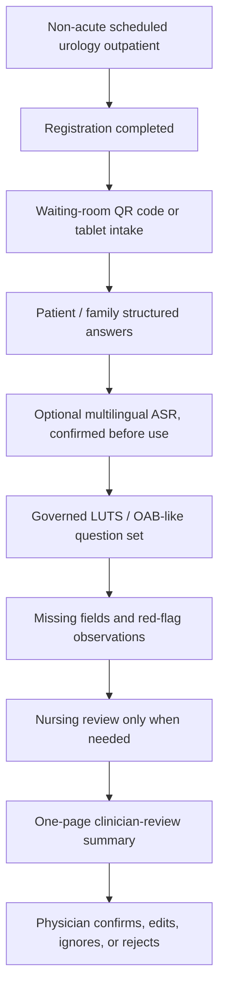

# Deep-Cultivation Proposal Writing Guide

Status: working guide

## Purpose

This guide answers:

```text
深耕計畫的提案撰寫，需要寫什麼？
```

Use it when drafting the Health Taiwan deep-cultivation section for the urology previsit / visit-readiness system.

The proposal should read like a healthcare workflow-improvement plan that uses AI, optional ASR, APP/tablet intake, and governance to reduce real clinical burden while preserving clinician authority.

2026-06-02 official meeting minutes, the 2026-06-19 owner update, and the
2026-06-23 official meeting minutes define the current writing split. The parent
信義 package currently carries PSA 篩檢與智慧問診 at NT$15,000,000, CRM at
NT$15,000,000, and 信義門診部碳盤查 at NT$7,500,000. Jason / 陽明交大 current
package owns the AI 問診、醫師覆核摘要、治理、KPI evidence, and NT$10,000,000
AI-only budget mapping; CRM, PSA clinical SOP, and carbon inventory are carried
by parent proposal / other-team workstreams.

The next parent-proposal review gate is 2026-07-14 same time, updated from the
original 2026-07-07 09:30 gate by the 2026-07-01 北市聯醫 LINE notice; Jason /
Wu team has no time conflict. Drafting before that meeting should support one
merged plan with KPI, budget, partner route, owner, evidence, and procurement /
asset-category controls.

The copied 2026-07-01 116-118 application guidance establishes the
second-stage submission-prep frame. The verified 2026-07-13 solicitation
briefing is now the latest briefing-level rule layer: proposal writing confirms
continuation/new-project status, applicant mode, funding ceiling, official
scope/goal -> 116/117/118 target -> method -> KPI -> outcome -> budget -> owner
linkage, block-grant and 30% capital controls, public-KPI governance, and
platform/package readiness. Formal circulation remains gated by the latest
official call document and digital-platform rules.

All proposal writing must follow `../core/ASSERTIVE_WRITING_POLICY.md`.

The proposal should be confident, direct, and affirmative. Safety boundaries remain mandatory, and they should be written as deliberate design choices, scope controls, governance gates, and claim-evidence alignment.

Proposal openings should also earn attention. Start with a real-world clinical
workflow burden or credible near-future risk, cite the official source, local
evidence record, stakeholder meeting note, or measured artifact that supports
that opening, describe current solution approaches fairly, name the remaining
gap as workflow fit / claim-evidence alignment / validation / safety /
scalability / governance, and then introduce this project as the new
architecture or framing that addresses the opening problem.

Before circulating a draft section, run `ASSERTIVE_WRITING_GATE.md`.

Before freezing a proposal package or sending a materially updated packet to an
external reviewer, check `../VERSIONING.md` and decide whether the repo version
needs a `patch`, `minor`, or `major` bump. The version number marks proposal and
governance stability beyond file edits.

For the 2026-05-20 postdoctoral strategy review of what to adopt, modify, or defer before a Health Taiwan proposal, use `DEEP_CULTIVATION_POSTDOC_NEXT_STEP_REVIEW.md`. Its practical next-step order is:

```text
freeze intended use -> freeze demo scope -> prepare reviewer evidence
-> define governance gates -> map KPI to budget
```

For the clinical friction and workforce-burden reduction principle, use `CLINICAL_FRICTION_REDUCTION_ANALYSIS.md`. This principle should be treated as a proposal-writing gate: the project must reduce medical-staff burden while protecting clinicians and nurses from routine AI labeling, extra-form filling, and workflow-change load.

For the current 2026-06-19 expert-review package, use:

- `../records/2026-07-02/xinyi-july14-complete-download-package-index.md`
- `../records/2026-07-02/xinyi-july14-pre-integration-expert-task-packet.md`
- `../records/2026-07-02/line-xinyi-deep-cultivation-health-service-center-psa-three-high-record.md`
- `../records/2026-06-02/outpatient-deep-cultivation-official-meeting-minutes.md`
- `../records/2026-06-23/taipei-city-hospital-huashan-xinyi-deep-cultivation-official-meeting-minutes.md`
- `../records/2026-06-23/deep-cultivation-2026-07-07-integration-schedule.md`
- `../records/2026-07-01/line-tch-merged-plan-review-postponement.md`
- `../records/2026-07-01/health-taiwan-stage2-application-guidance-record.md`
- `../records/2026-07-13/README.md`
- `exports/nycu-wu-team-ai-previsit-health-taiwan-complete-plan-2026-06-19.md`
- `../records/2026-06-19/nycu-ai-previsit-expert-review-analysis.md`
- `../records/2026-06-19/sources/nycu-ai-previsit-expert-review/README.md`
- `exports/nycu-ai-previsit-expert-review-packet-2026-06-19.md`
- `exports/nycu-ai-previsit-proposal-item-definitions-2026-06-19.md`
- `DEEP_CULTIVATION_KPI_TO_BUDGET_TABLE.md`
- `DEEP_CULTIVATION_KPI_BUDGET_ANNUAL_INTEGRATION_TABLE.md`

The 2026-07-02 package index is the current control index for the 7/14 handoff:
it connects the 6/23 official meeting, 7/1 postponement, 7/2 LINE owner split,
current proposal exports, and Downloads package. Use the task packet for
questions to 廖醫師 and the LINE record for current owner routing before
rewriting formal proposal sections.

Use `../records/2026-07-09/huashan-plan-format-reference-analysis-for-xinyi-urology.md`
as a peer-reference analysis for formatting and review discipline: agent control
notes, issue queues, quarterly checkpoints, KPI / budget / governance linkage,
shared-resource ownership, and 60%核刪版 planning. It is not a content source
for the 信義 / 泌尿 AI-only scope.

Use `../records/2026-07-09/health-taiwan-application-writing-spec-analysis-for-xinyi.md`
before rewriting official proposal sections. It maps the copied application
writing specification into chapter responsibilities, 20-page compression,
KPI/budget/governance traceability, and the current 信義 / PSA / 智慧問診 package
boundaries. It should control where facts belong: problem framing in `貳`,
work packages in `肆`, KPI and checkpoints in `伍`, budget in `柒`, staffing in
`捌`, and governance/risk/attachments in `玖`.

Use `../records/2026-07-13/README.md` immediately before proposal drafting as
the current official-briefing control layer. Its source-backed checks govern
applicant/category choice, second-stage project type, three-year targets,
grant-interface statements, KPI/public-result stewardship, block-grant budget
structure, application files, and the final-notice validation gate.

The same-day LINE coordination record adds the active review sequence: the
2026-07-14 meeting starts with the Zhongxiao proposal at 10:00, all subproject
owners are expected to attend, and document work is time-critical. For PSA and
AI/data content, write the adult-health-check service purpose separately from
research or retrospective-analysis purposes; assign a PI/IRB liaison and obtain
the hospital's formal general/expedited/exempt determination before research or
real-data analysis activates.

For historical official-format drafting context, use:

- `INTENDED_USE_FREEZE.md`
- `DEMO_SCOPE_FREEZE.md`
- `DEEP_CULTIVATION_OFFICIAL_FORMAT_CROSSWALK.md`
- `DEEP_CULTIVATION_APPLICATION_DRAFT_V0_7.md`
- `DEEP_CULTIVATION_APPLICATION_DRAFT_V0_6.md`
- `DEEP_CULTIVATION_APPLICATION_DRAFT_V0_5.md`
- `DEEP_CULTIVATION_APPLICATION_DRAFT_V0_4.md`
- `DEEP_CULTIVATION_KPI_TO_BUDGET_TABLE.md`
- `DEEP_CULTIVATION_KPI_BUDGET_ANNUAL_INTEGRATION_TABLE.md`
- `DEEP_CULTIVATION_GOVERNANCE_CHECKLIST.md`
- `DEEP_CULTIVATION_ANNUAL_CHECKPOINT_TABLE.md`

For the 2026-05-21 A2-0048 precedent proposal capture and postdoctoral
comparison, use:

- `../records/2026-05-21/a2-0048-smart-healthcare-center-precedent/README.md`

The precedent should be used as a format and execution-packaging reference while the current urology proposal stays focused on its deliberate previsit workflow scope.

Use `exports/nycu-wu-team-ai-previsit-health-taiwan-complete-plan-2026-06-19.md`
as the current proposal-writing entrypoint. It keeps the NT$10,000,000 /
KPI-budget controls, makes `範疇三：導入智慧科技醫療` the primary category, uses
`範疇一：優化醫療工作條件` as secondary support, and transfers the expert-review
recommendations into the Health Taiwan deep-cultivation section format. The
PSA document is a format reference and parent context source; its PSA SOP,
screening operations, abnormal-case tracking, CRM, and patient-management
content are not part of the current NYCU Wu-team AI-only previsit plan.

When a draft must mention the parent allocation, use this wording pattern
updated by the 2026-06-23 meeting:

```text
信義母案目前整合 PSA 篩檢與智慧問診 NT$15M、CRM 系統 NT$15M、
以及信義門診部碳盤查 NT$7.5M。本工作稿聚焦吳老師 / 陽明交大團隊
可交付的 AI 智慧問診與醫師覆核摘要，以三年 NT$10M 作為 AI-only
工作包；CRM、PSA 臨床 SOP 與碳盤查由母案或另案團隊承接。
```

When writing budget resilience after the 2026-06-23 meeting, use this pattern:

```text
本案以 KPI 服務量能為核心承諾，並以租賃服務、分年執行、採購範圍控制
與非核心模組排序回應審查刪減情境。硬體設備與無形資產均依 30% 控制
規劃；軟體系統優先採租賃 / service 模式，健康艙採買斷設備方向規劃。
```

Use `exports/nycu-ai-previsit-expert-review-packet-2026-06-19.md` as an earlier
expert handoff packet retained for traceability.

Use `DEEP_CULTIVATION_APPLICATION_DRAFT_V0_7.md`, `DEEP_CULTIVATION_APPLICATION_DRAFT_V0_6.md`, and `DEEP_CULTIVATION_APPLICATION_DRAFT_V0_5.md` as prior NT$10,000,000 discussion baselines only.

2026-05-19 expert-review update:

```text
Revise + Narrow.
```

For the first proposal-facing version, use:

```text
泌尿科門診前問診與醫師覆核摘要支持系統
```

Safe descriptive boundary:

```text
泌尿科門診前症狀蒐集與醫師覆核摘要輔助流程
```

Write this as a governed previsit workflow-support system. CRM follow-up is
parent-proposal or other-team context only for the current Jason / 陽明交大
package. ASR stays an optional confirmed-input layer. The first version focuses
on non-acute LUTS / OAB-like outpatients: nocturia, frequency, urgency, leakage,
voiding difficulty, or weak stream. Blood in urine, fever/chills, flank pain,
and currently being unable to urinate are patient-reported red-flag observations
recorded for clinician review.

## Assertive Writing Method

Use confident contribution-first language. State what the system does, why the scope is deliberate, and how governance preserves clinical authority.

| Defensive draft language | Proposal-ready language |
| --- | --- |
| 本系統只是門診前輔助工具。 | 本系統是門診前資訊整理與醫師覆核摘要的 workflow layer。 |
| 診斷權責需要清楚。 | 診斷與治療決策保留於醫師端，系統專注於 previsit information compression。 |
| 實證路徑需要分階段。 | 目前 evidence path 採 synthetic and expert-review materials，作為治理核准前的安全驗證階段。 |
| 還需要更多研究。 | 下一階段將以醫師閱讀時間、重複問診減少、缺漏欄位可見度與 staff-friction review 驗證 workflow value。 |
| HIS/EMR 關係需要清楚。 | 系統刻意設計為可與 HIS/EMR 邊界共存的 focused previsit workflow layer。 |

Required sequence for proposal paragraphs:

```text
contribution first -> deliberate scope second -> governance boundary third
```

Open proposal sections with capability, evidence, scope control, and next validation language.

## Core Proposal Logic

The proposal must answer one practical question:

```text
Can this system truly improve a healthcare workflow in a hospital or community-care setting?
```

It should support this secondary question:

```text
Which AI model is newest?
```

For 陳美如主任 and similar 北市聯醫 service-system stakeholders, the practical review question is even sharper:

```text
Can this enter the real hospital / community-care workflow, reduce work, stay governable, and survive after the demo year?
```

That means the proposal should make workflow slot, staff burden, cross-system continuity, KPI, owner, budget, governance, and maintenance visible before it explains AI model details.

The proposal should also make clinical friction visible before it explains AI details:

```text
Does this reduce the existing burden on physicians, nurses, and clinic staff,
or does it merely ask them to do more work for the AI system?
```

For this repo, the correct story is:

```text
stable urology outpatient
-> after-registration or waiting-room QR code / tablet symptom collection
-> missing-field visibility
-> patient-reported red-flag observation display
-> one-page clinician-review outpatient summary
-> measured workflow and summary usefulness review
```

The broad system identity remains:

```text
urology previsit intake / visit-readiness / clinician-reviewed summary
```

But the first-version proposal label should be:

```text
泌尿科門診前問診與醫師覆核摘要支持系統
```

not:

```text
AI triage / autonomous risk scoring / AI diagnosis / direct EMR writeback
```

## A2-0048 Precedent Lessons

The A2-0048 precedent is a useful institutional-scale reference because it shows
how a Health Taiwan proposal can package official sections, partners, KPI,
budget, annual checkpoints, governance and personnel into one submission.

Adopt these lessons:

- map each major claim to official scope, KPI, budget, owner, checkpoint and evidence artifact
- make workforce-burden reduction measurable, including baseline survey or before/after workflow evidence
- include AI, cybersecurity and data governance as first-class work packages
- prepare owner tables and review-response tables early
- show annual checkpoints with planned dates, cumulative progress, planned spending and expected evidence
- use the official cover, self-check, COI, no-duplicate-funding, partner-consent and appendix structure

Convert these precedent risks into v0.5 scope controls:

- broad module sprawl becomes a focused first workflow with later expansion gates
- autonomous or near-autonomous diagnosis, treatment, prescribing, triage or queue-priority wording becomes clinician-owned decision language
- large-scale savings, accuracy or adoption claims become KPI-backed workflow evidence
- Word template errors and internal draft residue become a clean official-format readiness check

Postdoctoral judgment after reviewing the precedent:

```text
Keep the narrow urology previsit design.
Learn the precedent's official-format discipline.
Adopt its proposal mechanics while preserving focused scope and clinician-owned decision language.
```

## Recommended Proposal Structure

| Section | What It Must Prove | What To Write For This Project |
| --- | --- | --- |
| 1. Policy and clinical background | The problem matters under Health Taiwan priorities | Lead with `導入智慧科技醫療`; use `優化醫療工作條件` as secondary workflow-burden support |
| 2. Clinical pain point | The current workflow has a real operational problem | Repeated urology history-taking, incomplete previsit context, and lack of a short clinician-readable intake summary |
| 3. Project objective | The project has a concrete service goal | Build a governed urology previsit intake and clinician-reviewed summary support workflow |
| 4. Service workflow | The system fits a real hospital process | Map registration, waiting-room QR/tablet intake, source-labeled answers, missing-field review, clinician summary, and physician review |
| 5. System design | The system components are understandable | Patient/family input, optional multilingual ASR, governed question engine, missing-information repair, red-flag observation display, summary draft, audit log |
| 6. AI / technical method | Technology supports the workflow | ASR, LLM-assisted summarization, governed question selection, structured summary generation, audit/version tracking |
| 7. Data and governance | Patient data, security, and responsibility are controlled | IRB, consent, privacy, de-identification, access control, logging, human-in-the-loop, security review |
| 8. KPI and evaluation | Outcomes are measurable | Synthetic flow completion, read time, missing fields, unsafe wording count, source labels, ASR confirmation, clinician usefulness, staff burden |
| 9. Implementation plan | The work is staged and executable | Year 1 design/walkthrough, Year 2 governed pilot preparation, Year 3 scale-up readiness |
| 10. Team and training | People can execute and govern it | PI/co-PI roles, hospital stakeholders, 吳老師團隊, student/engineer roles, IRB training |
| 11. Budget and procurement | Money maps to KPI | Personnel, APP/tablet intake work, ASR/cloud or server if used, security review, governance support, vendor/procurement assumptions |
| 12. Expected outcomes | The hospital receives durable value | Evaluated reduction of repeated work, better visit readiness, and governance-ready smart-healthcare workflow |
| 13. Scope control and governance | The proposal aligns claims with approved evidence | Clinician-owned diagnosis and treatment, institution-owned triage, governed deployment, and governed patient-data use |

Add a clinical-friction check inside sections 4, 8, 9, and 11:

```text
The project protects clinicians and nurses from extra routine labeling,
extra dashboards, extra exception handling, and major workflow retraining by tying
each workflow change to a larger existing burden that the system demonstrably reduces.
```

## 陳美如主任 Reviewer Lens

Use `../records/2026-05-19/chen-meiru-stakeholder-profile.md` when preparing materials for 北市聯醫.

Likely priorities:

- real workflow landing: registration, waiting-room intake, clinician summary, and human review must be operationally plausible
- staff-burden reduction: the system protects nursing and administrative attention while reducing existing workflow load
- cross-system continuity: outpatient workflow, community screening, case management, future CRM, and future HIS/EMR readiness form a connected service chain
- governance and responsibility: human-in-the-loop, no AI diagnosis, no AI triage, no automatic EMR writeback, data boundary, security, auditability, and error handling
- KPI and owner mapping: each claim should have a metric, annual checkpoint, responsible owner, and matching budget logic
- sustainability: maintenance, question-bank updates, vendor/internal ownership, and post-project operations must be credible
- executive readability: the value proposition should be explainable as workflow improvement and public-hospital service value before model novelty

One-sentence stakeholder-safe framing:

```text
本子計畫先在非急性泌尿科門診導入受治理的門診前症狀蒐集與醫師覆核摘要流程，評估重複問診減少、資料完整性提升，並建立後續智慧醫療與病人管理延伸所需的治理基礎。
```

## Storyline To Use

Start from the clinic before the model.

Recommended storyline:

1. Non-acute urology outpatient workflows repeatedly ask the same LUTS / OAB-like symptom questions.
2. A guided previsit workflow can collect repeated, previsit-safe information during the waiting-room window.
3. The system can show missing fields and patient-reported red-flag observations without making triage or diagnosis claims.
4. AI and ASR can reduce input and summary-preparation burden, but all output stays clinician-reviewed.
5. Governance, KPI, and budget mapping make the project executable rather than a demo.
6. CRM/reminder support remains a future governed phase after the first-version workflow scope is established.

Lead with workflow value before these secondary topics:

- LLM novelty
- model benchmark scores
- broad AI transformation slogans
- autonomous triage
- direct hospital-system integration claims

## Proposal-Safe System Architecture



This diagram is intentionally a clinician-review previsit workflow diagram. Queue prioritization, urgency labels, and direct EMR writeback remain under separate institutional governance paths.

## Technical Section Guidance

The technical method should be written after the workflow section.

Use this order:

1. Patient-facing guided intake
2. Optional multilingual ASR as an input layer
3. Governed urology question bank
4. Dynamic question selection within approved boundaries
5. Missing-information detection
6. Structured clinician-review summary
7. SOAP-structured reference summary, only for clinician review
8. Patient-reported red-flag observation display
9. Audit logging and version tracking
10. Future interoperability readiness, if governance permits
11. Future CRM follow-up readiness only if the parked phase is reopened

Allowed technical wording:

- `clinician-review summary`
- `SOAP-structured clinician-review reference summary`
- `human-in-the-loop`
- `governed question selection`
- `future FHIR/TW Core IG readiness`
- `future governed CRM follow-up readiness`
- `auditability and traceability`

Avoid technical wording:

- `AI doctor`
- `AI triage`
- `risk score`
- `automatic diagnosis`
- `automatic treatment recommendation`
- `direct HIS/EMR integration in the current demo`
- `clinical effectiveness proven`

## Clinical Workflow Integration

The proposal must show how the system enters the real workflow.

Write the before/after clearly:

| Current workflow problem | Proposed workflow change |
| --- | --- |
| Patient symptoms are collected late or repeatedly | Collect repeated, previsit-safe information before clinician-led interpretation |
| Physicians spend time reconstructing basic history | Provide a short clinician-review summary |
| Missing context appears during the visit | Surface missing information before handoff |
| Red-flag patient reports can be mistaken for AI triage if worded poorly | Display them only as patient-reported observations for human review |
| AI demo value is unclear | Tie AI to measurable workflow burden reduction |
| AI system may create hidden clinical work | Add a friction-budget check before making the feature core scope |

The proposal should explicitly name who acts at each step:

- patient or helper completes intake
- nurse or staff handles only missing, conflicting, or red-flag-observation cases when needed
- clinician reviews and owns interpretation
- CRM owner or service SOP handles follow-up only if a future governed phase is reopened

## Clinical Friction Reduction

Use this as a proposal principle:

```text
本子計畫以降低臨床工作摩擦與醫療人員負荷為核心原則。
系統保護醫師與護理師的臨床注意力，讓 reviewer input 聚焦於流程可用性、摘要品質與導入摩擦，而非例行 AI 標註或額外研究工作。
```

The system should reduce:

- repeated questioning
- documentation preparation
- scattered patient narrative reconstruction
- missing-information repair during the visit
- unnecessary nurse interruption
- patient/family explanation burden
- avoidable system switching

The system preserves staff attention by avoiding:

- routine clinician data-labeling work
- a separate complex dashboard as the only useful output
- nurse responsibility to complete every missing field
- new login/training burden without clear workflow payoff
- hidden maintenance work without owner and budget

Before adding a function to the proposal, ask:

```text
Does this feature reduce an existing clinical burden more than it adds new work?
```

## KPI And Evaluation Design

Use measurable KPI. Avoid generic phrases like `提升效率` without a metric.

Candidate KPI:

| KPI Category | Candidate Indicator | Why It Matters |
| --- | --- | --- |
| Visit readiness | Clinician can review summary in under one minute | Prevents long-transcript burden |
| Repeated work | Repeated history questions reduced in walkthrough or pilot | Tests actual workflow value |
| Missing information | Missing key previsit fields reduced after repair prompts | Tests readiness improvement |
| Completion feasibility | Patient/helper/staff-assisted completion rate reaches agreed target | Tests adoption reality |
| Clinician usefulness | Clinician usefulness rating reaches agreed threshold | Tests whether physicians would read it |
| Staff burden | Nurse/staff burden remains acceptable | Prevents hidden workload transfer |
| Clinical friction | Extra clicks, system switches, training time, and exception-handling burden remain acceptable | Tests whether the system is deployable in real workflow |
| ASR confirmation | ASR-derived text or structured answer is confirmed before entering summary | Prevents speech errors becoming fact |
| Unsafe wording | Diagnosis, treatment, triage, exam-order, and EMR-writeback terms remain absent | Preserves clinical boundary |
| Future CRM continuity | Return-visit, lab-draw, or follow-up SOP is defined only if future phase is reopened | Keeps parked scope clear |
| Governance | IRB/privacy/security/procurement gates have owners | Tests execution readiness |
| Safety boundary | Zero diagnosis, treatment, or autonomous triage claims | Preserves clinical responsibility |
| Auditability | Output source and review status are traceable | Supports responsible AI |

Each KPI should have:

- baseline or current-process assumption
- target or draft target
- measurement method
- owner
- matching budget line, if money is requested

## Budget Logic

The budget must follow the KPI.

Write the logic as:

```text
Because the project must achieve KPI X,
we need work package Y,
therefore the budget includes Z.
```

Examples:

| If The Proposal Claims | Then Budget May Include | Required Justification |
| --- | --- | --- |
| guided previsit completion | APP / web intake work, usability review | completion KPI and patient/helper workflow |
| reduced summary burden | ASR or summary-generation work | review-time and clinician-usefulness KPI |
| future CRM follow-up continuity | CRM platform/customization or vendor work | only if the parked phase is reopened with reminder/follow-up KPI and SOP owner |
| governed pilot readiness | security review, audit logging, RA/coordinator | IRB/privacy/security/procurement gates |
| cross-domain training | training time or student/RA support | talent-training plan and role definition |

Include a budget line when it supports a KPI, owner, checkpoint, governance requirement, or workflow-value deliverable.

## Governance Section Checklist

The governance section should include:

- IRB training and approval path
- patient-data boundary
- consent model before real patient data
- data retention and deletion rules
- role-based access control
- audit logging
- model / prompt / rule versioning
- clinician review and override
- error reporting
- security-governance review for APP, API, ASR, future CRM, or platform work
- procurement review for outsourced work
- MOU or written collaboration record for cross-unit partners

The proposal should say that discovery and demo materials use synthetic or non-real data unless a separate governance decision approves otherwise.

## Three-Year Writing Frame

## Year 1: Design, Governance, And Workflow Validation

Write:

- finalize after-registration / waiting-room workflow for non-acute urology visit-readiness
- define governed urology question bank
- build or refine clinician-review summary format
- run synthetic walkthrough and stakeholder review
- define red-flag observation wording and manual-review boundary
- keep CRM follow-up parked unless hospital stakeholders explicitly reopen it
- list IRB, privacy, security, MOU, and procurement gates
- collect clinician/staff feedback on readability and burden

## Year 2: Governed Pilot Preparation And Optional Future CRM Specification

Write:

- refine patient/helper/staff-assisted workflow
- prepare audit log and review-status requirements
- define CRM reminder, lab-draw, return-visit, or case-management prototype only if the parked phase is reopened
- decide internal, outsourced, or hybrid ownership
- complete required governance before any real patient-data workflow
- prepare interoperability-readiness mapping only if hospital stakeholders request it

## Year 3: Evidence-Based Scale-Up Readiness

Write:

- evaluate whether workflow burden and visit-readiness improved
- decide whether the system should extend beyond non-acute urology LUTS / OAB-like workflows
- decide whether CRM follow-up becomes a sustained service module
- prepare integration discussion only after evidence, governance, and ownership are clear
- keep diagnosis, treatment, and autonomous triage outside scope unless separately approved

## One-Page Proposal Skeleton

Use this as the first draft skeleton:

```text
Title:
泌尿科門診前問診與醫師覆核摘要支持系統

Problem:
Non-acute urology outpatient workflows repeatedly collect LUTS / OAB-like symptom history and often lack a short, source-labeled previsit summary before physician review.

Objective:
Build a governed urology previsit intake and clinician-reviewed summary support workflow that evaluates whether repeated information capture can be reduced while preserving clinician authority.

Workflow:
Registration -> waiting-room QR/tablet guided intake -> missing-information and red-flag observation display -> clinician-review summary -> physician confirms, edits, ignores, or rejects.

Technology:
Optional multilingual ASR, governed question selection, structured summary generation, audit/version logging, and future interoperability readiness.

Governance:
Human-in-the-loop, no diagnosis, no treatment advice, no autonomous triage, no automatic EMR writeback, no real patient-data workflow without IRB/privacy/security approval.

KPI:
Synthetic flow completion, review time, missing-field marking, unsafe wording count, source-label completeness, ASR confirmation, clinician usefulness, staff burden, auditability, and governance gates.

Budget:
Personnel, intake/APP/tablet work, optional ASR or summary module, security/governance, and vendor/procurement items only when tied to KPI. CRM/API readiness belongs only to a reopened future phase.

Expected impact:
Evaluated reduction of repeated work, improved visit readiness, responsible AI governance, and Health Taiwan smart-healthcare alignment.
```

## Common Failure Modes

Avoid these:

- writing the proposal as `LLM + RAG + ASR` before explaining clinical pain
- claiming hospital integration before governance and ownership exist
- promising AI triage when the current scope is previsit readiness
- adding vital-sign/kiosk/smart-pharmacy components without explaining the workflow slot
- listing KPI without data source, owner, or measurement method
- listing budget without a matching KPI
- treating Aging Clock as core before its data source, aging definition, intervention, and IRB path are defined
- citing external examples as if this project already has their validation status

## Minimum June 2 Draft Package

Before the June 2 follow-up, prepare:

1. One-page 子計畫二 narrative.
2. Workflow diagram.
3. Three-year milestone table.
4. KPI table with measurement method.
5. KPI-to-budget mapping.
6. Governance gate checklist.
7. Scope boundary paragraph.
8. Open decision list: exact workflow slot, first patient group, clinician summary length, red-flag observation handling, vendor/internal split, PI/IRB liaison, formal review category and timing, MOU partners, and whether optional CRM/kiosk/smart-pharmacy ideas remain parked.
