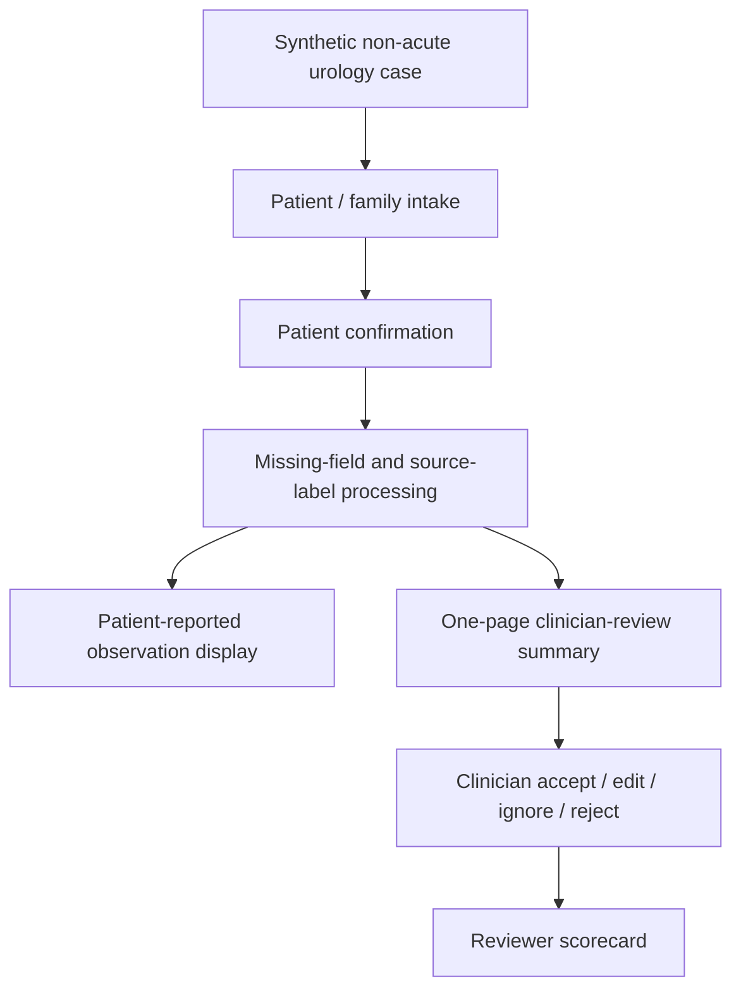

# Demo Scope Freeze

Status: proposal-prep freeze v0.1

Date: 2026-05-20

Purpose: define what the next Health Taiwan proposal-facing demo may show, and what it must not imply.

## Controlling Rule

The demo exists to support proposal review.

It should prove:

```text
This workflow can reduce previsit information friction and produce a clinician-reviewable summary without crossing into diagnosis, triage, treatment, or real patient-data use.
```

It should not prove:

```text
The AI is clinically effective, production-ready, integrated with hospital systems, or able to make clinical decisions.
```

## Included In Demo

| Area | Included scope |
| --- | --- |
| Case data | Three to five synthetic cases |
| Department | Urology only |
| Symptom scope | Non-acute LUTS / OAB-like symptoms |
| Patient input | Plain-language guided intake |
| Source labels | Patient / family / staff-assisted / ASR-confirmed |
| Missing information | Missing-field list and incomplete-answer visibility |
| Red-flag observations | Patient-reported observations only, human-review wording |
| Summary | One-page clinician-review summary |
| ASR | Optional input-layer demonstration only if transcript is confirmed before summary |
| Auditability | Display or design note for question version, source, summary version, review status |
| Governance messaging | Clear no-diagnosis / no-triage / no-treatment / no-EMR-writeback boundary |

## Excluded From Demo

Do not show or imply:

- real patient data
- live HIS / EMR / EHR access
- real appointment / queue data
- diagnosis
- differential diagnosis
- treatment suggestion
- medication advice
- exam or procedure recommendation
- autonomous triage
- urgency level
- risk score
- queue reprioritization
- formal SOAP note
- automatic EMR writeback
- CRM reminder implementation
- production LINE official account
- production hospital app deployment
- clinician model-training or data-labeling workflow

## Demo User Stories

### Patient / Family

```text
As a patient or family helper,
I can answer short urology previsit questions during the waiting-room period,
confirm what I entered,
and understand that the clinician will review the information.
```

### Clinic Staff

```text
As clinic staff,
I only need to intervene when the patient cannot complete the flow,
answers are contradictory,
medicine information is incomplete,
or a patient-reported observation requires local human review.
```

### Clinician

```text
As a clinician,
I can read a one-page summary in under one minute,
see source labels and missing fields,
and accept, modify, ignore, or reject the content.
```

### Proposal Reviewer

```text
As a Health Taiwan reviewer,
I can see that the demo maps to workflow burden reduction, safety boundary,
AI/data/security governance, and measurable KPI.
```

## Synthetic Case Set

Use three to five cases:

| Case | Purpose | Boundary |
| --- | --- | --- |
| Nocturia / frequency | Core LUTS flow | No diagnosis such as BPH or OAB |
| Urgency / leakage | Conditional follow-up and bother score | No treatment advice |
| Voiding difficulty / weak stream | Missing-field and medicine-info handling | No catheter or urgent-action recommendation |
| Visible blood / occult-blood concern | Patient-reported observation wording | No cancer-risk inference |
| Incomplete / contradictory answers | Failure behavior | No forced summary certainty |

## Required Demo Screens Or Artifacts

The demo packet should include:

- patient intake screen or walkthrough
- patient confirmation view
- missing-field list
- patient-reported observation display
- clinician-review summary
- safety boundary text
- audit/version metadata mock
- reviewer scorecard

Optional:

- ASR confirmation example
- tablet/QR flow diagram
- manager-facing KPI mock

## Acceptance Criteria

Before showing the demo to a hospital reviewer:

| Gate | Acceptance criterion |
| --- | --- |
| Safety wording | No diagnosis, treatment, triage, risk-score, exam-order, or EMR-writeback claim |
| Data boundary | Synthetic-only examples; no patient identifiers |
| Reviewability | Summary can be read in 30-60 seconds |
| Source trace | Every summary claim has visible source category or answer reference |
| Missing fields | Missing or uncertain fields remain visible |
| Staff burden | Demo does not require nurses to complete every missing answer |
| ASR safety | Any ASR content is confirmed before entering summary |
| Failure behavior | Contradiction, incomplete answer, or red-flag observation has safe fallback |

## No-Go Signals

Pause or narrow the demo if:

- clinicians would need a separate complex dashboard
- nurses become the default repair layer
- the patient-facing UI sounds like medical advice
- summary text sounds clinically certain when source answers are uncertain
- any real patient data is requested
- the demo claims clinical effectiveness
- the reviewer interprets it as AI triage

## Proposal-Safe Demo Diagram



## Freeze Decision

For the next proposal-facing review, any feature outside this freeze is treated as:

```text
future governed phase
```

not:

```text
current demo commitment
```
