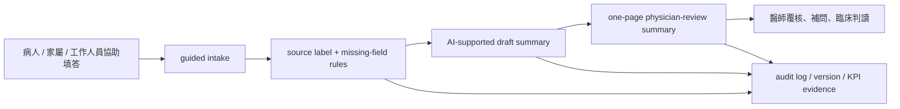

# 「健康台灣深耕計畫」－泌尿科門診前問診與醫師覆核摘要支持系統

狀態：陽明交大吳老師團隊「門診前 AI」健康台灣深耕計畫完整工作稿

日期：2026-06-19

格式來源：`records/2026-06-18/sources/tch-zhongxiao-xinyi-deep-cultivation-plan-revised-2026-06-18.docx`。該檔為泌尿科自行提報 PSA 內容，本稿僅取其健康台灣深耕計畫章節格式，不沿用 PSA 計畫內容。

會議來源：`records/2026-06-02/outpatient-deep-cultivation-official-meeting-minutes.md`。該紀錄顯示信義母案中 AI 智慧問診提報約新臺幣 15,000,000 元且包含 CRM；本稿依後續 owner split，僅編列吳老師 / 陽明交大團隊可交付的 AI 問診與醫師覆核摘要工作包，每年新臺幣 10,000,000 元，三年合計新臺幣 30,000,000 元。

審查來源：`records/2026-06-19/sources/nycu-ai-previsit-expert-review/`

## 封面填報建議

| 欄位 | 建議填法 | 說明 |
| --- | --- | --- |
| 計畫名稱 | 泌尿科門診前問診與醫師覆核摘要支持系統 | 名稱直接扣住門診前問診、醫師覆核與摘要支持。 |
| 縣市別 | 臺北市 | 依主提單位所在地確認。 |
| 申請模式 | 由主提單位確認；本稿先保留 A / A1 路徑 | 行政資格與送件模式需由主提機構定案。 |
| 計畫範疇 | 主軸：範疇三「導入智慧科技醫療」；副支援：範疇一「優化醫療工作條件」 | 範疇三支撐 AI、流程效率、資料安全；範疇一支撐降低重複問診與資訊整理負擔。 |
| 主提機構 | 待主提單位確認 | 醫事機構代碼、統一編號、負責人與函送流程由主提機構補齊。 |
| 合作機構 | 國立陽明交通大學團隊；臺北市立聯合醫院相關院區 / 門診部依主提案確認 | NYCU 擔任 AI workflow、問診摘要 schema、KPI evidence、治理文件與 prototype 支援角色。 |
| 申請經費 | 每年新臺幣 10,000,000 元，三年合計新臺幣 30,000,000 元整 | 信義母案 AI 智慧問診提報約 NT$15M 且包含 CRM；本稿只列吳老師 / 陽明交大 AI-only package 工作額度，正式補助款 / 配合款與會計科目由 budget owner 轉表。 |
| 執行期程 | 三年期；依核定年度調整 | Y1 setup、Y2 evaluation、Y3 handoff。 |
| 計畫主持人 | 待主提單位確認 | 需與簽章、利益衝突、同意書一致。 |
| 聯絡人 | 待主提單位確認 | 需與正式送件平台及行政窗口一致。 |

## 目錄

壹、申請單位自我檢核項目表

貳、計畫概要

參、申請單位簡介

肆、計畫規劃

伍、效益評估

陸、出國計畫書

柒、經費規劃

捌、人力配置表

玖、其他

拾、審查意見預答與回復表

附錄、來源與待確認事項

## 壹、申請單位自我檢核項目表

本工作稿支援主提單位完成「健康台灣深耕計畫」送件格式、計畫範疇、KPI、經費、治理與合作單位內容整合。正式送件前，主提單位需完成資格證明、公職人員利益衝突迴避自主檢核、未重複申請聲明、參與計畫同意書、醫事機構代碼、簽章與函送程序。

陽明交大團隊提供智慧醫療 workflow 設計、AI/data governance、KPI evidence、問診摘要 schema、prototype / reviewer evidence 與技術文件。正式醫療場域、個資、資安、IRB/QI、採購、委外與病人資料使用，由主提單位指定 owner 後啟動。

本案的送件定位採正向 scope control：AI package 負責門診前資訊蒐集、來源標記、缺漏欄位可見化、一頁式醫師覆核摘要與治理紀錄；病人關係管理、病人訊息推播、長期追蹤、正式 HIS/EMR 寫回與臨床處置決策，保留給另案治理路徑。

## 貳、計畫概要

本子計畫建立泌尿科門診前低摩擦症狀蒐集與醫師覆核摘要支持流程。系統以病人、家屬或工作人員協助填答、來源標記、缺漏欄位可見化、一頁式醫師覆核摘要與治理紀錄為核心，協助臨床團隊在看診前掌握主訴、症狀脈絡、追問方向與需補問資訊。

本計畫的主要貢獻是把 AI、APP、ASR 與 API readiness 放在可治理的門診前資訊整理流程中。AI 支援結構化、缺漏提示、摘要草擬、版本紀錄與人機協作；醫師保留臨床解讀、診斷與處置責任；真實病患資料、HIS/EMR 連接、IRB/QI、資安與採購流程，依院內治理與主提單位決策啟用。

本案以範疇三「導入智慧科技醫療」為主軸，建立問診、摘要、資料治理與安全查核的可驗收流程；以範疇一「優化醫療工作條件」為副支援，透過門診前資料整理與一頁式醫師覆核摘要，降低重複問診、臨場補問、缺欄補資料與資訊分散造成的時間負擔。

本子計畫作為泌尿科門診 visit readiness 支援層：病人在看診前完成 guided intake，醫師取得來源清楚、缺漏可見的一頁式覆核摘要。社區追蹤、CRM、病人訊息推播與回診管理不列入本案；本案聚焦於門診前資訊準備、醫師覆核、AI/data/security governance 與可驗收 KPI evidence。

## 參、申請單位簡介

### 一、主提醫療機構

主提醫療機構提供臨床場域、病人流程、門診工作流、資安與個資治理、IRB/QI 判定、採購與行政送件路徑。正式合作單位、醫事機構代碼、負責人、計畫主持人、聯絡人與簽章文件由主提案 owner 補齊。

主提醫療機構在本案中的關鍵角色，是把門診現場的資訊需求、診間節奏、臨床責任與院內治理路徑整合成可執行的深耕計畫。AI 問診系統的成功條件不是單一模型表現，而是臨床流程、資訊安全、醫師覆核與年度管考能共同運作。

### 二、國立陽明交通大學團隊

陽明交大團隊在本案中擔任智慧醫療工作流、AI 輔助問診、資料治理、KPI evidence 與技術轉譯角色。團隊重點是把泌尿科門診前資訊蒐集與醫師覆核摘要整理成可審查、可驗收、可治理的服務系統，並提供 question governance、summary schema、source label、missing-field visibility、prototype evidence 與 reviewer scorecard 支援。

### 三、協作分工原則

| 分工面向 | 主提醫療機構 | 陽明交大團隊 |
| --- | --- | --- |
| 臨床流程 | 定義場域、對象、門診節奏、醫師覆核位置 | 轉譯為 guided intake flow 與 summary workflow |
| 臨床問題 | 確認最低必要欄位、追問邏輯、不可用語 | 建立 question set、schema、missing-field 規則與版本紀錄 |
| 資料治理 | 指定資安、個資、IRB/QI、採購 owner | 提供 data minimization、audit log、AI governance 支援文件 |
| KPI 與 evidence | 確認年度查核與院內資料路徑 | 產出 KPI workbook、scorecard、reviewer evidence 與年度資料包 |
| 經費與採購 | 轉入正式會計科目、補助款 / 配合款、採購流程 | 提供工作包、單價依據、KPI-to-budget traceability |

## 肆、計畫規劃

### 一、範疇一：優化醫療工作條件

本子計畫透過門診前 guided intake 與一頁式醫師覆核摘要，降低重複問診、臨場補問、缺欄補資料、病人敘述分散與 follow-up 整理負擔。工作流設計聚焦於醫師、護理與櫃台可實際承接的流程，並以 reviewer scorecard 測量摘要可讀性、缺漏欄位可見性與 staff-friction。

本案對醫療工作條件的貢獻，是讓門診前資訊先被結構化、標示來源並呈現缺漏，使醫師在有限看診時間內能快速抓住主訴、病程時序、伴隨症狀、用藥或檢查提示，以及需要現場補問的欄位。這種 workflow evidence 比直接承諾留任率或門診量提升更符合本案可歸因範圍。

### 二、範疇二：規劃多元人才培育

本案可支援 training、documentation 與 governance readiness。若主提案指定訓練 owner 與預算，可納入臨床 reviewer 教育、AI governance 說明、資料最小化原則、IRB/QI 進場條件、資安與採購注意事項。訓練內容聚焦於如何安全使用來源標記摘要、如何辨識缺漏欄位、如何回饋 schema 修正，以及如何保存 evidence log。

第一版經費規劃不以國外研習作為核心工作。若正式送件版本以範疇二另列國外觀摩或訓練，需由 training owner 另列目的、行程、人數、天數、補助比例與人才培育 KPI。

### 三、範疇三：導入智慧科技醫療

本計畫主打範疇三。核心建置包括：

- 低摩擦問診入口：病人、家屬或工作人員協助填答。
- ASR optional confirmation：語音輸入僅作為可確認輸入，未確認 transcript 不進入摘要。
- Clinical question governance：以泌尿科門診前症狀脈絡、醫師覆核需求與最低必要欄位，建立第一版問題集。
- Source label：每一條摘要資訊標示來源為病人、家屬、工作人員協助或 ASR-confirmed。
- Missing-field visibility：讓醫師看見重要缺漏、不確定與 unknown/missing 區分。
- 一頁式醫師覆核摘要：提供看診前快速閱讀、修正與補問。
- AI / data / cybersecurity governance：保留版本、錯誤處理、audit trail、reviewer evidence 與年度查核資料。

本案的智慧醫療定位，是用 AI 支援資料整理、缺漏提示與摘要草擬，讓醫師保留臨床判讀與最終處置。AI 輸出以醫師覆核為必要流程，所有核心資訊保留來源、版本與審查紀錄，形成可追溯、可驗收、可交接的智慧門診前流程。

### 四、範疇四：社會責任醫療永續

本子計畫對範疇四的貢獻，是讓泌尿科門診服務建立更清楚、可追溯、可交接的門診前資訊整理流程。當信義母案另由對應 owner 承接社區追蹤、CRM 或病人管理成效時，本 AI-only 工作包提供回到泌尿科門診前的 visit readiness 支援：個案在看診前完成症狀整理，醫師取得資訊完整、來源清楚的一頁式覆核摘要，後續臨床照護可建立在更清楚的病人陳述與資料邊界上。

### 五、流程設計

### 六、年度工作設計

| 年度 | 工作重點 | 主要交付 |
| --- | --- | --- |
| Y1 setup | intended use、臨床邊界、問題集、summary schema、source label、missing-field、synthetic reviewer evidence | 問題集 v1、摘要 schema v1、禁止語句清單、synthetic review scorecard、governance owner table |
| Y2 evaluation | 依院內治理核准 route 進行 limited workflow evidence 或 workflow simulation；完成一輪臨床回饋改版 | QI/IRB 判定、limited workflow 或 simulation evidence、usefulness scorecard、staff-friction review |
| Y3 handoff | KPI evidence、維運 owner、final report、下一階段 HIS/EMR/API/採購治理 brief | final evidence package、maintenance owner brief、next-stage governance brief |

## 伍、效益評估

### 一、績效指標

本案效益評估採三層設計：第一層是 workflow 可用性，第二層是資料完整性與安全，第三層是治理與年度交付。評估重點放在本案可直接歸因的門診前資訊準備、醫師覆核摘要品質與治理成熟度。

| 範疇 | 績效指標 | 衡量或量化基準定義 | 現況數據 | 年度目標 / 門檻 | 對應工作包 |
| --- | --- | --- | --- | --- | --- |
| 優化醫療工作條件 | 摘要閱讀時間 | reviewer 由打開摘要至完成初步掌握之秒數；回報中位數與分布 | 待 baseline；synthetic case 先測 | Y1 design target <=60秒；Y2/Y3 回報 approved workflow 或 reviewer evidence | W2, W3, W4, W6 |
| 優化醫療工作條件 | 醫師有用性 | 5點量表：摘要是否幫助快速掌握主訴、時序、需補問欄位 | 待測 | median >=4/5；未達標即回 schema 迭代 | W2, W6 |
| 導入智慧科技醫療 | 最低必要欄位完成 / 標示率 | 最低必要欄位完成，或明確標示 unknown / missing 之比例 | 待 baseline | >=90%；不可把未填當完成 | W3, W4, W6 |
| 導入智慧科技醫療 | 缺漏欄位可見率 | 應標示的重要缺漏中，被摘要明確標示之比例 | 待測 | >=90%；重大缺漏未顯示即 fail-safe 修改 | W2, W3, W4 |
| 導入智慧科技醫療 | source label 完整率 | 每一條摘要資訊皆標示來源：病人、家屬、工作人員、ASR-confirmed 等 | partial design | 100%；無來源 AI 推論不得進醫師摘要 | W3, W4, W5 |
| 導入智慧科技醫療 | unsafe wording unresolved count | 診斷、治療、自動分流、EMR writeback 等未核准語句 | 目標 0 | 0 unresolved；出現即 freeze release | W4, W5 |
| 優化醫療工作條件 | staff-friction pass | 護理、櫃台、醫師端不增加不可接受的重複輸入、點擊、例外處理 | 待 workflow review | Y1 walkthrough；Y2 一輪改版後通過；Y3 SOP | W2, W3, W7 |
| 導入智慧科技醫療 | governance readiness | AI/data/security/IRB/procurement owner 是否命名；進場 route 是否完成 | owner table pending | 未命名 owner 不碰真實資料 | W5, W6 |
| 經費與管考 | KPI-to-budget mapping | 每一經費列有 KPI、owner、source、evidence | workbook established | 100%；未映射項目刪除或改列 | ALL |

### 二、年度查核點

| 年度 | 查核點 | 應交付證據 | Go / No-Go |
| --- | --- | --- | --- |
| Y1 | Intended use / clinical boundary 鎖定 | intended-use 文件、禁止語句清單、CRM out-of-scope 註記 | 未完成不得做真實資料測試 |
| Y1 | Question set + summary schema v1 | 問題集、schema、source label、missing-field 規則 | 未達標不進 reviewer demo |
| Y1 | Synthetic reviewer evidence | 3-5 個 synthetic cases、timed review、scorecard | read time 與 usefulness 未達標則修 schema |
| Y2 | Governance-approved limited workflow evidence | QI/IRB 判定、流程紀錄、臨床 feedback | 未核准真實資料 route 時，改用 workflow simulation |
| Y2 | 模型 / 摘要安全與 audit | 版本紀錄、audit samples、red-team log | unsafe wording 未清零即 freeze release |
| Y3 | Final evidence package | KPI 報告、失敗案例與修正、維運 owner | 無 maintenance owner 不承諾長期服務 |
| Y3 | Next-stage governance brief | HIS/EMR/API/正式採購條件列表 | 不把本案自動轉為 production EMR writeback |

### 三、效益敘述

本案的直接效益，是讓泌尿科門診前資訊蒐集更清楚、醫師覆核更快速、缺漏資訊更可見、AI 輸出更可追溯。這些效益能用 reviewer time、clinician usefulness、minimum-field completion、source-label audit、unsafe wording QA 與 governance readiness 量化，並能在年度查核中交付。

本案的延伸效益，是讓泌尿科門診在正式看診前取得更好的 visit readiness。此效益以門診前摘要流程與醫師覆核品質呈現，避免把本期 AI package 擴張成病人追蹤或長期臨床結果承諾。

## 陸、出國計畫書

本子計畫第一版不以出國研習作為核心工作。若主提案以範疇二納入訓練或國外觀摩，需由 training owner 另列目的、行程、人數、天數、經費與補助比例，並對應人才培育 KPI。本案目前將人才培育聚焦在臨床 reviewer 教育、AI governance、資料最小化、IRB/QI 進場條件、資安與採購注意事項。

## 柒、經費規劃

本稿以每年新臺幣 10,000,000 元，三年合計新臺幣 30,000,000 元作 AI-only package 討論配置。2026-06-02 會議紀錄中的信義 AI 智慧問診母案提報約新臺幣 15,000,000 元，且包含 CRM 系統；CRM 系統由母案 / 其他團隊承接其建置、採購、維運與追蹤 KPI。本稿的經費表聚焦吳老師 / 陽明交大團隊可驗收的 AI 問診、醫師覆核摘要、governance 與 KPI evidence。正式送件前，主提單位需依健康台灣深耕計畫經費支用標準，轉成正式會計科目、單價、數量、年度、補助款 / 配合款、採購註記與支用說明。

### 一、工作包經費表

| 工作包 | 第一年 | 第二年 | 第三年 | 三年合計 | KPI / evidence |
| --- | ---: | ---: | ---: | ---: | --- |
| W1 Proposal coordination / PM / RA / KPI evidence | NT$2,000,000 | NT$2,000,000 | NT$2,000,000 | NT$6,000,000 | proposal package、KPI workbook、annual evidence |
| W2 Clinical workflow review / reviewer sessions | NT$1,500,000 | NT$1,500,000 | NT$1,200,000 | NT$4,200,000 | summary read time、clinician usefulness、staff-friction |
| W3 Question governance / intake / summary schema | NT$2,000,000 | NT$1,500,000 | NT$1,000,000 | NT$4,500,000 | question bank、source label、missing-field |
| W4 AI prototype / summary generation / review evidence | NT$2,000,000 | NT$2,000,000 | NT$1,500,000 | NT$5,500,000 | prototype、trace log、safety audit |
| W5 AI / data / security / privacy governance | NT$1,000,000 | NT$1,000,000 | NT$1,000,000 | NT$3,000,000 | governance checklist、procurement gate |
| W6 Evaluation / baseline / QI / IRB / limited pilot evidence | NT$1,000,000 | NT$1,500,000 | NT$2,000,000 | NT$4,500,000 | baseline、QI/IRB、evaluation report |
| W7 Optional ASR / intake station readiness | NT$500,000 | NT$500,000 | NT$1,300,000 | NT$2,300,000 | ASR-confirmed、intake station readiness |
| 總計 | NT$10,000,000 | NT$10,000,000 | NT$10,000,000 | NT$30,000,000 | 100% mapped |

### 二、官方科目概算

| 官方科目 | 三年概算 | 編列邏輯 |
| --- | ---: | --- |
| 人事費 | NT$6,140,000 | PM/RA、KPI/evaluation RA、clinical reviewer protected time、question/schema/AI engineering、QA cycle、evaluation analyst。依支用標準與機構薪資核實。 |
| 業務費 | NT$3,630,000 | 外部審查 / 出席、文件包、資料蒐集、workflow walkthrough、LLM/API/cloud/ASR 租金或權利使用、治理工作坊、IRB、問卷 / 訪視等。 |
| 設備費 | NT$230,000 | clinic-owned intake station readiness；若改租用則轉業務費。設備費約占總額 2.3%，低於 30% 資本門上限。 |
| 合計 | NT$10,000,000 | 正式表仍需主提單位確認補助款 / 配合款、採購門檻、核銷科目與驗收文件。 |

### 三、單價依據與審查說服邏輯

| 單價 / 項目 | 依據與本案用法 |
| --- | --- |
| PM/RA 60,000/人月 | 以碩士級研究人力標準、年終、勞健保、勞退與專案管理負荷估算；正式依機構標準核實。 |
| KPI/evaluation RA 45,000/人月 | 支援 baseline、scorecard、管考資料與 evidence log。 |
| AI engineering 85,000/人月 | 支援 AI/software prototype、trace logging、summary schema integration 與安全測試。 |
| 臨床 reviewer package 12,500/session | 作為 reviewer protected time、案例閱讀、scorecard coding、缺漏欄位判讀與修正建議的完整工作量包。 |
| 外部專家 2,500/meeting | 作為外部且非計畫支薪人員的實質審查或諮詢上限設計。 |
| 問卷 / 訪視 200/份 | 用於 clinician/staff survey 或訪談補償。 |
| IRB 100,000/case/year reserve | 涉及人體試驗或人體資料時保留；若 QI 判定不需 IRB，經 budget owner 核定後轉 evaluation/QI。 |
| LLM/API/cloud/ASR 10,000/service-month or package | 優先以租金 / 權利使用費處理，保留資料最小化、存取控制與 audit log。 |
| 設備 230,000 | 僅作 clinic-owned intake station readiness，不列個人手機或個人平板；若改租用則轉業務費。 |

### 四、經費範圍控制

| 本期支持項目 | 範圍控制 |
| --- | --- |
| guided intake、source label、missing-field visibility | 聚焦門診前資訊蒐集與醫師覆核摘要 |
| AI summary drafting and review evidence | 醫師保留診斷、治療與處置責任 |
| LLM/API/cloud/ASR readiness | 以可確認輸入、資料最小化與租用 / 權利使用優先 |
| QI/IRB reserve and governance | 依院內 route 啟用真實資料；未核准時使用 synthetic / workflow simulation |
| clinic-owned intake station readiness | 不列個人手機、個人平板或一般行政設備 |

## 捌、人力配置表

| 類別 | 姓名 | 現職 | 在本計畫內擔任之具體工作性質、項目及範圍 |
| --- | --- | --- | --- |
| 主提案行政 owner | 待確認 | 待確認 | 正式提報 route、Word/PDF、簽核、合作單位與送件整合 |
| Subproject clinical owner | 待確認 | 泌尿科 / 門診 owner 待確認 | 目標族群、問題集、summary acceptance、clinical boundary |
| Proposal coordinator | 待確認 | 待確認 | 格式整合、版本控管、KPI-to-budget traceability |
| Engineering owner | 待確認 | 陽明交大團隊 | intake、summary schema、versioned implementation evidence |
| AI/data governance owner | 待確認 | 待確認 | prompt / rule versioning、data minimization、auditability |
| IT/security owner | 待確認 | 待確認 | access control、device/API/security review、audit log |
| Evaluation owner | 待確認 | 待確認 | baseline、scorecards、KPI evidence、annual report |
| Budget / procurement owner | 待確認 | 待確認 | AI 問診正式會計科目、年度拆分、採購與委外驗收 |
| Training / documentation owner | 待確認 | 待確認 | reviewer education、governance documentation、handoff SOP |

## 玖、其他

本工作稿是陽明交大吳老師團隊「門診前 AI」深耕計畫內容稿，並保留智慧醫療子計畫的治理邊界。正式送件前需要主提單位確認：

1. 本稿是獨立子計畫、正式計畫內工作包，或主提計畫附錄。
2. 主提機構、合作機構、醫事機構代碼、計畫主持人、聯絡人與簽核流程。
3. 範疇設計是否採「範疇三主打、範疇一副支援、範疇四條件式支援」。
4. 每年 NT$10,000,000，三年合計 NT$30,000,000 是否維持為 AI 問診與醫師覆核摘要 package 討論額度。
5. ASR、APP/API、intake station 是 funded item、demo-only，或後續採購。
6. 真實病患資料 route 為 no data、QI/service、IRB research，或 mixed route。
7. 採購 threshold、正式會計科目、單價、數量、配合款與 negative-list 檢查。
8. 所有 owner：clinical、AI/schema、AI/data governance、IT/security、evaluation、budget/procurement。

## 拾、審查意見預答與回復表

| 評審可能質疑 | 建議回復 | 可展示證據 |
| --- | --- | --- |
| 為什麼需要 NT$10M？ | 本案是三年治理型門診前資訊流程，不是單一 chatbot。經費涵蓋臨床問題治理、source label、missing-field、AI 摘要、reviewer evidence、資安 / 資料治理、QI/IRB、年度管考與交接。 | 經費明細、KPI 矩陣、成本依據 |
| AI 角色如何界定？ | AI 支援結構化、缺漏提示與摘要草擬；醫師保留判讀、診斷、處置。unsafe wording KPI 要求未核准診斷、治療、分流語句為 0。 | 禁止語句清單、red-team log、source label audit |
| CRM 如何在母案與本稿分工？ | 2026-06-23 更新後，信義母案目前整合 PSA 篩檢與智慧問診 NT$15M、CRM 系統 NT$15M、信義門診部碳盤查 NT$7.5M；本稿是吳老師 / 陽明交大 AI-only 工作包，支援門診前 visit readiness 與醫師覆核摘要。CRM、病人訊息推播、長期追蹤由母案 / 其他團隊治理，讓本 AI package 維持可驗收、可採購、可治理。 | 2026-06-23 official meeting minutes、owner table、budget split |
| KPI 是否太偏 workflow？ | 這些 KPI 與本案可歸因成果一致。先用 workflow、安全、traceability KPI 建立可信度；若 Y2 governance 核准，再做 limited workflow evidence。 | 年度查核點、scorecard |
| 摘要閱讀時間 <=60 秒是否合理？ | 作為設計目標合理；正式報告同步回報 actual 與分布。若超過 90 秒，則縮短摘要或調整欄位。 | timed reviewer logs |
| ASR / APP / API 如何處理？ | ASR 作為 confirmed input readiness；未確認 transcript 不進摘要。APP/API/HIS/EMR 只保留 readiness 或下一階段治理條件，本期不承諾正式寫回。 | W7、資料治理 gate、next-stage governance brief |
| 如何確保經費可核銷？ | 工作包已拆到 KPI、owner、source 與 evidence；正式送件前由 budget owner 轉成官方科目、單價、數量、補助款 / 配合款、採購與驗收文件。 | official category table、workbook |

## 附錄、來源與待確認事項

### 一、使用來源

| 來源 | 位置 |
| --- | --- |
| 115 年度院外門診部深耕計畫討論會議紀錄 | `records/2026-06-02/outpatient-deep-cultivation-official-meeting-minutes.md` |
| 格式來源 | `records/2026-06-18/sources/tch-zhongxiao-xinyi-deep-cultivation-plan-revised-2026-06-18.docx`，泌尿科自行提報 PSA 內容；本稿僅取健康台灣深耕計畫章節格式 |
| 專家審查 DOCX | `records/2026-06-19/sources/nycu-ai-previsit-expert-review/nycu-ai-previsit-plan-kpi-budget-review-draft-2026-06-19.docx` |
| KPI / 經費 workbook | `records/2026-06-19/sources/nycu-ai-previsit-expert-review/nycu-ai-previsit-kpi-budget-model-2026-06-19.xlsx` |
| 完整 package | `records/2026-06-19/sources/nycu-ai-previsit-expert-review/nycu-ai-previsit-completed-package-2026-06-19.zip` |

### 二、政策與成本依據

| 來源 | 用途 |
| --- | --- |
| 行政院「健康台灣深耕計畫(114-118年)」：`https://www.ey.gov.tw/Page/5A8A0CB5B41DA11E/f1618406-1ed7-4e72-bd4f-d1b6faaf8381` | 四大範疇、長期深耕視角、範疇三智慧醫療定位 |
| 衛福部健康台灣深耕計畫專區：`https://dep.mohw.gov.tw/TDU/cp-1567-82709-121.html` | 計畫緣起、政策定位、KPI 參考 |
| 健康台灣深耕計畫下載區：`https://htsprout.nhri.org.tw/download.html` | 計畫書格式、AI 治理、資安治理、資料治理自我檢核表、管考與經費文件 |
| 健康台灣深耕計畫經費文件與範疇三懶人包：`https://htsprout.nhri.org.tw/download.html` | 人事費、業務費、設備費、IRB、問卷、租金、設備與雜支規則，以及 AI / 資料 / 資安治理方向 |
| NSTC 研究人力約用注意事項：`https://law.nstc.gov.tw/LawContent.aspx?id=FL028686` | 研究人力成本底線 |
| 勞動部歷年最低工資 / 基本工資調整：`https://www.mol.gov.tw/1607/28162/28166/28180/70460/76761/76833/post` | 115 年最低工資基準 |

### 三、正式送件待確認

| 待確認事項 | Owner |
| --- | --- |
| 主提機構、合作機構、醫事機構代碼、PI、聯絡人、簽章 | 主提單位 |
| 送件模式與本稿角色：subproject / work package / appendix | 主提單位 |
| 信義母案 NT$15M AI 智慧問診 allocation 與本稿 NT$10M AI-only package 的正式關係 | 主提單位 + budget owner |
| 每年 NT$10M，三年合計 NT$30M 是否維持為 AI-only package ceiling | 主提單位 + budget owner |
| 真實病患資料 route：no data / QI / IRB / mixed | Clinical + IRB/QI + data governance owner |
| ASR、APP/API、intake station status | Engineering + security + procurement owner |
| 正式科目、配合款、採購門檻、negative-list review | Budget / procurement owner |
| 維運 owner 與下一階段 HIS/EMR/API governance route | 主提單位 + IT/security owner |
