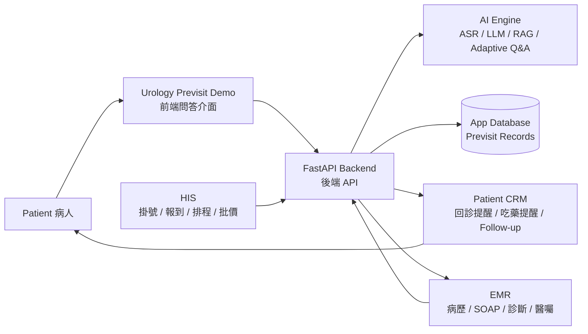
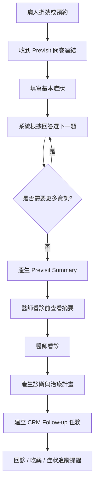
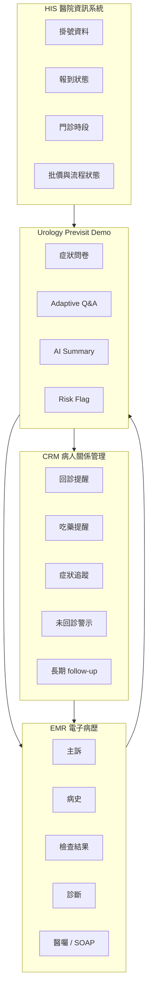
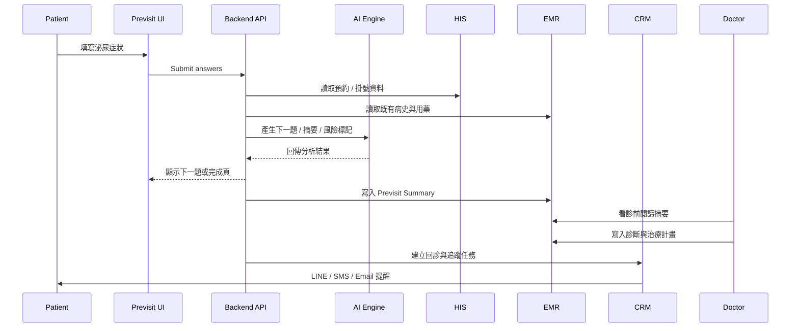
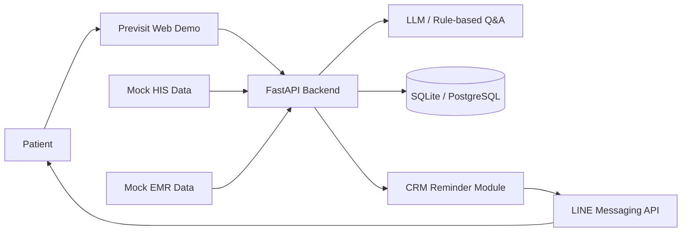
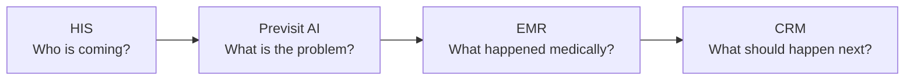

# CRM / PRM / HIS / EMR Standalone Concept Note

Status: standalone exploratory note

Date: 2026-05-19

Scope boundary: this note records CRM, patient-management MVP, HIS, EMR, and possible Mermaid diagrams as background thinking only. It is not connected to the current accepted urology previsit planning, proposal scope, MVP scope, implementation roadmap, or Health Taiwan deep-cultivation positioning unless a future decision explicitly links it.

## Core CRM Definition

CRM means Customer Relationship Management.

中文通常翻作：

```text
客戶關係管理系統
```

但 CRM 不只是「客戶名單」。真正的核心是：

```text
持續追蹤與管理關係
```

在醫療脈絡中，對應概念可稱為：

```text
PRM = Patient Relationship Management
```

也就是病人關係管理或病人長期互動管理。

## Simplest Explanation

假設今天開一間診所，重要問題不是：

```text
病人有沒有來過？
```

而是：

- 他上次什麼時候來？
- 他現在狀況如何？
- 他有沒有回診？
- 他是不是流失了？
- 他需不需要被提醒？
- 他現在是不是高風險？
- 他過去跟診所互動過什麼？

CRM 管的不是靜態資料，而是關係生命週期。

## What CRM Manages

CRM 管的是：

```text
互動歷史 + 目前狀態 + 下一步行動
```

| Type | CRM records |
| --- | --- |
| 聯絡資訊 | 姓名、電話、Email、偏好聯絡方式 |
| 互動紀錄 | 曾經講過什麼、誰聯絡誰、何時聯絡 |
| 狀態 | 是否回診、是否成交、是否完成追蹤、是否流失 |
| 行為 | 是否點開訊息、是否回覆、是否預約、是否取消 |
| 排程 | 下次聯絡時間、回診日、提醒時間 |
| 分類 | 高風險、高價值、VIP、需要協助 |
| 自動化 | 自動提醒、通知、追蹤、任務指派 |

最重要的 CRM 問題是：

```text
這個人現在在關係流程的哪一步？下一步誰要做什麼？什麼時候做？
```

## CRM Is Not Just A Database

資料庫只是儲存資料：

```text
姓名：王小明
電話：0912...
```

CRM 是管理長期互動流程：

```text
04/12：回診提醒
04/13：未回應
04/15：護理師電話追蹤
04/16：病人表示症狀惡化
04/17：安排提前回診
```

差別在於 CRM 有時間軸、責任歸屬、狀態轉換與下一步行動。

## Real-World CRM Instances

### Medical CRM / Patient Relationship Management

泌尿科診所中的病人：

```text
王先生
BPH
兩週後回診
```

CRM 可以做：

- 自動提醒回診
- 追蹤吃藥
- 記錄症狀改善
- 標記高風險未回診
- 提醒櫃台或護理師追蹤

這是醫療 CRM / PRM。

### Insurance CRM

保險業務不可能記得幾百個客戶的細節。CRM 會記：

```text
林小姐
上次聯絡：04/12
對投資型保單有興趣
孩子今年高中
六月可能有資金需求
```

系統可以提醒：

```text
兩週未追蹤
生日快到了，自動發送祝福
```

### Automotive CRM

以汽車銷售為例，CRM 可追蹤：

- 看過哪台車
- 是否試駕
- 最常看的車型
- 是否下訂
- 是否取消
- 是否需要銷售人員 follow-up

後續可觸發 Email、App 通知、優惠、試駕邀約。

### Engagement CRM

串流或 App 平台也有 CRM 思維：

- 使用者看了什麼
- 何時停下來
- 多久沒登入
- 可能喜歡什麼
- 是否可能流失

系統再推推薦、提醒或回流訊息。

### School / Student Success CRM

學校也有 CRM-like workflow：

- 哪些學生快被退學
- 哪些學生長期缺課
- 哪些學生沒交學費
- 哪些學生可能休學
- 哪些學生需要輔導

後續行動是主動聯絡、發通知、安排輔導或 advisor follow-up。

### Support CRM

客服系統如 Zendesk / Intercom 管理的是：

- ticket 狀態
- issue owner
- escalation
- response SLA
- customer satisfaction
- resolution history

這也是關係管理，只是關係透過客服流程呈現。

## CRM Value

很多人以為 CRM 是聯絡簿，但真正值錢的是 retention。

| Domain | CRM value |
| --- | --- |
| 醫療 | 病患不要在需要追蹤時消失 |
| SaaS | 使用者不要無聲退訂 |
| 電商 | 客戶重複購買 |
| 保險 | 長期續約 |
| 教育 | 學生持續學習與被支持 |

在醫療場景中，retention 不只是商業留存，也包括 care continuity、follow-up completion、operational accountability。

## Standalone CRM Patient-Management MVP Idea

This section records a standalone idea:

```text
Clinic-level Follow-up CRM
```

核心痛點：

```text
病人離開診間後，醫療流程就斷掉了。
```

常見斷點：

- 忘記吃藥
- 沒有回診
- 不知道症狀有沒有改善
- 醫師不知道病人後續狀況
- 診所失去病患黏著度

這個 MVP 不是完整 HIS、完整 EMR、完整醫療 AI、完整 FHIR interoperability、或完整醫療法規平台。

它是一個診所等級的 follow-up CRM。

## MVP v1 Minimal Functions

先砍到極簡，MVP v1 只有四個功能：

| Function | Description |
| --- | --- |
| 病人建立 | 姓名、電話、疾病或追蹤類型、回診日 |
| 回診提醒 | LINE / SMS / Email |
| 吃藥提醒 | 每日固定提醒 |
| Follow-up 狀態 | 有無改善、是否回診、是否需要人工追蹤 |

第一版不要追求完整醫療 AI。第一版應該是醫療流程管理系統。

理由：

- AI 很難驗證，CRM 較容易驗證
- AI 很難導入，CRM 較容易導入
- AI 需要大量資料，CRM 幾乎不用
- workflow / reminders / engagement / documentation / operational efficiency 往往更容易落地

## Candidate Technical Stack

可行 MVP 技術架構：

| Layer | Candidate tools |
| --- | --- |
| Frontend | Streamlit, Next.js |
| Backend | FastAPI |
| Database | SQLite for MVP, PostgreSQL for later |
| Notification | LINE Messaging API, Twilio SMS, Email |
| Deployment | Docker, VPS, Railway, Render |

## Core Follow-Up Workflow

### Step 1

醫師看診後產生追蹤資訊：

```text
診斷：
BPH

藥物：
Tamsulosin

回診：
14 天後
```

### Step 2

櫃台或醫護人員按下：

```text
建立 Follow-up
```

### Step 3

系統自動建立追蹤節點：

| Time | Action |
| --- | --- |
| Day 1 | 提醒吃藥 |
| Day 3 | 詢問排尿是否改善 |
| Day 7 | 再次追蹤 |
| Day 14 | 提醒回診 |

這個產品的核心不是 AI，而是 workflow continuity。

## Example Follow-Up Script

Day 3 問題：

```text
排尿是否改善？
[改善]
[無改善]
```

Day 14 提醒：

```text
明天是您的回診日，請記得攜帶藥袋與近期症狀變化紀錄。
```

## Commercial / Operational Value

真正價值不是提醒功能本身，而是病患留存與照護連續性：

- 病患不回診
- 長期追蹤斷掉
- 慢性病管理困難
- 病患黏著度低
- 診所無法掌握離院後狀態

可能適用科別或場景：

- 泌尿科
- 糖尿病
- 高血壓
- 睡眠
- 身心科
- 復健

## Possible First Product Label

可作為獨立探索方向的名稱：

```text
LINE-based Urology Follow-up CRM
```

這個方向的重點不是一開始做 AI，而是做出診所今天可能願意試用的工具。

## Possible Research Extensions

CRM workflow 本身可成為未來 AI research 的接口。

### Dynamic Follow-Up Routing

不同病人可能需要：

- 不同提醒頻率
- 不同問答
- 不同風險狀態
- 不同人工介入門檻

可能連接：

- LLM
- embeddings
- adaptive questioning
- workflow routing

### Non-Adherence Detection

病人不回應可能代表：

- 症狀惡化
- 停藥
- 流失
- 忘記
- 不會使用系統

這可以變成 AI-supported workflow problem。

### Explainable Clinical Workflow AI

較安全、較落地的 AI framing：

```text
AI 幫你管理病患流程
```

而不是：

```text
AI 幫你診斷癌症
```

## Possible Phases

| Phase | Scope |
| --- | --- |
| Phase 1 | 病人管理、LINE 通知、回診提醒、SQLite |
| Phase 2 | symptom tracking、questionnaire、dashboard |
| Phase 3 | AI follow-up suggestion、risk scoring、adaptive routing |
| Phase 4 | FHIR / EMR integration |

These phases are recorded as standalone brainstorming only.

## HIS Definition

HIS means Hospital Information System.

中文通常叫：

```text
醫院資訊系統
```

HIS 是醫院的營運中樞，管理整間醫院的行政、流程與作業狀態。

| Scenario | HIS does |
| --- | --- |
| 病人掛號 | 建立就診序號、科別、醫師 |
| 報到 | 管理到院與候診狀態 |
| 批價收費 | 計算健保、自費、掛號費 |
| 住院管理 | 床位、轉床、出院 |
| 藥局 | 處方流向、領藥狀態 |
| 檢驗檢查 | 抽血、X 光、超音波排程 |
| 行政報表 | 門診量、住院量、營收 |

HIS 比較像醫院版 ERP。

## HIS Real-World Flow

病人去醫院看泌尿科：

1. 櫃台掛號
2. 報到
3. 醫師看診
4. 醫師開藥、開檢查
5. 批價
6. 領藥
7. 預約下次回診

這整串流程有許多部分由 HIS 串起來。

## EMR Definition

EMR means Electronic Medical Record.

中文通常叫：

```text
電子病歷
```

EMR 管的是病人的醫療內容。

| Type | EMR content |
| --- | --- |
| 主訴 | 頻尿、血尿、排尿疼痛 |
| 病史 | 過去病史、用藥史、過敏史 |
| 診斷 | BPH、UTI、尿路結石 |
| SOAP | Subjective、Objective、Assessment、Plan |
| 檢查結果 | 尿液檢查、PSA、腎功能 |
| 影像報告 | X 光、CT、超音波報告 |
| 醫囑 | 開藥、回診、轉診、檢查 |

## EMR Real-World Example

醫師可能在 EMR 中寫：

```text
主訴：頻尿、夜尿三個月
病史：夜間解尿 3-4 次，尿流變細
檢查：攝護腺輕度肥大
診斷：Benign Prostatic Hyperplasia
處置：Tamsulosin 0.2mg QD，兩週後回診
```

這是 EMR 的內容。

## HIS vs EMR

一句話：

```text
HIS 管醫院流程，EMR 管病人病歷。
```

| Comparison | HIS | EMR |
| --- | --- | --- |
| 管理對象 | 醫院營運流程 | 病人醫療紀錄 |
| 使用者 | 櫃台、批價、藥局、護理師、行政、醫師 | 醫師、護理師、醫療人員 |
| 核心資料 | 掛號、收費、床位、藥局、檢查排程 | 病史、診斷、檢查結果、治療計畫 |
| 比喻 | 醫院的作業系統 / ERP | 病人的醫療筆記本 |
| 對 CRM MVP 的關係 | 可能提供掛號與回診資料 | 可能提供診斷、用藥、追蹤計畫 |

## CRM Layer Around HIS / EMR

假設一個病人 follow-up CRM：

```text
病人看診結束
-> 系統知道他兩週後要回診
-> LINE 提醒病人回診
-> 每天提醒吃藥
-> 回收症狀改善狀況
```

可能資料來源：

| CRM function | Possible source |
| --- | --- |
| 病人姓名、電話、回診日期 | HIS |
| 診斷、用藥、追蹤計畫 | EMR |
| 回診提醒 | CRM |
| 吃藥提醒 | CRM |
| 症狀問卷 | CRM |
| 回寫紀錄 | Possibly EMR in later governed integration |

## MVP Should Not Directly Integrate HIS / EMR

第一版不應直接串醫院正式 HIS / EMR。

Reasons:

- 醫院系統權限難拿
- 資安要求高
- 個資法壓力大
- HIS / EMR 廠商格式不同
- API 不一定開放
- 導入週期很長

Standalone MVP 可以先做成手動輸入：

```text
姓名、電話、診斷類型、回診日期、提醒規則
```

這樣就可以 demo。

## Standalone Urology Follow-Up CRM Example

病人：

```text
王先生
診斷：攝護腺肥大
用藥：Tamsulosin
回診：14 天後
```

系統自動做：

| Time | System action |
| --- | --- |
| 每天晚上 8 點 | LINE 提醒吃藥 |
| 第 3 天 | 詢問夜尿是否改善 |
| 第 7 天 | 詢問是否有頭暈、低血壓副作用 |
| 第 13 天 | 提醒明天回診 |
| 第 14 天 | 回診前收集症狀狀態給醫師看 |

這不是完整 HIS，也不是完整 EMR。這是 HIS / EMR 外圍的一個:

```text
Patient Follow-up CRM layer
```

## Mermaid Diagram 1: Hypothetical System Overview



## Mermaid Diagram 2: Hypothetical Patient Previsit And Follow-Up Flow



## Mermaid Diagram 3: HIS / EMR / CRM Boundary



This diagram is useful for explaining a possible boundary:

```text
Do not rebuild HIS or EMR. Add a previsit + follow-up intelligence layer around them.
```

## Mermaid Diagram 4: Hypothetical Data Flow



## Mermaid Diagram 5: MVP Version With Mock HIS / EMR



This is the simplest hypothetical implementation shape because it avoids real hospital integration.

## Mermaid Diagram 6: Short Positioning Diagram



Plain-language explanation:

```text
HIS 知道誰要來。
Previsit AI 先理解病人問題。
EMR 保存醫療紀錄。
CRM 確保後續追蹤不斷線。
```

## Boundary And Non-Decision

This note does not decide that the current urology previsit system should implement CRM, HIS integration, EMR integration, FHIR, LINE messaging, SMS, or AI follow-up routing.

Recorded only as standalone background:

- CRM = relationship lifecycle and next-action management
- PRM = healthcare/patient version of CRM
- HIS = hospital operational workflow system
- EMR = electronic clinical record system
- A small clinic-level follow-up CRM MVP is technically feasible
- Real HIS / EMR integration should be avoided in a first MVP unless governance, access, security, privacy, vendor/API, and operational ownership are explicitly solved
