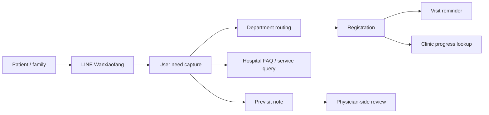
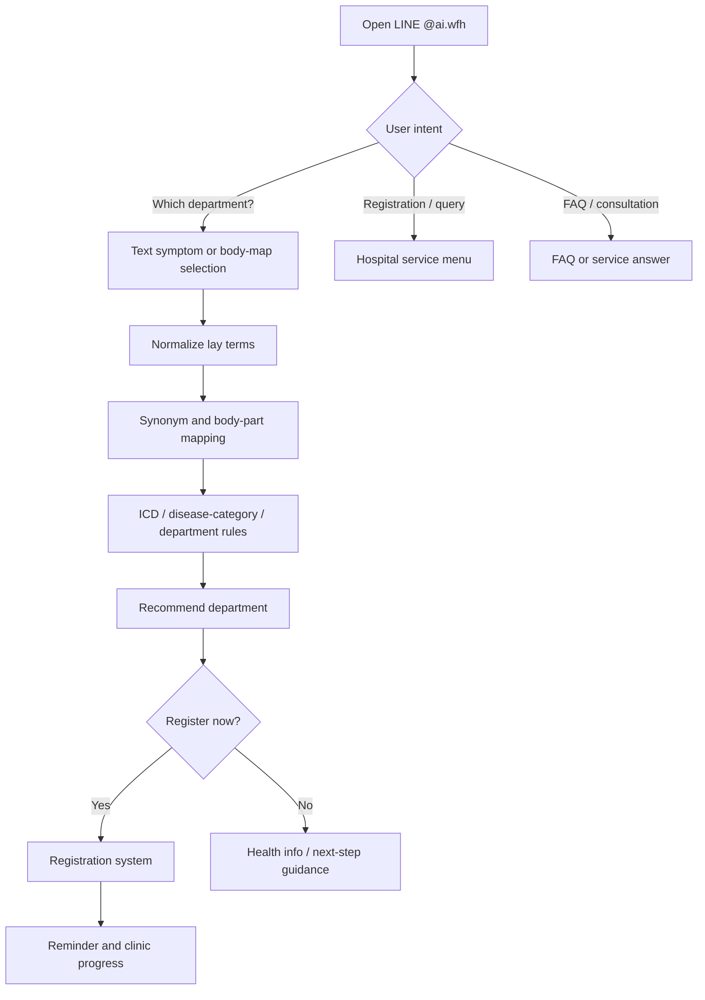
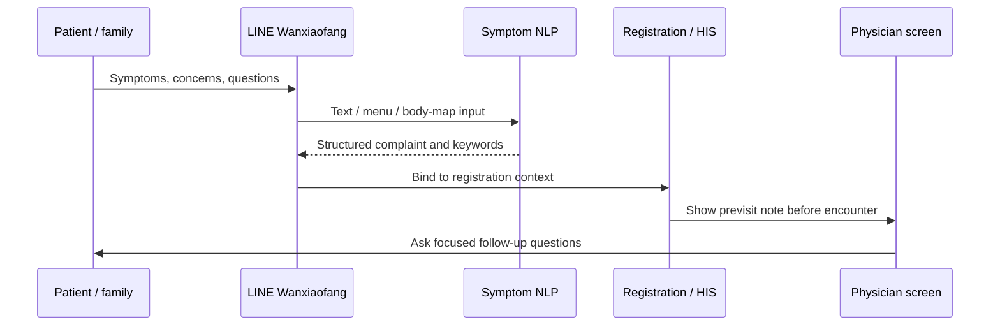
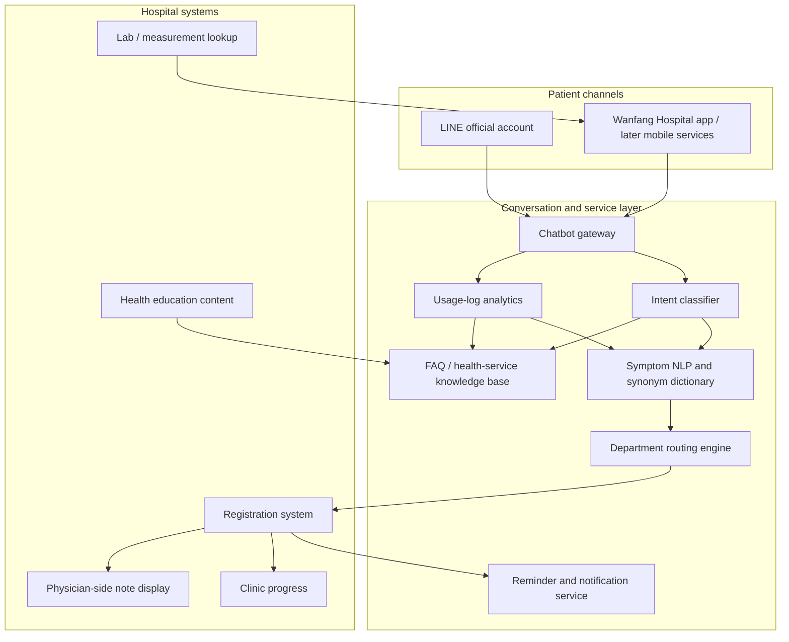
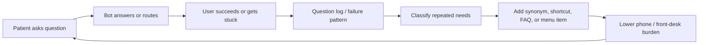
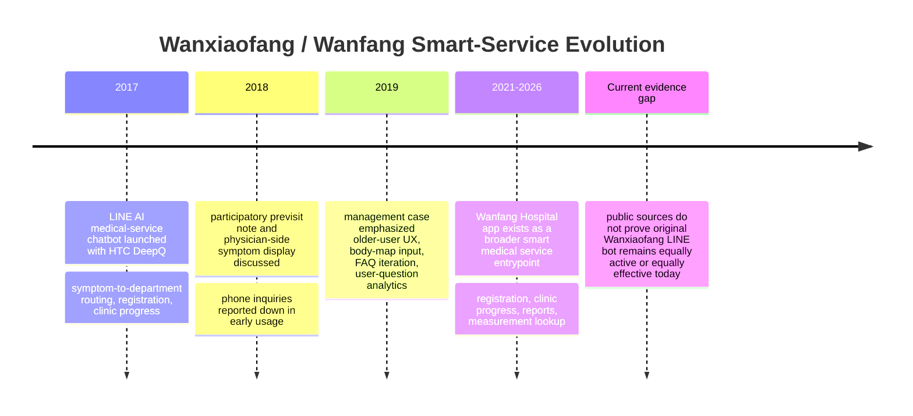
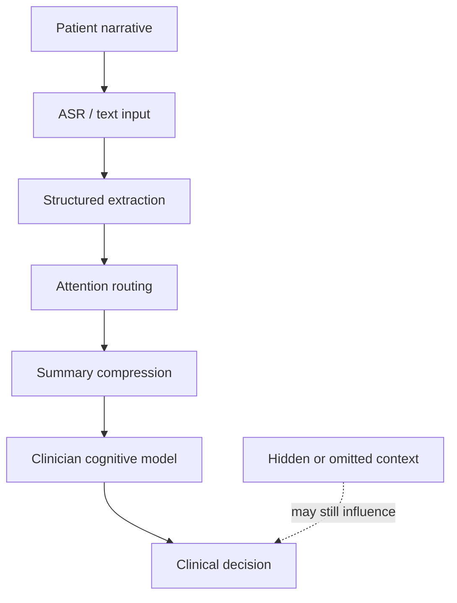
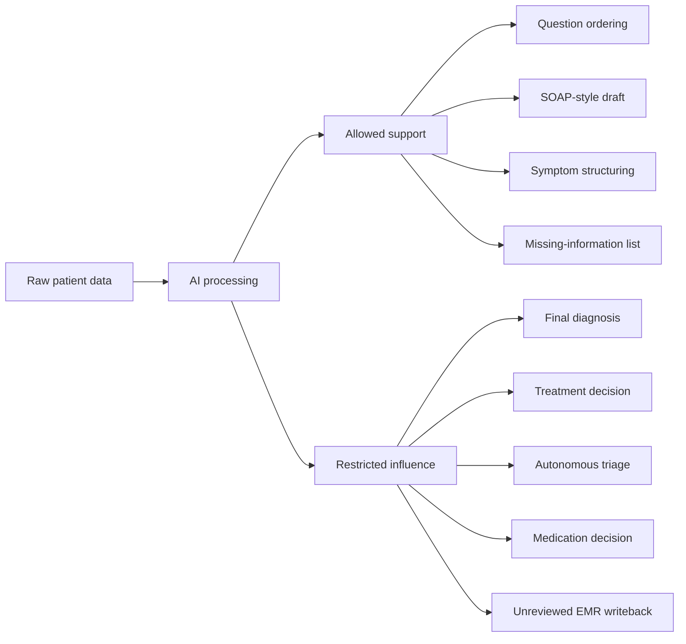
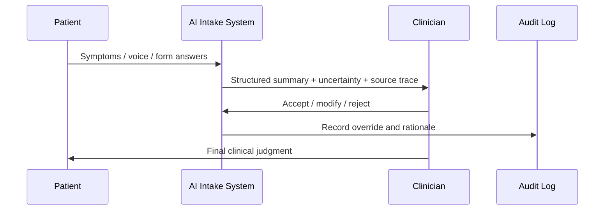
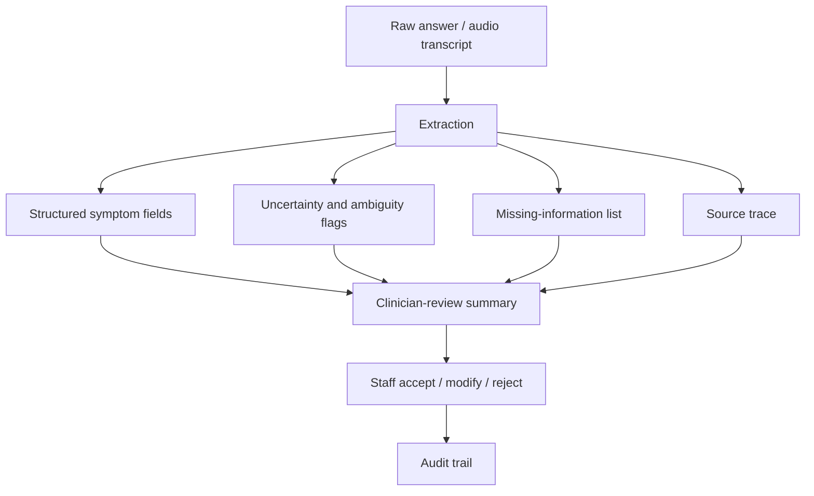

# Wanxiaofang External Benchmark Note

Status: external benchmark note

Date captured: 2026-05-20

Meeting context: this records a short point mentioned around the 2026-05-19 meeting discussion.

Scope boundary: `萬小芳` is not this project's product, not a target to copy, and not a feature commitment. This note is only for studying user need, user feedback, service-flow design, and hospital-facing smart-service patterns.

## One-Line Summary

`萬小芳` was a Taipei Municipal Wanfang Hospital AI medical-service chatbot / smart hospital assistant built with HTC DeepQ and launched around late 2017.

Its useful lesson is not that the AI model was advanced. Its useful lesson is that the product was close to real user friction:

```text
patients do not know where to go, what department to register for, how to ask, or how to prepare before seeing the doctor
```

## Source Notes

| Source | Date / type | Useful facts |
| --- | --- | --- |
| 今日北醫 | 2017-12-10 institutional news | Wanfang Hospital and HTC DeepQ launched `萬小芳`; the system was built on LINE, suggested departments from symptoms, supported registration, visit data lookup, appointment reminders, real-time clinic progress, and future app / personal-health-record expansion. |
| 健康醫療網 | 2017-12-01 media report | Described `萬小芳` as an AI medical-service chatbot developed by Wanfang Hospital and HTC DeepQ; users could search LINE official account `@ai.wfh`, enter symptoms, receive department suggestions, register, query visit records, and receive visit reminders. |
| iThome | 2017-12-01 technology news | Listed six early LINE chatbot services: department guidance, registration, registration query/cancel, clinic progress, phone consultation, and personal registration settings; also described text input and body-part image selection. |
| CNA / Taipei Times | 2018-01 media reports | Reported previsit symptom content being sent to the physician-side system, more than 4,000 early users, and reduced phone inquiries in the first two months. |
| 網管人 | 2018-09-13 interview | Reported design rationale, older-user LINE preference, 21% phone-volume reduction, registration through `萬小芳` growing from 1% to 5-6%, ICD-based routing, physician-experience model training, and synonym-database challenges. |
| myMKC / 能力雜誌 | 2019-05-27 management case | Framed `萬小芳` as more than a LINE official account: a chatbot designed around older users, hospital phone-load reduction, department-routing questions, previsit notes, and iterative use of user questions to improve service design. |
| Wanfang Hospital official history / management pages | Current hospital site | The hospital's history page records the 2017 Line Bot `萬小芳` as part of smart-hospital / participatory-medical-record development; current management text still references `萬小芳` and self-service payment machines as measures that improve convenience and reduce waiting. |
| Google Play / App Store public listings | Current app-store listings checked 2026-05-20 | Wanfang Hospital's mobile app still exists and lists smart registration, clinic progress, doctor/hospital introductions, lab-report lookup, and important measurement-result lookup. Public snippets did not prove that the original `萬小芳` LINE bot remains active under the same brand today. |

Source URLs:

- `https://tmubt.tmu.edu.tw/2017/12/10/2017-12-10-3630/`
- `https://www.healthnews.com.tw/article/35954`
- `https://www.ithome.com.tw/news/118812`
- `https://www.cna.com.tw/news/ahel/201801220135.aspx`
- `https://www.taipeitimes.com/News/taiwan/archives/2018/01/23/2003686280`
- `https://www.netadmin.com.tw/netadmin/zh-tw/market/B03CA94788FF452DA0C0EC9FE30E3B99`
- `https://mymkc.com/article/content/23155`
- `https://www.wanfang.gov.tw/about/history/`
- `https://www.wanfang.gov.tw/about/team/ab1193fc4b7ba150/`
- `https://play.google.com/store/apps/details?hl=zh_TW&id=io.sparktech.wfh`
- `https://apps.apple.com/tw/app/%E8%87%BA%E5%8C%97%E5%B8%82%E7%AB%8B%E8%90%AC%E8%8A%B3%E9%86%AB%E9%99%A2/id1549459206`
- `https://www.deepq.com/`

## What It Was

`萬小芳` should be understood as:

```text
LINE Bot
+ AI Q&A
+ symptom-to-department routing
+ hospital-service flow
+ appointment / registration support
+ future personal-health-record expansion
```

It is closer to:

```text
AI hospital service assistant
```

than to:

```text
general entertainment chatbot
```

It also foreshadows a healthcare CRM / PRM pattern because the system was not only answering questions. It was trying to keep the patient connected to the hospital workflow before and around the visit.

## Reported Functions

Reported functions included:

- symptom-directed department suggestion
- registration support
- visit-information lookup
- common visit-record lookup
- visit reminders
- real-time clinic progress lookup
- AI / FAQ-style medical-service Q&A
- health-information lookup
- previsit note collection
- future app integration
- future personal health record support, such as medication and lab-result lookup

## Detailed Product Analysis

### Product Positioning

The safest reconstruction is:

```text
萬小芳 = LINE-first hospital service assistant
```

not:

```text
autonomous medical diagnosis system
```

It combined:

- conversational entrypoint
- visual / menu-based symptom input
- department-routing guidance
- registration and visit-service integration
- previsit symptom note capture
- reminders and clinic-progress lookup
- iterative service-design feedback from user questions

Its product unit was therefore not "chat." Its product unit was:

```text
one hospital-service journey from uncertainty -> department choice -> registration -> preparation -> visit
```

### Likely User Journey

Public sources support this flow:

1. Patient opens LINE official account `@ai.wfh`.
2. Patient selects a menu item such as `該看哪一科`, registration, query/cancel registration, clinic progress, phone consultation, or registration settings.
3. If the patient chooses department guidance, the patient enters symptoms in text or selects uncomfortable body areas from a visual body map.
4. The system maps layperson symptom language to medical terms, body locations, disease-code categories, and department options.
5. The system suggests a department and can guide online registration.
6. Appointment and clinic-progress services keep the patient connected to the hospital flow.
7. If the patient leaves symptom information before the visit, that information can appear in the physician-side system for review.
8. User questions and usage logs feed future improvements, such as shortcutting common symptoms or expanding FAQ / education content.

### Likely System Architecture

The architecture below is a reconstruction from public descriptions. It is not an official architecture diagram.

| Layer | Likely responsibility | Source status |
| --- | --- | --- |
| LINE official account | main patient-facing channel | source-supported |
| Menu / visual body map | low-typing and older-user symptom entry | source-supported |
| Chatbot gateway | receive text/menu/body-map events | inferred |
| Intent classifier | decide whether user wants department routing, registration, query, clinic progress, FAQ, etc. | inferred |
| Symptom NLP / synonym map | map lay terms like `肚子` to clinical terms like abdomen | source-supported |
| Department routing engine | connect symptoms / ICD-like disease categories to department suggestions | source-supported |
| FAQ / health-content service | answer repeated hospital / medical-service questions | source-supported at function level |
| Hospital registration integration | create or route registration actions | source-supported |
| Clinic progress / reminder service | query progress and send reminders | source-supported |
| Physician-side note handoff | display previsit symptom notes in clinical workstation / order-entry context | source-supported |
| Analytics / feedback loop | classify repeated questions and improve content / UI | source-supported at design level |

### AI / NLP Design

Public reports suggest a pre-LLM architecture:

```text
intent classification
+ symptom keyword extraction
+ medical synonym dictionary
+ ICD / department mapping
+ physician-experience training data
+ FAQ matching
+ guided menu fallback
```

This is very different from a modern open-ended LLM agent. The system likely avoided unconstrained reasoning by keeping the goal concrete:

```text
help the patient find the right service path
```

The hard NLP problem was not "general intelligence." It was:

```text
layperson language -> clinically useful routing term
```

Examples from public reporting:

- `肚子` should map to abdomen.
- `屁股` should map to buttock / hip / pelvic-area concepts depending on context.
- `眼白` should map toward sclera / eye-related terminology.

This is exactly the kind of problem that can be solved through synonym tables, body-part maps, short clarification questions, and usage-log iteration.

### UX Design

The strongest UX decisions were:

- use LINE because older patients already knew it
- use a friendly character to make the hospital feel less cold
- use menu options for common tasks
- use visual body maps for users who cannot type symptoms clearly
- capture previsit notes so patients do not have to remember everything inside the room
- support family-assisted preparation
- iterate from real user questions rather than guessing what patients need

The product lesson:

```text
For hospital AI, low-friction UX can be more important than model novelty.
```

## Mermaid Diagrams

### 1. Product Role Map



### 2. Symptom-To-Department Routing Flow



### 3. Previsit Note Handoff



### 4. Inferred System Architecture



### 5. Feedback Loop



### 6. Evolution Timeline



## Reported Effects

Public sources reported these effects:

| Metric / effect | Reported value | Source interpretation |
| --- | --- | --- |
| Early LINE users | more than 4,000 / about 4,250 users in roughly the first two months | early traction, not long-term retention |
| Early phone inquiry reduction | about 18% in early reporting | initial service-load reduction |
| Later phone-volume reduction | 21% | stronger reported operational KPI |
| Registration through Wanxiaofang | from 1% to 5-6% | useful service adoption signal |
| Friend / user count | over 10,000 or 15,000+ in later reports, depending on source/date | growth signal; exact definition may vary |
| User-question corpus | over 100,000 questions reported in the 2019 management case | valuable feedback dataset for service design |
| Qualitative physician effect | previsit symptoms visible before the encounter | supports focused questioning and fewer repeated explanations |

The most important effect is not the numeric KPI alone. It is the pattern:

```text
patient uncertainty and repeated hospital-service questions became measurable design input
```

## Current Status As Of 2026-05-20 Web Check

### What Is Still Publicly Visible

Wanfang Hospital still has a mobile app entrypoint on its official website and public app-store listings.

Current public app-store descriptions list:

- smart registration
- real-time clinic progress
- hospital and physician introductions
- Wanfang lab-report lookup
- important measurement-result lookup

The official Wanfang history page still records the 2017 Line Bot `萬小芳` as a smart-hospital and participatory-medical-record milestone. A current management-team page also references `萬小芳` and self-service payment machines as convenience / waiting-time improvement measures.

### What Is Not Publicly Proven

I did not find a current official 2025-2026 source proving that:

- the original LINE bot `萬小芳` is still active under the same brand
- current `萬小芳` usage is as high as the 2018-2019 reported period
- current phone-volume reduction is still 18-21%
- current routing accuracy / patient satisfaction remains at the same level
- the app-store product is functionally the same thing as the original LINE bot

So the safest status statement is:

```text
The Wanfang Hospital mobile app remains active as a broader smart-medical-service entrypoint, but public evidence is insufficient to claim the original Wanxiaofang LINE bot remains active with the same brand, usage, and effect as 2017-2019.
```

### Current / Newer Technical Direction

Public Wanfang sources suggest the hospital's newer technology direction is broader than `萬小芳`:

- HIS 3.0 upgrade in 2024
- high-efficiency smart lab in 2024
- Hospital-at-Home participation in 2025
- continued official app entrypoints for registration, clinic progress, reports, and measurements
- broader smart hospital / data / AI framing in management text

Interpretation:

```text
The visible evolution is from LINE chatbot -> app / HIS / smart-hospital service infrastructure.
```

That means `萬小芳` should be studied as an early patient-service interface pattern, while the current hospital direction appears to emphasize integrated digital hospital services rather than a single chatbot brand.

## Postdoctoral Researcher Addendum: What We Have Not Discussed Enough

This section is an analytic addendum, not a source-backed claim about Wanfang Hospital or HTC DeepQ.

The most important missing question is not:

```text
Can this AI system work?
```

The deeper question is:

```text
Who changes behavior because this system exists, and who carries responsibility after that behavior changes?
```

Hospital AI adoption rarely depends only on model capability. A hospital uses a system when some role in the real workflow has less friction, less uncertainty, less repetitive labor, or better reviewability.

### 1. Design For Responsibility Transfer, Not Only AI Performance

The main risk of AI triage / previsit systems is not only that the AI may be wrong. The more subtle risk is:

```text
AI output sounds like a conclusion
-> staff begin to rely on it
-> clinical responsibility becomes ambiguous
```

The safer product language is:

```text
patient narrative organization for clinician review
```

Avoid making the system sound like:

```text
AI diagnosis
AI triage decision
AI treatment suggestion
```

This is not merely conservative wording. It is the basic condition for hospital trust, liability containment, and realistic deployment.

### 2. The Core Unit Is Clinical Handoff, Not Chat

`萬小芳` helped patients find an entrypoint into the hospital workflow.

The next-generation value for a urology previsit system should be:

```text
patient -> system -> nurse / clinician
```

That middle step is a clinical handoff. The system transforms a messy patient narrative into a form that a staff member can review, correct, and safely use.

The minimum research artifacts should therefore be:

```text
1. Patient intake record
2. Staff review summary
3. Audit trail
```

Without an audit trail, the system is only a demo. With an audit trail, the system begins to look like a deployable clinical workflow tool.

### 3. Design The Failure Modes First

Many demos show only the success path. Hospitals care about what happens when the system is uncertain, incomplete, contradictory, or clinically sensitive.

The system should explicitly define fallback behavior:

| Situation | Expected behavior |
| --- | --- |
| Low confidence | do not over-summarize; mark for staff confirmation |
| Inconsistent answers | show a contradiction flag |
| Possible red flag | stop short of conclusion; escalate for staff review |
| Missing information | generate a missing-information list |
| Ambiguous symptom wording | preserve the raw phrase and ask a clarification question |
| ASR uncertainty | show transcript confidence and raw audio / transcript linkage where appropriate |

This distinction matters because:

```text
failure behavior is part of the product architecture
```

### 4. Workflow KPIs Matter More Than Model-Only Scores

Accuracy, F1, and routing correctness are useful, but they are not enough for a hospital-facing system.

Operational KPIs may be more persuasive:

- time-to-understand chief complaint
- repeated-question rate
- nurse clarification burden
- clinician summary acceptance rate
- staff correction rate
- missing-critical-information rate
- wrong-department registration rate
- front-desk / phone load
- patient completion rate
- patient confusion or abandonment points

The important lesson from `萬小芳` is that the reported value was workflow value: fewer repeated calls, smoother first-layer guidance, and a better patient service path.

### 5. The System Needs Role-Specific Surfaces

A single chatbot screen is too shallow for a real clinical system.

At minimum, different roles need different views:

| Role | What this role needs |
| --- | --- |
| Patient / family | simple intake, low-typing interaction, clear next step |
| Nurse / case manager | red flags, missing items, contradictions, follow-up needs |
| Clinician | chief complaint, timeline, structured summary, raw-answer traceability |
| Manager / PI | usage, time saved, correction rate, abandonment rate, safety review signals |

This is the difference between:

```text
chatbot interface
```

and:

```text
clinical workflow system
```

### 6. Define Non-Autonomous Boundaries Early

A clinical AI boundary document should contain a sentence like:

```text
The system must not autonomously diagnose, assign final triage level, recommend treatment, or write directly into the EMR without clinician review.
```

In Chinese:

```text
系統不能自主診斷。
系統不能自主決定最終檢傷級別。
系統不能提供治療建議。
系統不能未經醫師確認直接寫入 EMR。
```

These are not only restrictions. They are trust-building constraints.

### 7. Reframe The Product Name Away From "AI Triage"

`AI triage` sounds powerful, but it also sounds legally and clinically dangerous.

A safer research/product framing is:

```text
Vital-aware previsit intake and clinician-review summary system
```

Chinese:

```text
結合生命徵象的門診前問診與醫護覆核摘要系統
```

This framing is more defensible for demo, paper, hospital conversation, and future regulatory discussion.

### 8. The Hidden System Is Clinical Attention Allocation

The system may look like an intake tool, but it is actually closer to:

```text
clinical attention allocation system
```

Because the system decides or influences:

- which questions are asked first
- which symptoms are highlighted
- which information is summarized
- which context is omitted
- which patients or narratives receive flags

Clinical attention is scarce. A system that routes attention can affect clinician cognition even if it never outputs a diagnosis.

### 9. Define The AI Influence Boundary

Most teams define only whether AI can diagnose. That is too narrow.

The harder question is:

```text
How far is AI allowed to influence clinical cognition?
```

| AI behavior | Possible cognitive risk |
| --- | --- |
| ordering questions | changes what staff notice first |
| highlighting symptoms | creates anchoring |
| summarizing narratives | removes nuance |
| compressing uncertainty | makes weak evidence look stable |
| risk labels | creates alert fatigue or overreaction |
| follow-up question suggestions | becomes implicit clinical guidance |

This is a cognitive-governance problem, not just an engineering problem.

### 10. Watch For Representation Collapse

The common pipeline looks simple:

```text
ASR -> LLM -> summary
```

The risk is that a high-dimensional patient narrative becomes a low-dimensional clinical phrase.

Example:

```text
Original narrative:
"I am not sure if it is pain. It feels dull, sometimes more obvious on the left,
but walking seems to make it better."

Compressed summary:
"left flank discomfort"
```

What may disappear:

- uncertainty
- hesitation
- temporal nuance
- behavior pattern
- emotional signal
- context that does not fit a clean symptom label

The research question is not only how to summarize. It is how to summarize without destroying clinically meaningful uncertainty.

### 11. Use An Uncertainty-Preserving Architecture

The output should not be only:

```text
summary
```

It should be closer to:

```text
summary + uncertainty + omitted context + source trace
```

Example schema:

```json
{
  "summary": "Patient reports intermittent left-sided dull discomfort.",
  "confidence": 0.63,
  "possible_ambiguities": [
    "pain versus discomfort is unclear",
    "timing and triggers are incompletely specified"
  ],
  "missing_information": [
    "fever",
    "gross hematuria",
    "pain severity",
    "duration"
  ],
  "source_trace": [
    {
      "summary_claim": "left-sided dull discomfort",
      "source_answer_id": "answer_003"
    }
  ],
  "raw_reference_available": true
}
```

This kind of output is less flashy than a polished paragraph, but it is much safer.

### 12. Study Override Friction

Many systems say they are human-in-the-loop. The UI may still push the clinician toward the AI's frame.

For example:

```text
HIGH RISK
```

may change clinician attention even before review.

A serious system should ask:

```text
How easy is it for the clinician to disagree with the AI?
```

Important design choices:

- make correction easy
- log accept / modify / reject
- show raw evidence near each AI claim
- avoid visually over-dominant risk badges
- separate "needs review" from "clinically high risk"
- study when staff override the system and why

### 13. Trust Calibration Is A Research Problem

The goal is not maximum trust. The goal is appropriate trust.

| Trust failure | Result |
| --- | --- |
| over-trust | automation bias |
| under-trust | system abandonment |
| unstable trust | inconsistent and unsafe use |

A good clinical AI workflow should help clinicians know:

```text
when not to trust the AI
```

This can become a stronger research contribution than simply improving a model benchmark.

### 14. Integration Entropy May Be The Real Deployment Risk

Medical AI systems often fail because of socio-technical integration, not because of model weakness.

Common failure sources:

- HIS integration cost
- EMR writeback constraints
- workflow mismatch
- nurse adoption burden
- physician resistance
- unclear liability
- alert fatigue
- maintenance burden
- data drift
- role-specific UI friction

The practical warning:

```text
The hardest part of healthcare AI is often not AI.
It is socio-technical integration.
```

### 15. Suggested Immediate Add-On Document

Create a future document:

```text
Clinical AI Boundary Document
```

It should define:

- what the system does not do
- who makes the final decision
- what raw information must never be hidden
- which symptom phrases must preserve raw text
- how uncertainty appears
- when escalation happens
- how override logging works
- how audit trails are stored
- what counts as a safety-relevant failure
- which metrics show workflow value

This would improve:

- hospital trust
- regulatory defensibility
- engineering clarity
- future publication quality
- demo credibility

### Governance Diagrams

#### Clinical Cognition Flow



#### AI Influence Boundary



#### Trust Calibration Loop



#### Uncertainty-Preserving Summary Architecture



### Postdoctoral-Level Research Question

The stronger research question is not:

```text
How do we build an AI triage chatbot?
```

It is:

```text
How should clinical attention be governed when AI systems mediate patient narratives before clinician review?
```

This reframes the work from:

```text
medical chatbot
```

to:

```text
AI-mediated clinical cognition governance
```

That is a deeper and more defensible research contribution.

## User-Need Insight

The strong product insight is:

```text
Hospital AI succeeds when it reduces user friction in the real service path.
```

The important user problems were practical:

- patients do not know which department to visit
- older users may not be comfortable with hospital websites or standalone apps
- users already understand LINE better than hospital portals
- many calls to the hospital are repeated routing / information questions
- patients forget what to say by the time they reach the clinic room
- family members may need to help prepare information before the visit
- hospital staff need to reduce repetitive phone and front-desk load

This is more valuable than a model-centric product claim.

## Design Lessons

### Start From The User's Existing Channel

`萬小芳` used LINE because many patients already used it. The product lowered access friction by entering an existing habit instead of forcing a new app habit.

Design implication:

```text
The best entrypoint may be the channel patients already understand, not the technically cleanest app surface.
```

### Use Visual And Low-Typing Interaction

The 2019 management case described body-map style interaction for users who may not type symptoms well. The point is not the exact UI pattern. The point is that symptom input should accommodate low literacy, older users, and vague symptom descriptions.

Design implication:

```text
A good medical assistant should handle "I do not know how to say it" as a first-class use case.
```

### Measure Workflow Value, Not Only AI Ability

Reported outcomes emphasized service burden and patient-flow value, including reduced phone volume and smoother first-layer guidance.

Design implication:

```text
Measure fewer repeated calls, fewer wrong-department registrations, better previsit preparation, and lower staff burden.
```

### Treat Previsit Notes As A Workflow Bridge

The reported `診前筆記` idea is especially relevant as a benchmark. The patient or family can write down the condition before the visit, and the clinician can review it rather than relying only on hurried in-room explanation.

Design implication:

```text
Previsit capture is valuable when it improves the clinician's first 1-2 minutes, not when it becomes an autonomous medical record.
```

## Relation To Current Research Thinking

This benchmark is conceptually adjacent to several current research interests:

- urology previsit intake
- adaptive question selection
- ASR-assisted input
- RAG / embedding-supported routing
- AI triage / routing
- patient-facing workflow assistance
- CRM / PRM follow-up
- HIS / EMR-adjacent service integration
- user-feedback-driven product iteration

However, adjacency does not mean scope adoption.

Current accepted urology previsit scope remains separate:

```text
previsit symptom collection -> missing-information repair -> clinician-review summary
```

`萬小芳` can be used as a benchmark for user need and service design, not as evidence that this project should implement registration, LINE messaging, payment, HIS integration, EMR integration, department routing, or broad hospital-service chatbot functions.

## Compared With Current Direction

`萬小芳` circa 2017-2019 appears to have been shaped around:

```text
AI hospital service assistant
```

using then-available patterns such as:

- LINE bot workflow
- rule-based or intent-classification style routing
- FAQ matching
- guided menus
- basic NLP
- hospital-service integration

Current research and prototype thinking may go further technically:

- vital-sign integration
- adaptive question selection
- embedding-based next-question ranking
- ASR + LLM / RAG possibilities
- guideline grounding
- explainable workflow routing
- clinician-review summary generation
- AI governance, privacy, and regulatory boundary design

But the benchmark warning is important:

```text
More advanced AI does not matter unless it solves a sharper workflow problem.
```

## Useful Research Questions

Questions to carry forward:

1. Which patient friction point is strongest: wrong department, unclear symptom expression, visit preparation, follow-up, or waiting anxiety?
2. What channel is easiest for the target users: LINE, app, kiosk, tablet, QR web form, phone-assisted staff flow, or family-assisted form?
3. What information should be captured before the visit to improve the clinician's first few minutes?
4. Which burden should be measured first: phone calls, front-desk questions, repeated nurse questions, wrong registration, missing information, or patient confusion?
5. What must remain outside the system: diagnosis, treatment recommendation, autonomous triage, official EMR writing, payment, or production HIS access?
6. How should user questions be logged and categorized so design improvements follow real demand rather than imagined features?

## Non-Decision

This note does not change the current project boundary.

Do not infer that this project will build:

- `萬小芳`
- a Wanfang Hospital clone
- a general hospital chatbot
- LINE official account integration
- registration or payment functions
- HIS / EMR writeback
- autonomous department routing
- clinical diagnosis or treatment advice

Use this note as:

```text
external benchmark for user need, service-flow design, and product evaluation questions
```
