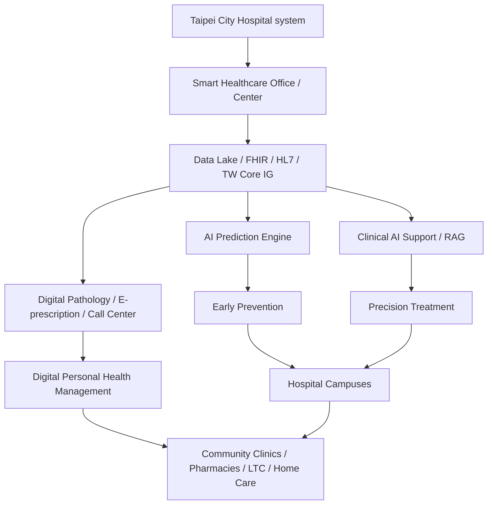

# A2-0048 Smart Healthcare Center Precedent Proposal Record

Status: captured and analyzed

Date captured: 2026-05-21

Source PDF:

```text
/home/jnclaw/Downloads/附件1_A2-0048計畫書修正檔案 (003)-智慧健康醫療中心20260521.pdf
```

Extracted source files:

- `sources/full-text.txt`: complete text extraction from the 43-page PDF by `pdftotext -layout`.
- `sources/pdfinfo.txt`: PDF metadata.
- `sources/source-pdf.sha256`: source PDF checksum.

Checksum:

```text
b5daca1b66afebcc24f0e83067e1738c7d4ba780a29de90bc204ef3124e52309
```

This Markdown file is the structured record and analysis. The complete extracted content is preserved in `sources/full-text.txt`.

## 1. Source Identity

| Field | Captured content |
| --- | --- |
| Proposal title | 「健康台灣深耕計畫」－臺北市立聯合醫院智慧醫療創新五年計畫：整合 AI 技術打造慢性病預防診療與全人健康照護生態圈 |
| Applicant | 臺北市立聯合醫院 |
| County / city | 臺北市 |
| Application mode | A2 |
| Categories checked | 範疇一：優化醫療工作條件；範疇二：規劃多元人才培育；範疇三：導入智慧科技醫療；範疇四：社會責任醫療永續 |
| Requested total budget | 99,989,245 元 |
| Matching fund | 8,544,245 元 |
| Execution period | 114/09/01 至 115/12/31 |
| PI | 王智弘，總院長 |
| Main contact | 趙康邑，副執行秘書 |
| PDF pages | 43 |

## 2. Cooperating Institutions

The proposal positions itself as a cross-hospital, cross-community, and cross-professional ecosystem plan. Cooperating institutions listed on the cover include:

1. 臺北市立萬芳醫院-委託臺北醫學大學辦理
2. 社團法人臺灣在宅醫療學會
3. 臺北市醫師公會
4. 臺北市藥師公會
5. 多田診所
6. 松禾診所
7. 臺北市私立建民老人長期照顧中心(養護型)
8. 臺北市私立賢暉老人長期照顧中心(養護型)
9. 郵政醫院-委託中英醫療社團法人經營
10. 中華民國助產師助產士公會全國聯合會
11. 123 宅藥局
12. 大東健保藥局
13. 予志藥局
14. 石川藥師藥局
15. 博醫仁愛藥局
16. 博醫和平藥局

## 3. Official Section Map

| Official section | Content captured |
| --- | --- |
| 壹、申請單位自我檢核項目表 | eligibility, partner consent, duplicated funding, conflict-of-interest, disclosure and appendix checks |
| 貳、計畫概要 | legal/policy basis, problem analysis, relation to existing government subsidy plans, three strategic pillars, responsible-AI governance, five-year vision |
| 參、申請單位簡介 | Taipei City Hospital scale, multi-campus role, service capacity, community reach |
| 肆、計畫規劃 | four official categories, detailed work packages, partner execution content, review-opinion supplements, cybersecurity/data-governance plans |
| 伍、效益評估 | KPI table, baseline/target values, annual checkpoints, expected benefits, spending/progress checkpoints |
| 陸、出國計畫書 | Singapore hospital visit and HIMSS conference plan |
| 柒、經費規劃 | line-item budget, scope allocation, capital/current expenditure, matching funds |
| 捌、人力配置表 | PI, co-PIs, subproject leads, campus leads, department leads, research assistants |
| 玖、其他 | IRB explanation: IRB in review; research planned for second phase; no first-phase research execution |
| 拾至拾參 | COI, no-duplicate-funding declaration, participation consent, review-response form are listed, but the PDF table of contents contains unresolved Word bookmark errors |

## 4. Core Proposal Logic

The precedent is not a single clinical AI product. It is an institutional smart-healthcare transformation program.

Its main logic is:

```text
aging population + chronic disease burden + fragmented clinical data
-> AI-driven early prediction
-> AI-assisted precision treatment
-> digital personal health management
-> cross-level, cross-site smart healthcare ecosystem
```

The proposal repeatedly frames AI as a way to reduce healthcare-worker burden, connect hospital and community care, and create a responsible-AI governance center.

## 5. Three Strategic Pillars

### Strategy 1: Early Prevention

The first strategy shifts the system from passive treatment to proactive prediction.

Main components:

- AI integrated risk engine for chronic disease and CKM-related risk.
- Use of NHI MediCloud, HIS, LIS, wearable, genetic and longitudinal health data.
- XGBoost for static risk factors.
- Transformer models for longitudinal time-series signals.
- Stacking/meta-classifier fusion.
- SHAP for explainability and modifiable risk factor identification.
- Fetal heart-sound AI, pediatric ECG AI, home ECG, and other early-warning scenarios.

### Strategy 2: Precision Treatment

The second strategy uses big data and embedded AI to support precision integrated treatment.

Main components:

- AI Co-pilot-like clinician support.
- Single source of truth across fragmented clinical data.
- Guideline-linked support for CKD, diabetes, cardiovascular risk and CKM-related care.
- Digital pathology infrastructure.
- AI medication-safety review.
- RAG and LLM-based clinical knowledge support.
- Nursing voice AI.
- Smart Call Center.

### Strategy 3: Personal Health Management

The third strategy builds a digital personal-management layer outside the hospital.

Main components:

- 24-hour AI digital health manager / personal assistant.
- Personalized nutrition, medication, and self-management support.
- Food photo recognition and health education.
- Encrypted case-manager communication.
- Smart bidirectional referral across hospital, clinic, pharmacy and community care.
- Long-term individual disease-management loop.

## 6. Governance And Technical Architecture

The proposal treats governance as a core workstream, not an appendix.

Captured governance/architecture elements:

- Smart healthcare office / smart healthcare center as the responsible-AI governance hub.
- AI transparency, model inventory, data asset inventory and auditability.
- SMART on FHIR, FHIR, HL7, TW Core IG, LOINC, RxNorm.
- Data lake v1.0 and later data lake v2.0.
- HIS, LIS, PACS, NHI MediCloud, wearable, genomic, pathology and community data sources.
- Threat risk assessment (TRA).
- GCB, EDR, Zero Trust and related cybersecurity controls.
- ISO27001 within two years and third-party certification within three years.
- Model version control, lifecycle monitoring, clinical validation and deployment review.
- External technical roles: NYCU biomedical AI research team for algorithms, company deployment/inference support, NVIDIA technical support for explainability/GPU-related modules.

## 7. Four Official Categories

### Category 1: Optimize Medical Working Conditions

Main direction:

- Reduce repetitive documentation and administrative labor.
- Improve high-burden clinical workflows such as CKD, diabetes, heart failure, COPD and emergency care.
- Use clinical AI support and RAG knowledge systems.
- Build digital pathology workflow.
- Build AI medication-safety review and CDSS.
- Use home-side automation to reduce case-management and education burden.
- Run baseline surveys for time and personnel cost before AI introduction.

Important lesson:

```text
The precedent makes workforce burden a measurable operating problem, not a slogan.
```

### Category 2: Talent Cultivation

Main direction:

- Smart healthcare empowerment workshops.
- Cross-department clinical workgroups.
- Overseas visits and international conferences.
- Digital tool learning map.
- Digital pathology training.
- ESG / net-zero training such as iPAS and ISO 14064 / ISO 14067 related programs.

### Category 3: Smart Healthcare Technology

Main direction:

- AI governance.
- Interoperability and data standards.
- Clinical AI applications.
- Workflow and staff-burden reduction.
- Smart outpatient, smart ward, digital pathology, remote care and call-center services.

Category 3 contains the most relevant precedent for our current proposal, but this precedent is much broader than our urology previsit scope.

### Category 4: Social Responsibility And Sustainable Healthcare

Main direction:

- Graded care and bidirectional referral.
- Community health promotion.
- Rural/remote care and health equity.
- Green healthcare, carbon and ESG management.
- Paperless/digital workflow.
- Long-term care and pharmacy participation.

## 8. Partner-Specific Execution Content

Captured partner roles:

| Partner | Captured execution direction |
| --- | --- |
| Wanfang Hospital | smart teaching alliance, overseas training/conference, elite training, cross-disciplinary training, hospital-at-home risk stratification, remote monitoring and emergency response |
| Taiwan Home Healthcare Society | home healthcare training center, cross-institution faculty/course exchange, home-care benchmark training, AI risk stratification, remote care, knowledge platform |
| Taipei Medical Association | rural/remote care, adolescent/school-age health intervention, co-care, digital pathology platform, sustainability reporting, community health, app and e-prescription support |
| 多田診所 / 松禾診所 | wireless monitoring for high-risk dialysis patients, abnormal-event reporting, remote support, staff training and acceptance evaluation |
| Taipei Pharmacist Association / pharmacies | electronic prescription receiving and dispensing workflow, community pharmacy execution, public education and error reduction |
| Long-term care institutions | physician rounds, pharmacist medication review, community pharmacy delivery, remote monitoring and long-term-care role expansion |
| Postal Hospital | maternal/infant orthopedic clinic and community service |
| Midwives association | obstetric and practical training, midwife-OB co-training, interprofessional courses and international exchange |

## 9. KPI Pattern

The precedent uses a table pattern that is useful for our own proposal:

```text
scope -> indicator code -> indicator name -> measurement definition -> baseline -> target
```

Examples captured:

| Scope | KPI pattern | Captured target |
| --- | --- | --- |
| Scope 1 | AI-assisted repetitive-work time reduction | 15% reduction for CKM clinic standardization |
| Scope 1 | Electronic prescription issue count | 200 |
| Scope 1 | Staff work satisfaction | +5% |
| Scope 2 | Smart-healthcare training participation | 80% |
| Scope 2 | International exchange count | 4 |
| Scope 2 | Cross-department project participation | 10% |
| Scope 3 | AI image interpretation accuracy/report-time improvement | 15% |
| Scope 3 | AI home-coverage solution | 5% CKM high-risk pilot |
| Scope 3 | Physician adoption of AI CDSS | 30% |
| Scope 3 | Structured EMR coverage including wearable/genomic data | 50% |
| Scope 3 | Big-data AI prediction AUROC | 0.81 |
| Scope 3 | Data-sharing platform security compliance | 85% |
| Scope 4 | Rural/remote care coverage | 30% |
| Scope 4 | Adolescent/school-age health intervention | 40% |
| Scope 4 | Digital pathology use and energy saving | 35% / 5% |

## 10. Annual Checkpoint Pattern

The proposal has detailed checkpoint tables with:

- work content
- content state
- planned completion date
- cumulative progress percentage
- cumulative planned spending
- expected output and benefit

Examples:

| Period / checkpoint | Captured pattern |
| --- | --- |
| 114/09/01-115/03/31 | cumulative progress around 15%; spending checkpoint around 13,716,750; governance/legal framework, clinical prototype, baseline survey, training, smart medical committee |
| 115/04/01-115/12/31 | module standardization, data lake, digital pathology deployment, e-prescription trial, annual AI work-benefit monitoring report, standardized training, international exchange, data lake 2.0 and multi-modal AI development |

Important lesson:

```text
A strong Health Taiwan proposal should connect work package, date, percent progress, spending and evidence artifact.
```

## 11. Overseas Plan

The precedent includes an overseas plan under Category 2.

| Item | Content | Budget |
| --- | --- | --- |
| Singapore hospital visit | smart hospital benchmark learning, visit/workshop/expert exchange | 197,850 元 |
| HIMSS international conference | health information management, FHIR/HL7, AI clinical application, digital pathology and home health technology | 439,480 元 |
| Total | overseas training / international conference | 637,330 元 |

This is a useful format reference only. Our current urology subproject should not add overseas travel unless the parent proposal intentionally owns a Category 2 talent-training budget.

## 12. Budget Structure

| Budget class | Captured amount / content |
| --- | --- |
| Personnel | 15,350,904 元 |
| Business expense | 51,430,096 元 |
| Capital expense | 24,664,000 元 |
| Subsidy total | 91,445,000 元 |
| Matching fund | 8,544,245 元 |
| Total | 99,989,245 元 |
| Capital percentage of subsidy | 27% |
| Matching-fund percentage of total | 9% |

Budget items include:

- doctoral and master-level full-time assistants
- research assistants / case managers / IT personnel
- part-time doctoral/master assistants
- hardware and software leasing
- physiological monitors
- transport vehicle rental
- AI servers and software services
- lecture fees, consultation meetings, survey gifts, IRB fee, postage, stationery, printing, clinical trial-related subject expenses
- overseas travel
- computer processing and data analysis
- paper publication/editing fees
- ESG/net-zero education and third-party assurance
- community integrated screening service maintenance
- risk-prediction-model analysis outsourcing
- smart healthcare platform, app, dashboard, cloud/API service, wearable device, remote-care package, e-prescription, FHIR exchange platform, inference/training servers and model-distillation/development tools

## 13. Human Resources Structure

The proposal lists a large institutional execution structure:

- PI: hospital superintendent.
- Co-PIs: deputy superintendents, strategy lead and campus superintendents.
- Category leads:
  - Scope 1: human resources office lead.
  - Scope 2: teaching/research department lead.
  - Scope 3: chief secretary / smart healthcare lead.
  - Scope 4: planning/administrative center lead.
- Execution secretary.
- Campus deputy superintendents.
- Department leads from emergency medicine, community medicine, oncology, neurology, family medicine, pharmacy, nursing, social work, medical affairs, nephrology, IT and planning.
- Full-time and part-time assistants.

Important lesson:

```text
The proposal makes institutional ownership visible. Each major claim has to be tied to a named role or unit before formal submission.
```

## 14. Quality Risks Observed In The Precedent

The precedent is valuable as a format and scope reference, but it is not a flawless writing model.

Observed risks:

- The table of contents contains unresolved Word bookmark errors for sections 拾 to 拾參.
- The extracted text includes internal draft residue such as `???? 要留嗎`.
- The extracted text includes an internal recommendation-style sentence such as `根據以上說明, 故建議為 7/30`.
- The proposal is very broad: CKM, diabetes, CKD, CVD, digital pathology, e-prescription, call center, nutrition, app, data lake, FHIR, community referral, ESG, overseas training, home care and more.
- Some language moves close to clinical decision support or treatment suggestion claims, such as guideline-linked individual treatment recommendation, AI-generated health advice and AI prescription/lifestyle recommendation.
- Several numerical claims are ambitious and would need strong evidence, ownership and governance to be credible.

## 15. Architecture Summary Diagram Of The Precedent



## 16. What We Should Learn

### Adopt

We should adopt these structural lessons:

- Use the official section order and show the administrative blanks clearly.
- Tie every major function to official scope, KPI, budget, owner, checkpoint and evidence artifact.
- Treat clinical friction and workforce-burden reduction as a measurable plan requirement.
- Include AI/data/cybersecurity governance as a first-class execution path.
- Prepare a review-response table early.
- Add partner/owner responsibility tables before making cross-unit claims.
- Include annual checkpoint tables with progress percentage, planned spending and expected evidence.
- Keep budget lines justified by KPI, not by technical excitement.

### Modify Before Adoption

We should adapt these items carefully:

- The precedent uses a very broad ecosystem story. Our current proposal should keep the broad policy alignment but preserve a narrow executable urology workflow.
- The precedent includes overseas training. Our current subproject should leave this to the parent proposal unless a real Category 2 owner and budget exist.
- The precedent uses clinical AI and CDSS language. Our wording should remain clinician-review summary and workflow support.
- The precedent uses large claims such as AI second brain and large-scale savings. Our proposal should stay assertive but evidence-grounded: repeated-question reduction, read-time, missing-field visibility and staff-friction reduction.

### Do Not Copy

We should not copy:

- unresolved template errors
- internal draft notes
- excessive module sprawl
- autonomous or near-autonomous clinical decision language
- treatment, diagnosis, prescription or queue-priority wording
- unsupported savings, scale or accuracy claims

## 17. Decision For Our Current Deep-Cultivation Draft

Current judgment:

```text
Keep our v0.3 proposal design as the main plan.
```

Reason:

Our current urology previsit proposal is narrower, more governable and more credible for a first implementation slice. It already has stronger safety boundaries for diagnosis, treatment, triage, EMR writeback, real patient data and clinical authority.

The precedent is stronger than our current draft in official-format completeness and institutional execution packaging. Therefore, we should learn its format discipline, not its scope breadth.

## 18. Concrete Updates For Our Proposal Package

Add or reinforce these items in our drafting package:

1. Add a precedent-derived official-format checklist: cover page, self-check, partner consent, COI, duplicate funding, review-response table.
2. Add a stronger owner table: clinical lead, outpatient workflow owner, IT/security, data/AI governance, budget owner, procurement owner, project coordinator.
3. Add an annual checkpoint table with planned date, cumulative progress, spending checkpoint and evidence artifact.
4. Add KPI-to-budget traceability before itemized budget.
5. Add a short cybersecurity/data governance paragraph aligned with AI governance, audit logs, access control, version control and future FHIR readiness.
6. Keep CRM, HIS/EMR integration and FHIR as future governed readiness unless the parent proposal explicitly requires them.
7. Keep the assertive writing method: contribution first, deliberate scope second, governance boundary third.

## 19. Comparison To Our Current Proposal

| Dimension | A2-0048 precedent | Our current v0.3 direction | Judgment |
| --- | --- | --- | --- |
| Scope | Very broad institutional ecosystem | Narrow urology previsit workflow | Keep ours |
| Official format completeness | Strong | Good but still needs parent blanks | Learn from precedent |
| Workforce-burden framing | Strong | Strong and more explicit for low-friction design | Keep ours, add formal checkpoint style |
| AI ambition | High, multi-module | Focused workflow support | Keep ours |
| Governance | Strong but broad | Strong and clearer clinical boundary | Keep ours, add more official form references |
| KPI/budget integration | Detailed budget and KPI tables | In progress | Learn from precedent |
| Writing quality | Some draft residue and bookmark errors | Cleaner, assertive policy exists | Keep ours |
| Regulatory safety | Some CDSS/treatment-support language risk | Safer clinician-review framing | Keep ours |

## 20. Bottom Line

This precedent teaches us how a Health Taiwan deep-cultivation proposal is packaged at institutional scale:

```text
official format + named ownership + scope/category mapping
+ KPI/budget/checkpoint traceability + governance + partner execution plan
```

It does not require us to broaden our current proposal. The stronger next move is to preserve the narrow urology previsit workflow and upgrade the packaging with precedent-derived format discipline.

