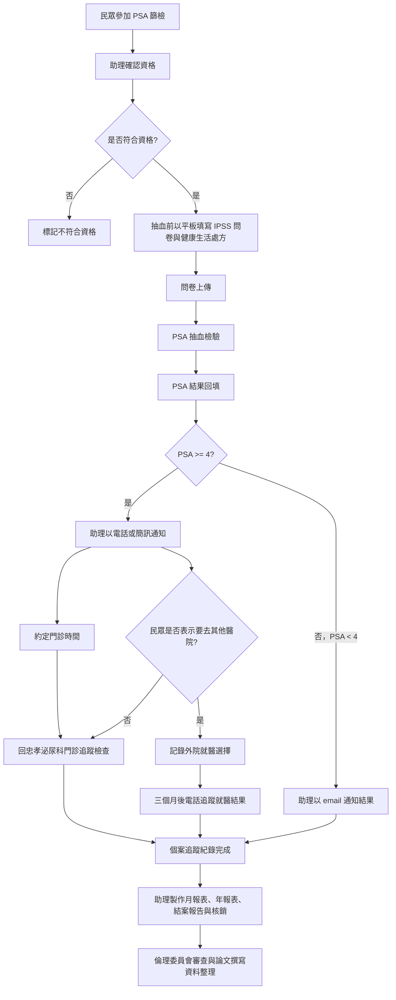

# PSA 篩檢流程：AI Agent Readable Workflow Spec

## 1. Document Metadata

```yaml
document_type: clinical_screening_workflow
workflow_name: PSA 篩檢流程
project_name: 信義門診部 健康台灣深耕計畫 PSA 篩檢
target_volume: 3000 人
primary_site: 信義門診部
follow_up_clinic: 忠孝泌尿科門診
primary_test: PSA 抽血檢驗
questionnaire: IPSS 問卷
additional_output: 健康生活處方
main_staff_role: 助理
```

## 2. Agent Objective

本 workflow agent 的任務是協助執行 PSA 篩檢行政流程，包括：

```yaml
objectives:
  - 協助確認民眾是否符合 PSA 篩檢資格
  - 協助建立與查詢抽血名冊電子檔
  - 協助民眾於抽血前使用平板填寫問卷並上傳
  - 根據 PSA 檢驗結果執行通知與追蹤流程
  - 協助產出月報表、年報表、結案報告與核銷資料
  - 支援倫理委員會審查申請與論文撰寫所需資料整理
```

## 3. Scope Boundaries

```yaml
agent_scope:
  allowed:
    - 行政流程協助
    - 篩檢資格初步判斷
    - 名冊查詢與資料登錄
    - 問卷填寫流程引導
    - PSA 結果通知流程提醒
    - 門診追蹤排程提醒
    - 報表資料彙整
  not_allowed:
    - 不進行醫療診斷
    - 不解釋 PSA 數值的臨床意義
    - 不提供治療建議
    - 不替代醫師或護理人員判斷
    - 不自行決定個案是否需要進一步檢查
```

## 4. Eligibility Rules

### 4.1 Inclusion Criteria

民眾需符合以下條件：

```yaml
eligibility:
  must_be:
    - 男性
    - 從未曾參加本計畫篩檢
  age_condition:
    any_of:
      - age >= 50
      - age >= 45 AND has_family_history_of_prostate_cancer == true
```

### 4.2 Agent Decision Logic

```pseudo
IF sex != "男性":
    mark_as_not_eligible(reason="非男性")

ELSE IF previous_participation_in_project == true:
    mark_as_not_eligible(reason="曾參加本計畫篩檢")

ELSE IF age >= 50:
    mark_as_eligible(reason="男性且年齡 >= 50 歲")

ELSE IF age >= 45 AND has_family_history_of_prostate_cancer == true:
    mark_as_eligible(reason="男性且年齡 >= 45 歲，並有攝護腺癌家族史")

ELSE:
    mark_as_not_eligible(reason="未符合年齡或家族史條件")
```

## 5. Required Resources

```yaml
resources:
  tablets:
    required_per_session: 3
    purpose:
      - 抽血前填寫問卷
      - 上傳問卷資料
  staff:
    assistant:
      responsibilities:
        - 協助民眾查詢是否在本計畫內
        - 協助填寫與上傳問卷
        - 通知 PSA 結果
        - 安排門診追蹤
        - 製作報表與核銷資料
  electronic_roster:
    name: 抽血名冊電子檔
    usage:
      - 建立抽血名冊
      - 第二場開始查詢民眾是否已在本計畫內
```

## 6. Data Inputs

```yaml
participant_record:
  participant_id: string
  name: string
  sex: string
  age: integer
  phone_number: string
  email: string
  has_family_history_of_prostate_cancer: boolean
  previous_participation_in_project: boolean
  screening_session_id: string
  questionnaire_completed: boolean
  questionnaire_upload_status: uploaded | failed | pending
  ipss_score: number | null
  psa_value: number | null
  result_notification_method: phone | sms | email | null
  follow_up_required: boolean
  follow_up_clinic: string | null
  external_hospital_follow_up: boolean
  external_hospital_name: string | null
  three_month_follow_up_status: pending | completed | not_required
```

## 7. Workflow Steps

## Step 1 — Screening Session Preparation

```yaml
step_id: prepare_screening_session
actor: 助理
trigger: 篩檢場次開始前
actions:
  - 建立抽血名冊電子檔
  - 確認本場次可使用平板數量 >= 3
  - 確認問卷系統可正常填寫與上傳
  - 確認 PSA 抽血流程已準備
outputs:
  - electronic_blood_draw_roster_created
  - tablets_ready
  - questionnaire_upload_ready
```

## Step 2 — Participant Eligibility Check

```yaml
step_id: check_participant_eligibility
actor: 助理
trigger: 民眾報到或篩檢前
actions:
  - 確認民眾性別
  - 確認民眾年齡
  - 詢問是否有攝護腺癌家族史
  - 查詢是否曾參加本計畫篩檢
  - 第二場開始，需使用電子名冊查詢民眾是否已在本計畫內
decision_rule:
  eligible_if:
    - 男性
    - 從未曾參加本計畫篩檢
    - 年齡 >= 50
      OR 年齡 >= 45 且有攝護腺癌家族史
outputs:
  - eligible
  - not_eligible
  - eligibility_reason
```

## Step 3 — Pre-Blood-Draw Questionnaire

```yaml
step_id: pre_blood_draw_questionnaire
actor: 助理
trigger: 民眾符合篩檢資格且準備抽血前
actions:
  - 使用平板協助民眾填寫 IPSS 問卷
  - 協助民眾完成健康生活處方相關資料
  - 上傳問卷資料
  - 確認上傳成功
outputs:
  - ipss_questionnaire_completed
  - health_lifestyle_prescription_completed
  - questionnaire_uploaded
error_handling:
  upload_failed:
    - 重新上傳
    - 若仍失敗，標記為 pending
    - 通知負責助理後續補登
```

## Step 4 — PSA Blood Test

```yaml
step_id: psa_blood_test
actor: medical_staff
trigger: 問卷完成並上傳後
actions:
  - 執行 PSA 抽血檢驗
  - 將 PSA 結果回填至個案資料
outputs:
  - psa_value_recorded
```

## Step 5 — PSA Result Routing

### 5.1 PSA ≥ 4

```yaml
condition: psa_value >= 4
risk_route: follow_up_required
actor: 助理
notification_methods:
  - 電話
  - 簡訊
actions:
  - 通知民眾 PSA 結果需進一步追蹤
  - 約定門診時間
  - 安排回忠孝泌尿科門診追蹤檢查
  - 記錄通知時間、通知方式與結果
follow_up_goal:
  - 依據患者具體需求與健康狀況，發展個性化醫療服務
outputs:
  - participant_notified
  - follow_up_appointment_scheduled
  - referred_to_zhongxiao_urology_clinic
```

### 5.2 PSA ≥ 4 but Participant Chooses Another Hospital

```yaml
condition:
  - psa_value >= 4
  - participant_prefers_external_hospital == true
actor: 助理
actions:
  - 記錄民眾表示將至其他醫院就醫
  - 記錄外院就醫資訊
  - 建立三個月後電話追蹤任務
  - 三個月後追蹤就醫結果
outputs:
  - external_hospital_choice_recorded
  - three_month_follow_up_task_created
  - three_month_follow_up_result_recorded
```

### 5.3 PSA < 4

```yaml
condition: psa_value < 4
risk_route: routine_result_notification
actor: 助理
notification_method: email
actions:
  - 以 email 通知民眾 PSA 結果
  - 記錄通知時間與寄送狀態
outputs:
  - result_email_sent
  - notification_record_completed
```

## 8. Notification Rules

```yaml
notification_rules:
  psa_greater_or_equal_4:
    method_priority:
      - phone
      - sms
    message_purpose:
      - 通知需進一步門診追蹤
      - 約定忠孝泌尿科門診時間
    required_log_fields:
      - notification_datetime
      - method
      - contact_success
      - appointment_datetime
      - staff_id

  psa_less_than_4:
    method_priority:
      - email
    message_purpose:
      - 通知 PSA 篩檢結果
    required_log_fields:
      - email_sent_datetime
      - email_delivery_status
      - staff_id
```

## 9. Follow-Up Tracking

```yaml
follow_up_tracking:
  required_when:
    - psa_value >= 4
  default_follow_up_location:
    - 忠孝泌尿科門診
  external_hospital_exception:
    condition:
      - 民眾表示要去其他醫院就醫
    actions:
      - 記錄民眾選擇
      - 三個月後電話追蹤就醫結果
  follow_up_status_values:
    - pending
    - contacted
    - appointment_scheduled
    - completed
    - external_hospital_tracking_pending
    - external_hospital_tracking_completed
    - lost_to_follow_up
```

## 10. Reporting and Administration

```yaml
reporting_tasks:
  monthly_report:
    actor: 助理
    frequency: 每月
    content:
      - 篩檢人數
      - 符合資格人數
      - 問卷完成數
      - PSA >= 4 人數
      - PSA < 4 人數
      - 門診追蹤安排數
      - 外院追蹤個案數

  annual_report:
    actor: 助理
    frequency: 每年
    content:
      - 年度篩檢總人數
      - 年度陽性追蹤統計
      - 年度通知完成率
      - 年度追蹤完成率

  final_report:
    actor: 助理
    timing: 計畫結案時
    content:
      - 總篩檢人數
      - 流程執行成果
      - 追蹤結果
      - 計畫執行摘要

  reimbursement:
    actor: 助理
    timing: 依核銷時程
    content:
      - 核銷資料
      - 報表附件
      - 計畫執行證明
```

## 11. Ethics Review and Research Output

```yaml
research_and_compliance_tasks:
  ethics_review:
    task: 申請倫理委員會審查
    actor: project_team
    required_before:
      - 論文撰寫
      - 研究資料分析
      - 涉及人體研究資料使用前

  manuscript:
    task: 撰寫論文
    actor: project_team
    data_source:
      - PSA 篩檢資料
      - IPSS 問卷資料
      - 追蹤結果
      - 報表統計
```

## 12. Recommended Agent State Machine

```yaml
participant_status:
  - registered
  - eligibility_checked
  - not_eligible
  - eligible
  - questionnaire_pending
  - questionnaire_uploaded
  - blood_draw_completed
  - psa_result_pending
  - psa_result_recorded
  - psa_less_than_4_email_sent
  - psa_greater_or_equal_4_notification_pending
  - psa_greater_or_equal_4_notified
  - follow_up_appointment_scheduled
  - external_hospital_follow_up_pending
  - three_month_follow_up_completed
  - case_closed
```

## 13. Error Handling Rules

```yaml
error_handling:
  missing_age:
    action:
      - ask_staff_to_confirm_age
      - do_not_mark_eligible_until_confirmed

  missing_family_history:
    action:
      - ask_staff_to_confirm_family_history
      - if age >= 50, eligibility can still proceed
      - if age between 45 and 49, eligibility cannot proceed until confirmed

  missing_previous_participation_status:
    action:
      - query_electronic_roster
      - do_not_proceed_until_confirmed

  missing_psa_value:
    action:
      - mark_result_status_as_pending
      - do_not_send_result_notification

  invalid_psa_value:
    action:
      - request_result_verification
      - do_not_route_case_until_verified

  failed_notification:
    action:
      - retry_contact
      - record failed attempt
      - escalate to project staff if repeated failure
```

## 14. Privacy and Safety Guardrails

```yaml
privacy_guardrails:
  - 僅收集執行 PSA 篩檢流程所需資料
  - 不向未授權人員揭露 PSA 結果
  - 電話、簡訊、email 通知需記錄時間與方式
  - 問卷與 PSA 結果應與個案 ID 綁定
  - 報表應優先使用統計資料，避免不必要揭露個人身分資料

medical_safety_guardrails:
  - Agent 不解讀 PSA 數值
  - Agent 只依據 PSA >= 4 或 PSA < 4 執行行政分流
  - PSA >= 4 一律導向門診追蹤流程
  - 民眾若選擇其他醫院，需記錄並安排三個月後追蹤
```

## 15. Mermaid Flowchart



## 16. Items To Confirm

```yaml
to_confirm:
  - 3000人是目標收案數、預估篩檢量，還是計畫上限？
  - 「健康生活處方」是所有民眾都產出，還是依問卷結果產出？
  - IPSS 問卷是否已有固定電子表單欄位？
  - PSA 結果由哪個系統回填？
  - email、簡訊、電話通知是否已有標準文字模板？
  - 三個月後追蹤外院就醫結果時，需要記錄哪些欄位？
  - 報表格式是否已有衛生局、醫院或計畫辦公室規定格式？
  - 倫理委員會審查是否需在篩檢前完成，或僅限後續研究資料使用前完成？
```
