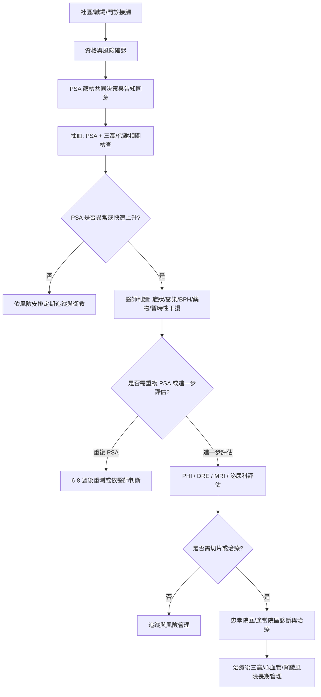

# 「健康台灣深耕計畫」AI Agent Readable Markdown

## 0. 文件目的與使用規則

本文件將原始 DOCX 草稿整理為可供 AI agent、專案經理、醫師、個管師、行政承辦與資料治理人員共同使用的 Markdown 資料包。內容分成四層：

1. `source_summary`：原稿已經提供的資訊。
2. `verified_facts`：已上網核實的政策、統計、臨床與臺北市服務資訊。
3. `risk_flags`：可能被審查委員質疑、資料不足或需要改寫的內容。
4. `recommended_revision`：建議放入正式申請書的修正版文字與流程設計。

AI agent 使用時，不得把 `UNVERIFIED` 或 `NEEDS_REVISION` 的句子直接放入正式計畫書。所有涉及臨床效益、篩檢成效、政策資格、醫事機構代碼、資安或 AI 治理的敘述，都應連同 `source_id` 一併追蹤。

---

## 1. 計畫基本資料

```yaml
project_title: >
  「健康台灣深耕計畫」－推動三高篩檢與腦心血管疾病預防，
  同步守護健康「攝區」，攝護腺癌 PSA 精準篩檢
project_period_roc: 116-01-01_to_118-12-31
project_period_gregorian: 2027-01-01_to_2029-12-31
city: 臺北市
application_mode: A3
application_mode_meaning: 非醫學中心或非準醫學中心可獨立申請；仍可進行垂直與區域合作
selected_scopes:
  - scope_3: 導入智慧科技醫療
  - scope_4: 社會責任醫療永續
main_institution:
  name: 臺北市立聯合醫院附設信義門診部
  type: V_診所
  medical_institution_code: "2101170050"
  unified_business_number: "99958172"
  address: 臺北市信義區大道路 116 號 1 樓
  phone: "02-8780-4152"
principal_investigator:
  name: 陳瑞泉
  role: 醫師兼主任
contact_person:
  name: 洪淑如
  role: 技術師
  email: DAP60@tpech.gov.tw
coordinating_institution_contact:
  institution: 臺北市立聯合醫院
  phone: "02-2786-1288 ext. 8672"
  fax: "02-2786-1491"
  email_normalized: Z3805@tpech.gov.tw
source_date_roc: 115-07-02
source_date_gregorian: 2026-07-02
```

---

## 2. 合作機構資料表

| role | institution | type | code_or_status | system_or_alliance | verification_status | note |
|---|---|---:|---|---|---|---|
| 主提機構 | 臺北市立聯合醫院附設信義門診部 | V 診所 | 2101170050 | 是 | VERIFIED | 健保署資料可查到該代碼。 |
| 合作機構 1 | 臺北市立聯合醫院 | III 區域醫院 | 0101090517 | 是 | PARTIAL | 原稿代碼可保留，但建議再次由院內行政確認完整院區／總院代碼表示方式。 |
| 合作機構 2 | 臺北市信義區健康服務中心 | VIII 其他 | 未填 | 否 | NEEDS_COMPLETION | 建議補上機關屬性、聯絡窗口與合作任務。 |
| 合作機構 3 | 臺北市南港區健康服務中心 | VIII 其他 | 未填 | 否 | NEEDS_COMPLETION | 原稿名稱後多一個頓號，應刪除。 |
| 合作機構 4 | 臺北市內湖區健康服務中心 | VIII 其他 | 未填 | 否 | NEEDS_COMPLETION | 建議補上機關屬性、聯絡窗口與合作任務。 |
| 合作機構 5 | 臺北市立聯合醫院附設內湖門診部 | V 診所 | 2101110027 | 是 | VERIFIED | 核對資料一致。 |
| 合作機構 6 | 臺北市立聯合醫院附設南港門診部 | V 診所 | 2101120014 | 是 | NEEDS_REVISION | 原稿寫作 `21011200140`，多一個 0，應修正。 |

---

## 3. 核實後的計畫定位

### 3.1 一句話定位

本計畫不是單純「多做 PSA 抽血」，而是把男性攝護腺癌早期發現、三高風險控制、腦心血管疾病預防、個案追蹤與數位治理整合為一套社區到醫院的閉環照護模式。

### 3.2 政策對位

| policy_dimension | alignment |
|---|---|
| 健康台灣深耕計畫 | 對應 114-118 年健康台灣深耕計畫，由下而上提出創新策略與績效指標。 |
| 申請模式 A3 | 信義門診部屬非醫學中心，可採 A3 申請；與忠孝院區、內湖／南港門診部、區健康服務中心形成區域合作。 |
| 範疇三：智慧科技醫療 | 可落在流程效率、醫療數據共享與安全、智慧化追蹤、FHIR/TW Core IG、資安治理、資料治理、AI 治理。 |
| 範疇四：社會責任醫療永續 | 可落在分級醫療、社區為基礎的整合照護、可近性、公平性、健康生活型態、ESG 管理。 |
| 臺北市整合性篩檢 | 可銜接臺北市健康服務中心與醫療院所的一站式整合篩檢服務。 |
| 臺北市成人保健與三高業務 | 可銜接社區三高篩檢、三高異常個案追蹤、心血管疾病防治網、糖尿病共同照護網。 |

---

## 4. 核實後建議版：計畫概要

臺灣人口結構快速高齡化，65 歲以上人口占比已於 2025 年超過 20%，進入超高齡社會；臺北市老年人口占比更高，代表慢性病、癌症、衰弱與多重共病照護需求將持續上升。男性高齡族群中，攝護腺癌是重要癌症負擔之一。依國民健康署公開資料，攝護腺癌為我國男性癌症發生率第三位、死亡率第六位；111 年新發個案 9,062 人，113 年死亡 1,897 人。

本計畫以臺北市立聯合醫院附設信義門診部為主提機構，結合忠孝院區、內湖門診部、南港門診部，以及信義、南港、內湖等區健康服務中心，建立「社區與職場接觸—風險知情篩檢—異常追蹤—泌尿科診斷—三高與心血管風險控制—長期個案管理」的區域聯防模式。其核心不是把 PSA 作為無差別大量篩檢，而是針對 50 歲以上男性與 45 歲以上具家族史等較高風險男性，透過共同決策、風險告知與分層追蹤，降低晚期發現與失訪風險。

PSA 升高並不等於攝護腺癌，良性攝護腺肥大、攝護腺炎、感染、近期射精、劇烈騎乘運動或近期攝護腺處置都可能影響數值。因此，本計畫應建立標準化流程：異常 PSA 先由醫師依症狀、病史與暫時性干擾因子判讀；必要時重複檢測，並搭配肛門指診、PHI、MRI 或其他臨床工具，再決定是否切片。PHI 可整合 total PSA、free PSA 與 p2PSA，尤其可用於 PSA 4-10 ng/mL 的灰色地帶，協助判斷是否需要切片，但不應被寫成獨立診斷癌症的工具。

同時，本計畫將攝護腺癌早期發現與三高、代謝症候群、腦心血管風險控制整合。原因有二：第一，三高與代謝異常本身是高齡男性健康風險核心；第二，部分攝護腺癌治療，尤其去雄性激素療法，可能增加體脂、血脂、胰島素阻抗、糖尿病與心血管風險，因此治療前後均需把血壓、血脂、血糖、腎功能、體重、腰圍與生活型態納入追蹤。

在智慧醫療面，本計畫建議建立可稽核的個案管理平台，而不是只描述「線上諮詢」或「異常通知」。平台至少應支援告知同意、篩檢資格判斷、檢驗數值匯入、異常值分級、轉介狀態、個管師任務、醫師覆核、衛教推播、追蹤期限提醒、成果指標匯出與權限控管。若使用 AI 或自動化決策，必須明列 human-in-the-loop、模型使用範圍、錯誤風險、資料來源、效能監測、偏誤評估與責任歸屬。

---

## 5. 建議服務流程

### 5.1 高階流程



### 5.2 eligibility_rules

```yaml
screening_eligibility:
  primary_group:
    - male
    - age_gte: 50
    - has_capacity_for_informed_decision: true
  high_risk_group:
    - male
    - age_gte: 45
    - any_of:
        - first_degree_family_history_of_prostate_cancer
        - known_high_risk_genetic_context_if_available
        - clinician_identified_high_risk
  exclusion_or_delay_conditions:
    - active_urinary_tract_infection_or_prostatitis_until_resolved
    - recent_prostate_biopsy_or_instrumentation_until_clinically_appropriate
    - recent_ejaculation_or_vigorous_cycling_within_48_hours_if_nonurgent
    - patient_declines_after_shared_decision
  special_caution:
    - age_gte_70_should_not_be_automatically_screened_without_clinician_discussion
    - limited_life_expectancy_or_severe_comorbidity_requires_individual_clinical_judgment
```

### 5.3 abnormal_result_management

```yaml
psa_abnormal_management:
  principle: PSA 升高不是癌症診斷，需結合臨床判讀。
  first_actions:
    - review_age_adjusted_psa_context
    - review_BPH_prostatitis_UTI_symptoms
    - review_recent_ejaculation_cycling_biopsy_or_instrumentation
    - review_medications_affecting_psa
    - consider_repeat_psa_if_asymptomatic_and_clinically_appropriate
  gray_zone:
    psa_range_ng_ml: "4-10"
    recommended_tools:
      - PHI
      - free_PSA_ratio
      - DRE
      - prostate_MRI_if_available
      - urologist_review
  escalation:
    - urology_referral
    - biopsy_decision_shared_decision
    - case_manager_follow_up
```

---

## 6. 數位平台與資料治理設計

### 6.1 minimum_viable_system

| module | purpose | minimum_data_fields | owner |
|---|---|---|---|
| participant_registry | 個案基本資料與聯絡方式 | pseudonymous_id, name, birth_year, sex, phone, district, consent_status | 個管師／承辦 |
| eligibility_engine | 判斷是否進入專案流程 | age, risk_group, family_history, exclusion_or_delay_reason | 醫師／個管師 |
| consent_module | PSA 篩檢共同決策與告知同意 | consent_version, consent_timestamp, risk_benefit_acknowledged | 醫師／個管師 |
| lab_ingestion | 匯入 PSA、血糖、血脂、腎功能等檢驗值 | PSA, total_cholesterol, LDL, HDL, triglyceride, fasting_glucose_or_HbA1c, creatinine/eGFR | 檢驗室／資訊 |
| risk_status | 異常分級與追蹤期限 | prostate_risk_status, metabolic_risk_status, follow_up_due_date | 醫師覆核 |
| referral_tracking | 轉介與回診閉環 | referral_target, referral_date, appointment_date, completed, lost_to_follow_up | 個管師 |
| education_delivery | 衛教與生活型態介入 | education_topic, delivered_at, channel, response | 健康服務中心 |
| audit_log | 稽核與責任追蹤 | actor, action, timestamp, data_scope, reason | 資安／資訊 |
| KPI_export | 計畫績效回報 | aggregated_metrics_only, suppression_rules_for_small_counts | 專案管理 |

### 6.2 governance_requirements

```yaml
data_governance:
  interoperability:
    - use_FHIR_where_applicable
    - align_with_TW_Core_IG_where_applicable
  privacy:
    - role_based_access_control
    - least_privilege
    - data_minimization
    - consent_versioning
    - retention_policy
    - de_identification_for_reporting
  cybersecurity:
    - audit_log_immutable_or_tamper_evident
    - encryption_in_transit
    - encryption_at_rest
    - backup_and_disaster_recovery
    - vulnerability_management
    - incident_response_plan
  ai_governance_if_ai_is_used:
    - human_in_the_loop
    - model_purpose_limitations
    - model_input_output_logging
    - performance_monitoring
    - bias_and_equity_review
    - no_autonomous_diagnosis_or_treatment_order
```

---

## 7. 建議 KPI 與可回溯指標

### 7.1 process_kpis

| KPI | definition | numerator | denominator | target_note |
|---|---|---:|---:|---|
| 社區／職場觸及人數 | 完成衛教或篩檢說明的人數 | touched_people | planned_outreach_capacity | 需分區、年齡、場域。 |
| PSA 共同決策完成率 | 完成利弊告知與同意／不同意紀錄者 | completed_sdm | eligible_men | 不以越高越好作唯一目標，重點是知情。 |
| PSA 檢測完成率 | 完成 PSA 抽血者 | psa_tested | sdm_completed_and_agreed | 可分年齡與風險層。 |
| PSA 異常覆核率 | 異常 PSA 有醫師覆核紀錄者 | clinician_reviewed_abnormal_psa | abnormal_psa_cases | 必須接近 100%。 |
| PHI 使用率 | PSA 灰色地帶且完成 PHI 者 | phi_completed | psa_gray_zone_cases | 需依院內可近性與醫囑定義。 |
| 轉介完成率 | 異常需轉介且完成泌尿科就診者 | completed_referrals | referrals_indicated | 是閉環管理核心。 |
| 失訪率 | 到期未完成追蹤者 | lost_to_follow_up | follow_up_due_cases | 越低越好。 |
| 三高異常追蹤率 | 三高異常且有追蹤計畫者 | metabolic_followup_created | metabolic_abnormal_cases | 連結健康服務中心。 |
| 數位平台資料完整率 | 必填欄位完整個案 | complete_records | all_records | 需定義必填欄位。 |
| 稽核紀錄完整率 | 敏感資料存取有完整 audit log | logged_access_events | all_access_events | 範疇三資安核心。 |

### 7.2 outcome_kpis

| KPI | definition | caution |
|---|---|---|
| 高風險個案早期診斷比例 | 確診個案中局部或早期分期比例 | 需要足夠時間與樣本數，不宜第一年承諾過度。 |
| PSA 異常至泌尿科評估時間 | abnormal_result_date 到 urology_visit_date | 可作為流程效率指標。 |
| 三高控制改善 | 血壓、HbA1c、LDL 等追蹤改善 | 需排除資料缺漏與回歸均值。 |
| 晚期比例變化 | 第四期／遠端轉移比例 | 需要多年度追蹤；短期應以流程指標為主。 |
| 民眾滿意度與理解度 | 篩檢前後知識／滿意度問卷 | 必須避免只量滿意、不量理解。 |

### 7.3 balancing_measures

| balancing_measure | why_it_matters |
|---|---|
| 偽陽性與不必要切片比例 | 避免計畫被質疑造成過度醫療。 |
| 切片後感染、出血、疼痛等不良事件 | 篩檢計畫必須同時管理傷害。 |
| 過度診斷／低風險癌治療比例 | 應強化主動監測與共同決策。 |
| 70 歲以上篩檢比例 | 避免與現有建議衝突。 |
| 低社經、獨居、交通不便者失訪率 | 社會責任醫療永續須量公平性。 |
| 個資或資安事件數 | 範疇三必要風險指標。 |

---

## 8. 事實查核表

| id | draft_claim | verification_result | status | recommended_action | source_ids |
|---|---|---|---|---|---|
| FC-01 | 健康台灣深耕計畫期程 116-118 年。 | 第二階段自 116 年起至 118 年底；總計畫為 114-118 年、5 年期。 | VERIFIED | 保留，但可明確寫「第二階段」。 | S01, S02 |
| FC-02 | A3 申請模式。 | 官方申請資訊列明 A 類醫療機構，非醫學中心含非準醫學中心可獨立申請。 | VERIFIED | 保留。 | S02 |
| FC-03 | 範疇三、範疇四。 | 範疇三含 AI、流程效率、資料共享與安全、智慧醫院；範疇四含分級醫療、社區基礎整合照護、公平可近性、健康生活、ESG。 | VERIFIED | 建議把計畫活動逐項對應到目標與 KPI。 | S03 |
| FC-04 | 臺灣即將進入超高齡社會。 | 2024 年國發會推估 2025 年超過 20%；2026 年中央社引內政部統計顯示 2025 年已達 20.06%。 | NEEDS_REVISION | 若以 2026 年送件，建議改為「已進入超高齡社會」。 | S13, S14 |
| FC-05 | 攝護腺癌為臺灣男性發生率第三位、死亡率第六位。 | 國健署 2025 年資料支持；111 年新發 9,062 人，113 年死亡 1,897 人。 | VERIFIED | 保留並標年份。 | S05 |
| FC-06 | 臺灣約 33% 攝護腺癌確診時已遠端轉移／第四期，美國約 8%。 | 找到 2026 年中央社引台灣泌尿科醫學會說法：112 年資料為 28.06%，美國 8%，約 3.5 倍。未找到足夠官方原表佐證原稿 33%。 | NEEDS_REVISION | 正式稿建議改成「約三成」；若保留 33%，需補癌症登記分期原表與年份。 | S15 |
| FC-07 | PSA 為國際公認最重要篩檢工具。 | PSA 是常用早期偵測工具，但 NCI 與國健署均提醒不建議一般族群例行篩檢，需共同決策，且有偽陽性、過度診斷與治療風險。 | NEEDS_REVISION | 改成「PSA 是常用檢測工具，但應採風險知情、共同決策與分層追蹤」。 | S05, S06 |
| FC-08 | 我國尚未將 PSA 納入公費癌症篩檢。 | 國健署公開癌症篩檢服務列五癌，未列 PSA；國健署對 PSA 篩檢仍採利弊告知立場。 | VERIFIED | 保留，但避免寫成「因此一定要全面篩」。 | S05, S16 |
| FC-09 | 臺北市整合式篩檢是一站式健康檢查服務。 | 臺北市衛生局公開資料支持，且寫明 9 大項、6 項癌症篩檢、成人健檢、B/C 肝炎。 | VERIFIED | 原稿「五大癌症篩檢」需改寫為臺北市現行 6 項。 | S07, S08 |
| FC-10 | 臺北市健康服務中心有社區三高篩檢與異常追蹤。 | 臺北市衛生局健康管理科業務包含社區三高篩檢、成人預防保健、老人健檢、三高異常個案追蹤、心血管疾病防治網與糖尿病共同照護網。 | VERIFIED | 可作為本計畫特色，但不要延伸成全臺唯一。 | S09 |
| FC-11 | 臺北市健康服務中心社區三高篩檢全臺獨一無二。 | 未找到足夠比較證據證明其他縣市完全沒有類似衛生所／健康服務中心模式。 | UNVERIFIED | 建議刪除「全臺獨一無二」，改成「臺北市已有明確的區健康服務中心與三高異常追蹤機制」。 | S09 |
| FC-12 | PSA 升高可能由 BPH、發炎、感染造成。 | NCI 支持；且近期射精、劇烈騎乘、近期處置也可能暫時升高。 | VERIFIED | 保留，並加入重測／醫師判讀流程。 | S06 |
| FC-13 | PHI 整合 total PSA、free PSA、p2PSA，可用於 PSA 4-10 灰色地帶。 | Mayo Clinic Labs 支持；PHI 可協助是否切片，但不是第一線一般篩檢，也不是癌症診斷本身。 | VERIFIED_WITH_CAUTION | 保留並加限制條件。 | S11, S12 |
| FC-14 | 去雄性激素療法可能增加高血壓、高血脂、代謝症候群等風險。 | AHA/ACS/AUA advisory 與後續文獻支持 ADT 與體脂、血脂、胰島素阻抗、糖尿病、心血管風險相關。 | VERIFIED_WITH_CAUTION | 可保留，建議寫「可能增加」並安排治療前後監測。 | S17, S18 |
| FC-15 | 南港門診部醫事機構代碼 21011200140。 | 多個資料來源顯示應為 2101120014。 | ERROR | 必須修正。 | S19, S20 |
| FC-16 | 聯醫忠孝院區泌尿科提供攝護腺癌相關評估與治療。 | 忠孝院區泌尿科頁列泌尿道腫瘤初步評估、診斷、荷爾蒙、放射、化療、標靶、免疫、手術、海福刀微創標靶治療等。 | VERIFIED | 可保留，但精確列出由忠孝或聯醫體系可提供之服務。 | S21 |

---

## 9. 原稿重要文字建議替換

| original_or_issue | recommended_revision |
|---|---|
| 「臺灣即將邁入超高齡社會」 | 「臺灣已於 2025 年進入超高齡社會，65 歲以上人口占比已超過 20%。」 |
| 「PSA 檢測為國際公認最重要之攝護腺癌篩檢工具」 | 「PSA 是攝護腺癌早期偵測常用檢測工具，但因存在偽陽性、過度診斷與過度治療風險，本計畫採風險知情、共同決策與分層追蹤方式執行。」 |
| 「臺灣有約 33% 患者確診時遠端轉移」 | 「公開報導引述 112 年癌症登記資料指出，約 28.06% 攝護腺癌個案確診時已發生癌轉移；正式稿若使用 33%，應補明確年份與登記資料表。」 |
| 「五大癌症篩檢」 | 「臺北市整合性篩檢提供 9 大項一站式服務，包含 6 項癌症篩檢、成人健檢及 B/C 型肝炎篩檢。若另述國健署常規五癌篩檢，應分開說明。」 |
| 「信義健區康服務中心」 | 「信義區健康服務中心」。 |
| 「代謝症侯群」 | 「代謝症候群」。 |
| 「台北市健康服務中心的社區三高篩檢，全台獨一無二」 | 「臺北市衛生局已明列區健康服務中心辦理社區三高篩檢、三高異常個案追蹤、心血管疾病防治網與糖尿病共同照護網；本計畫可善用此既有公衛服務網絡，形成門診部與社區健康服務中心的整合照護特色。」 |
| 南港門診部 `21011200140` | 南港門診部 `2101120014`。 |
| `Z3805＠tpech.gov.tw` | `Z3805@tpech.gov.tw`，建議使用半形 @。 |

---

## 10. 申請書可採用之正式版摘要

本計畫由臺北市立聯合醫院附設信義門診部主提，結合臺北市立聯合醫院忠孝院區、內湖門診部、南港門診部，以及信義、南港、內湖等區健康服務中心，針對高齡化下男性健康、攝護腺癌早期發現、三高與腦心血管疾病預防，建立社區到醫院的整合照護模式。

計畫將銜接臺北市既有整合性篩檢與區健康服務中心成人保健業務，於社區、職場與門診場域提供男性健康識能教育、三高篩檢、攝護腺癌 PSA 風險知情篩檢與後續追蹤。對於 50 歲以上男性及 45 歲以上具家族史等高風險男性，經醫師或受訓人員完成篩檢利弊說明與同意程序後，提供 PSA 檢測；對於異常個案，依臨床情境評估是否重測、進行 PHI、DRE、MRI 或泌尿科進一步診斷，並由個管師追蹤轉介完成情形。

本計畫同時將三高與代謝風險管理納入攝護腺癌照護流程。對於篩檢發現血壓、血糖、血脂或腎功能異常者，由區健康服務中心與門診部共同提供衛教、追蹤與必要轉介；對於已進入攝護腺癌治療流程者，因部分治療可能影響代謝與心血管風險，將建立治療前後定期監測與跨科協作機制。

在智慧科技醫療方面，本計畫將建立可稽核的個案管理與追蹤平台，支援告知同意、檢驗資料匯入、異常分級、轉介狀態、追蹤期限、衛教紀錄、KPI 匯出與資料存取稽核。平台將以資安治理、資料治理與 AI 治理為基本要求，逐步導入標準化資料欄位、權限控管、稽核紀錄、去識別化統計與 FHIR/TW Core IG 相容設計，以提升跨機構協作效率與計畫成果可回溯性。

---

## 11. 待確認清單

```yaml
submission_blockers:
  - 修正南港門診部醫事機構代碼: 2101120014
  - 補齊各健康服務中心合作窗口、任務、同意書、用印資訊
  - 決定是否保留「33%」；若保留，需附癌症登記分期原表與年份
  - 刪除或改寫「全臺獨一無二」等絕對化敘述
  - 明確定義 PSA 篩檢共同決策文件與告知內容
  - 明確定義 PHI 使用條件、cutoff、轉介條件與醫師覆核流程
  - 補上三高檢查項目與異常判定標準
  - 補上數位平台之個資、資安、資料治理與 AI 治理設計
  - 補上年度 KPI、baseline、target、資料來源與稽核方式
  - 補上經費、人力配置與是否有重複申請之聲明
```

---

## 12. source_register

| source_id | title | url | source_type | used_for |
|---|---|---|---|---|
| S01 | 行政院：健康台灣深耕計畫（114-118年） | https://www.ey.gov.tw/Page/448DE008087A1971/1f7b4b9e-6dbe-4b4e-8d91-a8255c1ac12f | official_policy | 5 年期、489 億、四大範疇、18 目標 |
| S02 | 健康台灣深耕計畫申請資訊 | https://htsprout.nhri.org.tw/ApplyFlow.html | official_program | 第二階段 116-118、A/B/C/D 申請模式、A3 |
| S03 | 衛福部科技發展組：健康台灣深耕計畫專區 | https://dep.mohw.gov.tw/TDU/cp-1567-82709-121.html | official_policy | 範疇三與範疇四目標 |
| S04 | 臺灣智慧醫療三大中心：智慧醫療規範更新 | https://aicenter.mohw.gov.tw/AC/cp-7200-82982-208.html | official_guidance | 資安治理、資料治理、AI 治理、FHIR/TW Core IG |
| S05 | 國民健康署：攝護腺癌為男性常見癌症 出現異常症狀應及早就醫 | https://www.hpa.gov.tw/Pages/Detail.aspx?nodeid=4878&pid=19543 | official_health | 攝護腺癌排名、111/113 數字、PSA 共同決策立場 |
| S06 | National Cancer Institute: Prostate-Specific Antigen (PSA) Test | https://www.cancer.gov/types/prostate/psa-fact-sheet | official_health | PSA 風險、偽陽性、BPH/攝護腺炎、重測、PHI |
| S07 | 臺北市政府衛生局：整合性篩檢 | https://health.gov.taipei/cp.aspx?n=06AF6414B09FEAA2 | official_local | 9 大項、一站式、6 癌、成人健檢、B/C 肝炎 |
| S08 | 臺北市政府衛生局：115 年整合性篩檢新增 HPV 與胃癌篩檢 | https://health.gov.taipei/News_Content.aspx?n=4F01EBDF8F61F315&s=E12D32440C75B55A&sms=72544237BBE4C5F6 | official_local | 115 年整合性篩檢更新、HPV、胃幽門螺旋桿菌 |
| S09 | 臺北市政府衛生局：健康管理科 | https://health.gov.taipei/cp.aspx?n=7F88DFFE0A19DAA3 | official_local | 社區三高篩檢、異常追蹤、心血管疾病防治網、糖尿病共同照護網 |
| S10 | 臺北市 113 年長者功能服務機構名單 | https://www-ws.gov.taipei/Download.ashx?icon=.pdf&n=6Ie65YyX5biCMTEz5bm06ZW36ICF5Yqf6IO96KmV5Lyw5pyN5YuZ5qmf5qeL5ZCN5ZauLnBkZg%3D%3D&u=LzAwMS9VcGxvYWQvNjg0L3JlbGZpbGUvNTczNTUvODk5NDYxMS9kOWViYTVhYi1hZWYyLTQ5MzgtYmQ4ZS1mZGNmZmY3OWFiYTAucGRm | official_local_pdf | 南港、內湖門診部與健康服務中心代碼／地址參考 |
| S11 | Mayo Clinic Labs: The Prostate Health Index (PHI) in Prostate Cancer Risk Assessment | https://news.mayocliniclabs.com/2017/08/14/prostate-health-index-phi-prostate-cancer-risk-assessment-hot-topic/ | clinical_lab_reference | PHI 組成、PSA 4-10 ng/mL、非第一線一般篩檢 |
| S12 | Journal of the Chinese Medical Association: PHI 臺灣研究 | https://wd.vghtpe.gov.tw/jcma/files/8210_772.pdf | peer_reviewed_article | PHI 在臺灣資料中的判別力與切片輔助價值 |
| S13 | 國家發展委員會：高齡化 | https://www.ndc.gov.tw/Content_List.aspx?n=2688C8F5935982DC | official_demography | 2025 年老年人口占比超過 20% 之推估 |
| S14 | 中央社：台灣成超高齡社會 | https://www.cna.com.tw/news/ahel/202601090098.aspx | news_with_official_stats | 2025 年 65 歲以上人口 20.06%、臺北市 24.18% |
| S15 | 中央社：攝護腺癌晚期逼近 3 成 | https://www.cna.com.tw/news/ahel/202605260211.aspx | news_medical_society | 112 年攝護腺癌 28.06% 確診轉移、臺灣泌尿科醫學會倡議 |
| S16 | 國健署：112 年癌症登記與公費癌症篩檢服務 | https://www.hpa.gov.tw/Pages/Detail.aspx?nodeid=4878&pid=19734 | official_health | 五癌公費篩檢項目與 112 癌登統計 |
| S17 | AHA/ACS/AUA Science Advisory: ADT and cardiovascular risk | https://www.ahajournals.org/doi/10.1161/circulationaha.109.192695 | professional_society_advisory | ADT 與心血管／代謝風險 |
| S18 | AHA Newsroom: Hormonal therapy and heart risk | https://newsroom.heart.org/news/close-monitoring-for-heart-risk-needed-if-breast-prostate-cancer-treatment-includes-hormones | professional_society_news | ADT 可能增加膽固醇、三酸甘油酯、體脂、葡萄糖處理異常 |
| S19 | 健保署 PDF：轉診支付項目相關院所名單 | https://www.nhi.gov.tw/ch/dl-59136-0a3c7ba7c4fa434e95bdedd9ddd324a5-1.pdf | official_pdf | 信義、內湖、南港門診部代碼 |
| S20 | 診所通：臺北市立聯合醫院附設南港門診部 | https://www.clinics.com.tw/hospital/2101120014 | secondary_directory | 南港門診部代碼與服務項目輔助確認 |
| S21 | 臺北市立聯合醫院忠孝院區：泌尿科 | https://tpech.gov.taipei/mp109171/cp.aspx?n=591411D5DFB87DC2&s=6C7045BE0EFE517E | official_hospital | 泌尿道腫瘤評估與治療服務項目 |
```

---

## 13. machine_readable_status

```yaml
ready_for_next_step: true
recommended_next_step:
  - 由廖醫師確認 PSA/PHI/DRE/MRI/切片轉介流程與臨床 cutoff。
  - 由信義門診部與忠孝院區行政確認醫事機構代碼、合作機構與用印資訊。
  - 由健康服務中心確認社區三高篩檢資料欄位、異常追蹤流程與可提供之服務量能。
  - 由資訊／資安窗口確認平台是否可採 FHIR/TW Core IG、RBAC、audit log 與去識別化報表。
  - 由財務／承辦補上經費、人力配置、年度 KPI target 與配合款。
not_ready_for_submission_until:
  - absolute_claims_removed_or_sourced
  - clinical_pathway_signed_off
  - data_governance_section_added
  - codes_and_contacts_corrected
```
