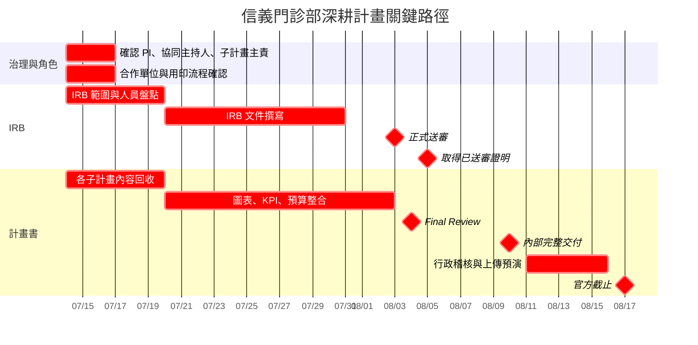

# 臺北市立聯合醫院健康臺灣深耕計畫準備會議紀錄與完整待辦事項

## 一、結論摘要

Jason 的現場手記大致正確，但有三項必須修正：

1. **IRB 時程不是「7 月 31 日已申請完成」**：會議決議較精確的表述是，`7 月 31 日前完成 IRB 送審文件`，並於 `8 月 3 日或 8 月 4 日正式送入北市聯醫 IRB`，目標 `8 月 5 日前取得已送審／收件證明`。
2. **GX10 不是六台**：信義案會議中明確暫估的是 **三台**，並曾討論分年度採購；「六台」可能混入華山案後段「每年一至二台」的未定構想，不能列為已決議。
3. **合作文件不能只寫 MOU**：所有正式列入計畫的合作機構，至少須完成官方要求的 **參與計畫同意書及機構資格證明**。若另涉及技術授權、資料交換、智慧財產或實際合作義務，再加簽 MOU、授權書或契約。

此外，「陳瑞泉擔任計畫主持人」符合會中方向，也與信義門診部的人員資訊相符，但仍須由院方正式確認其現任職稱、本人意願與提案系統中的最終指定，不能只憑逐字稿直接視為完成任命。

---

# 二、會議基本資料

| 項目 | 內容 |
|---|---|
| 會議名稱 | 健康臺灣深耕計畫第二階段—信義門診部整合計畫準備會議 |
| 日期 | 2026 年 7 月 14 日 |
| 時間 | 10:00–12:00 |
| 地點 | 院本部 B106 會議室 |
| 主席 | 陳美如主任 |
| 院方紀錄 | 林宏嶽管理師 |
| 主要出席單位 | 資訊中心、智慧健康醫療中心、忠孝院區代表、信義門診部及各子計畫團隊 |
| 會議目的 | 確認整合計畫架構、官方格式、圖表、KPI、經費、IRB、合作文件、人力與送件時程 |

---

# 三、計畫整體架構決議

## 3.1 四個子計畫

信義案由原本三個子計畫調整為四個子計畫：

| 子計畫 | 建議正式名稱 | 核心內容 | 建議主責 |
|---|---|---|---|
| 子計畫一 | 社區三高與心腦血管疾病防治暨 PSA 精準篩檢 | 配合三高防治 888；社區篩檢、PSA、異常辨識、前端轉介 | 莊美幸主任、廖醫師及臨床團隊 |
| 子計畫二 | 異常個案智慧門診與無紙化照護流程 | APP／電子表單、門診前資料蒐集、HIS 介接、智慧摘要、門診回歸與處置 | Jason、資訊／智慧醫療團隊、臨床主責人 |
| 子計畫三 | CRM 個案管理、衛教與持續追蹤 | 回診提醒、個案管理、衛教、未回診追蹤、跨單位轉介、成效追蹤 | 吳岳霖主任、Jason、技術團隊 |
| 子計畫四 | 信義門診部溫室氣體與碳管理 | 溫室氣體盤查、碳管理、永續治理及與整體照護流程的關聯 | 趙康邑主任／創新永續發展中心 |

## 3.2 整合邏輯

整體計畫應呈現以下閉環：

```text
社區與健康服務中心篩檢
        ↓
三高／PSA 風險辨識
        ↓
異常個案轉介信義門診部
        ↓
APP／電子表單／HIS／智慧門診
        ↓
醫療處置與風險分流
        ↓
CRM 個案管理、衛教、提醒與轉介
        ↓
追蹤結果回饋至門診、社區與合作單位
        ↓
導入數位化、減紙、流程效率與永續治理指標
```

整合計畫必須同時說明：

- 病人服務流；
- 資料流；
- 各子計畫間的依賴關係；
- 健康服務中心、院外門診部、聯醫各院區及外部合作單位的垂直與水平整合；
- 現行服務與新增計畫的差異，避免重複補助；
- 三年結束後的持續營運與維護模式。

---

# 四、圖表與文件呈現決議

## 4.1 至少五張核心架構圖

會議明確要求：

1. **一張整合型主計畫總圖**；
2. **子計畫一架構圖**；
3. **子計畫二架構圖**；
4. **子計畫三架構圖**；
5. **子計畫四架構圖**。

主計畫總圖至少包含：

- 四子計畫關聯；
- 資料來源與資料流向；
- 民眾／個案服務旅程；
- 異常個案轉介與回診；
- CRM 閉環追蹤；
- 院內外合作機構；
- 智慧醫療與永續效益；
- 各子計畫主要輸出與共同 KPI。

各子計畫圖應讓審查委員在不閱讀大量文字的情況下，理解「問題、介入、流程、輸出及成效」。

## 4.2 文件格式

- 全案必須套用 **2026 年第二階段最新官方申請格式**。
- 計畫書本體以 **60 頁**為限；經費規劃包含在本體中，指定附件另計。
- 正式送件版不得保留預算刪減歷程、內部討論痕跡或多版本比較。
- 可另保留一份「院內管理版」，呈現各子計畫經費、責任人與內部控管資訊。

---

# 五、KPI 與成效評估決議

## 5.1 KPI 編碼

取消「PSA KPI」與「其他 KPI」的分裂寫法。全部 KPI 放入同一體系，依子計畫編號：

```text
KPI 1-01、KPI 1-02……
KPI 2-01、KPI 2-02……
KPI 3-01、KPI 3-02……
KPI 4-01、KPI 4-02……
```

## 5.2 每一項 KPI 必須具備

- 指標定義；
- 分子、分母；
- 資料來源；
- 基準值；
- 116、117、118 年年度目標；
- 查核頻率；
- 查核點；
- 資料責任單位；
- 未達標時的矯正措施。

## 5.3 建議 KPI 類型

### 子計畫一

- 社區篩檢人次；
- 三高異常檢出率；
- PSA 篩檢涵蓋率；
- 異常個案轉介率；
- 完成門診評估率；
- 三高 888 對應指標。

### 子計畫二

- 電子表單使用率；
- 門診前資料完成率；
- 平均看診準備時間；
- 醫師看診時間或行政時間改善幅度；
- HIS／APP 資料介接成功率；
- 無紙化比例。

### 子計畫三

- CRM 納管率；
- 回診提醒成功率；
- 應回診個案完成回診率；
- 失聯個案再接觸率；
- 衛教完成率；
- 跨單位轉介完成率；
- 個案追蹤閉環率。

### 子計畫四

- 盤查邊界完成率；
- 溫室氣體盤查完成；
- 數位化／減紙量；
- 流程改善衍生的碳排減量估算；
- 改善措施完成率。

---

# 六、經費與採購決議

## 6.1 資本門

- 會議以「硬體、平台及軟體開發原則不超過總經費 30%」作為編列基準。
- 官方規則較精確的說法是：**原則上限 30%；若確有必要，可提出具體理由供審查**。
- 不能只為規避資本門比例，將實質資產取得改名為租賃或服務。
- 人事費、業務費與資本門應逐項標示，不得假設核定後可任意跨門別流用。

## 6.2 CRM 取得方式

尚未定案，必須完成「自行開發、現成產品租賃、訂閱式服務、買斷、委外客製」比較。評估項目至少包括：

- 三年總持有成本；
- 客製化能力；
- HIS／APP／Power BI 介接；
- 醫療資料安全；
- 個資與權限管理；
- 稽核紀錄；
- 維護及 SLA；
- 資料可攜性；
- 契約終止後資料取回；
- 廠商鎖定風險；
- 計畫結束後維運經費。

## 6.3 GX10／地端算力

會議的信義案暫定方向是：

- 暫以 **三台** GX10／同級個人 AI 運算設備估算；
- 曾估計三台編列約 80–100 萬元；
- 可分年度採購，不必第一年一次購足；
- 實際型號、數量、用途、效能與價格均尚未完成技術驗證及正式核定；
- 採購規格應以功能與效能需求描述，避免直接綁定單一品牌；
- 必須先完成工作負載估算、資安評估及院內算力盤點。

因此，「購買 GX10 六台」**不得列為會議決議**。

## 6.4 暫定預算方向

以下均為會議中的工作假設，不是最終核定額：

| 項目 | 會議暫定方向 | 狀態 |
|---|---:|---|
| CRM | 約 800 萬元 | 待功能、三年工作量與採購模式確認 |
| 地端 AI 設備 | 約 80–100 萬元／三台暫估 | 待技術與採購評估 |
| 碳盤查 | 約 50 萬元業務費暫估 | 待趙康邑主任正式報價與範疇確認 |
| PSA／臨床設備 | 剩餘額度可補強，曾提及 Echo／超音波 | 未定案 |
| 研究助理 | 由 2 人提高至約 6 人或更寬裕配置 | 待工作量、人事費與院長確認 |

---

# 七、IRB 決議與正確處理方式

## 7.1 內部時程

| 日期 | 里程碑 | 正確解讀 |
|---|---|---|
| 2026-07-31 | IRB 文件完成 | 完成研究計畫、名單、訓練證明及附件，不等於已正式受理 |
| 2026-08-03 至 2026-08-04 | 送交北市聯醫 IRB | 目標正式進件；依系統或行政窗口實際程序辦理 |
| 2026-08-05 前 | 取得已送審／收件證明 | 作為深耕計畫申請附件 |
| 核定撥款前 | 補正式 IRB 核准文件 | 涉及人體研究者須依官方規定完成 |

## 7.2 各子計畫 IRB 判定

| 子計畫 | 初步判定 | 待辦 |
|---|---|---|
| 三高／PSA | 若只是例行醫療未必屬研究；若前瞻性介入、研究問卷、檢體研究、比較組或以資料回答研究問題，應送 IRB | 送 IRB 預審／判定，不能只用「是否發論文」判斷 |
| 智慧門診／APP／AI | 若分析病人資料、評估 AI 對時間或成效影響，可能構成人體研究或醫療品質研究 | 明確寫出研究目的、資料欄位、比較方式與同意處理 |
| CRM | 若純行政提醒未必屬人體研究；若追蹤可識別個案並作研究分析，通常需要 IRB 判定 | 暫納入 IRB 文件，請 IRB 正式判定 |
| 碳盤查 | 通常不涉及人體研究 | 原則不送，但不得混入個人健康資料研究 |

## 7.3 IRB 人員名單

必須盤點：

- 計畫主持人；
- 共同／協同主持人；
- 各子計畫研究人員；
- 研究助理；
- 資料分析人員；
- 實際接觸個案、檢體或可識別資料的人員。

訓練時數不得假設一定能事後補件。應先依北市聯醫 IRB 最新核對清單確認主持人、共同主持人及其他研究人員的資格要求。

---

# 八、計畫主持人與協同主持人

## 8.1 計畫主持人

會議方向為：信義案由信義門診部主導，計畫主持人原則上應由信義門診部主管擔任，逐字稿提及 **陳瑞泉**。

目前應標示為：

```yaml
principal_investigator:
  candidate: "陳瑞泉"
  basis: "信義門診部主導，會議指示由院外門診部主管擔任"
  status: "待院方正式確認"
  confirmation_required:
    - current_title
    - personal_consent
    - eligibility
    - conflict_of_interest
    - final_application_registration
```

## 8.2 協同主持人

不能只「從每個子計畫抓一人」後直接掛名。每位人員應符合：

- 實際負責明確工作；
- 本人同意；
- 可投入三年；
- 符合 IRB 訓練與資格；
- 無採購或廠商利益衝突；
- 在申請書、IRB、經費與工作分工中角色一致。

建議每個子計畫提出：

1. 主責主管；
2. 臨床負責人；
3. 系統／資料負責人；
4. 行政與 KPI 責任人；
5. IRB 中的實際角色。

---

# 九、合作單位文件與用印

## 9.1 必備文件

每一個正式合作機構至少須準備：

- 機構設立／登記或資格證明；
- 官方「參與計畫同意書」；
- 機構印信；
- 機構負責人簽章；
- 計畫主持人簽章；
- 官方要求的其他聲明或切結文件。

## 9.2 視合作內容另備

- MOU；
- 技術授權書；
- 智慧財產授權；
- 資料使用／交換協議；
- 個資委託處理契約；
- 資安與保密條款；
- 委外服務或採購契約。

## 9.3 建議責任分工

- **Jason**：建立所有合作機構文件追蹤表，列明文件、窗口、送出日、用印狀態與缺件。
- **莊美幸主任／林宏嶽管理師／院方行政窗口**：確認北市聯醫內部用印流程、正式承辦單位與最晚送印日期。
- **各子計畫主責人**：確認自身合作機構及聯絡人。
- **各合作機構窗口**：完成該機構資格文件與簽章。
- 不建議把所有 MOU 與用印工作籠統指定給莊美幸主任一人。

---

# 十、研究助理與執行人力

## 10.1 會議結論

- 信義案目前只編 2 名研究助理，被認為不足。
- 華山案編列 10 人，是比較案例，不代表信義案必須照抄 10 人。
- 會中較具體的信義案方向是先提高至 **約 6 人**，或依工作量採較寬裕配置，以免審查刪減後無人執行。
- 這是「預算員額與工作量規劃」，不是已核准聘用人數。

## 10.2 建議的人力拆分

| 角色 | 建議人數 | 核心工作 |
|---|---:|---|
| 專案經理／整合管理 | 1 | 全案時程、會議、跨單位協調、風險及送件 |
| 臨床研究／IRB 助理 | 1 | IRB、同意程序、資料字典、研究紀錄 |
| 個案管理／CRM 助理 | 2 | 提醒、回診、衛教、失聯處理、轉介閉環 |
| 資料／系統助理 | 1 | 資料品質、報表、介接測試、權限紀錄 |
| 行政／KPI 助理 | 1 | 經費、核銷、KPI、查核點與成果文件 |
| 合計 | 6 | 可依年度與工作量調整 |

---

# 十一、Jason 現場手記逐項核對

| Jason 手記 | 判定 | 修正版 |
|---|---|---|
| 7/31 前 IRB 申請出來 | 部分正確 | 7/31 前完成 IRB 送審文件；不是保證已受理或核准 |
| 8/3 送到北市聯醫 IRB 中心門口 | 部分正確 | 8/3–8/4 為正式進件窗口；依電子系統／行政窗口流程辦理 |
| 8/17 前一週、8/10（一）繳交 | 正確 | 8/10 為內部完整交付日；8/17 是官方最終截止 |
| 8/4 開會 | 正確 | 最後整合／Final Review 會議；會後原則只做小修 |
| 一張主計畫關聯圖＋四張子計畫圖 | 正確 | 共至少五張核心圖，並補資料流、服務流及合作關係 |
| 資本門不得超過 30% | 部分正確 | 原則上限 30%；例外須具體說明並經審查 |
| 買 GX10 六台 | 錯誤／未定案 | 信義案暫估三台；型號、數量、價格與年度配置均待驗證 |
| 每項經費標示資本門或經常門 | 正確 | 建議進一步標示人事費、業務費、設備／資本門及計算依據 |
| 合作單位 MOU 蓋大小章 | 部分正確 | 官方參與計畫同意書及資格證明為必備；MOU 視實際合作另簽 |
| 問美幸主任是否負責用印 | 應加入，但不能預設 | 請美幸主任／林宏嶽確認院內承辦與用印責任鏈 |
| 使用今年正式申請格式 | 正確 | 應立即建立官方格式主文件並鎖定版本 |
| 主持人確定陳瑞泉 | 尚待正式確認 | 方向合理，但須確認現任職稱、本人同意及最終登錄 |
| 盤點各子計畫協同主持人 | 正確 | 另須確認實際角色、IRB 資格、投入程度及利益衝突 |
| 華山編 10 人；信義由 2 人加到 6 人 | 方向正確 | 華山是參考案例；信義 6 人是建議配置，仍待預算與院方核准 |

---

# 十二、完整待辦事項登錄表

> 「責任人」未經會議正式點名者，以「建議」標示，需於下一次會議確認。

| ID | 待辦事項 | 主要產出 | 建議責任人 | 期限 | 優先級 | 狀態 |
|---|---|---|---|---|---|---|
| A01 | 建立官方最新版申請書主文件 | 鎖定版型與目錄 | Jason | 立即 | P0 | 待辦 |
| A02 | 建立版本管理規則 | 檔名、版本、編修權限、變更紀錄 | Jason | 7/16 | P0 | 待辦 |
| A03 | 確認計畫主持人 | 職稱、同意、資格、正式登錄 | 陳美如主任、莊美幸主任、林宏嶽 | 7/17 | P0 | 待確認 |
| A04 | 盤點四子計畫共同／協同主持人 | 人名、角色、工作、投入比例、同意 | 各子計畫主責人 | 7/17 | P0 | 待辦 |
| A05 | 確認四子計畫正式名稱與主責 | 核准版架構表 | 主席、Jason、各主責 | 7/17 | P0 | 待辦 |
| A06 | 取得各子計畫完整文字與三年規劃 | 目標、策略、工作、年度里程碑 | 各子計畫主責人 | 7/20 | P0 | 待辦 |
| A07 | 撰寫 500 字計畫摘要 | 官方摘要欄位 | Jason | 7/24 | P1 | 待辦 |
| A08 | 重寫計畫前言與問題分析 | 三高、心腦血管、PSA、社區整合實證 | Jason、臨床團隊 | 7/24 | P1 | 待辦 |
| A09 | 繪製整合型主計畫總圖 | 一張完整總圖 | Jason、技術團隊 | 初稿 7/24；定稿 8/3 | P0 | 待辦 |
| A10 | 繪製四張子計畫圖 | 四張核心架構／流程圖 | 各子計畫主責＋Jason | 初稿 7/24；定稿 8/3 | P0 | 待辦 |
| A11 | 製作資料流與病人服務流 | DFD／Service Blueprint | Jason、資訊中心 | 7/27 | P1 | 待辦 |
| A12 | 製作合作網絡圖 | 健康中心、院外門診、聯醫院區、外部機構 | Jason、林宏嶽 | 7/27 | P1 | 待辦 |
| A13 | 建立 KPI 總表及編碼 | KPI 1-01 至 KPI 4-xx | Jason、各 KPI 責任人 | 7/27 | P0 | 待辦 |
| A14 | 蒐集 KPI 基準值 | 陽性率、轉介率、回診率、追蹤率等 | 各臨床／院區主責 | 7/24 | P0 | 待辦 |
| A15 | 制定 116–118 年年度目標 | 三年 KPI 與查核點 | 各子計畫主責、Jason | 7/28 | P0 | 待辦 |
| A16 | 補 PDCA、風險與備援 | 風險登錄表、矯正措施 | Jason、各主責 | 7/29 | P1 | 待辦 |
| A17 | 判定各子計畫 IRB 範圍 | 研究／非研究、資料、檢體、介入、同意程序 | PI、臨床主責、IRB 窗口 | 7/17 | P0 | 待辦 |
| A18 | 建立 IRB 人員清冊 | PI、共同／協同主持人、研究人員、助理 | Jason | 7/18 | P0 | 待辦 |
| A19 | 蒐集 IRB 訓練證明 | 依角色檢查時數與有效期 | 各參與人、Jason 彙整 | 7/20 | P0 | 待辦 |
| A20 | 確認 IRB 審查類型 | 一般、簡易、免審／非人體研究判定 | PI、IRB 窗口 | 7/20 | P0 | 待辦 |
| A21 | 撰寫 IRB 研究計畫與附件 | IRB 完整送審包 | Jason、PI、子計畫主責 | 初稿 7/24；定稿 7/31 | P0 | 待辦 |
| A22 | 正式送交北市聯醫 IRB | 系統送件／收件紀錄 | PI、Jason、院方窗口 | 8/3–8/4 | P0 | 待辦 |
| A23 | 取得已送審證明 | 可附於深耕申請資料 | Jason、IRB 窗口 | 8/5 | P0 | 待辦 |
| A24 | 建立所有合作機構清單 | 名稱、角色、窗口、文件需求 | Jason、各主責 | 7/17 | P0 | 待辦 |
| A25 | 確認院內用印流程 | 承辦、送印、大小章層級、前置天數 | 莊美幸主任、林宏嶽 | 7/17 | P0 | 待確認 |
| A26 | 蒐集合作機構資格證明 | 每一合作機構一份 | 各合作窗口、Jason 追蹤 | 7/27 | P0 | 待辦 |
| A27 | 完成參與計畫同意書 | 每一合作機構分別簽署用印 | 各合作窗口 | 8/3 前初步完成；8/10 全數完成 | P0 | 待辦 |
| A28 | 判斷是否另簽 MOU／授權 | 技術、IP、資料、服務合作文件 | 各主責、法務／採購 | 7/24 | P1 | 待辦 |
| A29 | 建立三年總預算總表 | 人事、業務、資本門、年度分配 | Jason、主計、各主責 | 初稿 7/24；定稿 8/3 | P0 | 待辦 |
| A30 | 逐項標示經費門別 | 分類、計算式、單價、數量、必要性 | Jason、主計／會計 | 7/27 | P0 | 待辦 |
| A31 | 檢查資本門占比 | 30% 基準及例外理由 | Jason、主計／會計 | 7/27 | P0 | 待辦 |
| A32 | 完成 CRM 方案比較 | 自建／租賃／訂閱／買斷決策矩陣 | 吳岳霖主任、Jason、資訊中心 | 7/22 | P0 | 待辦 |
| A33 | 完成 CRM 需求規格 | 功能、介接、資安、SLA、資料權利 | CRM 團隊、資訊中心 | 7/27 | P0 | 待辦 |
| A34 | 驗證地端 AI 算力需求 | 模型、資料量、延遲、容量、三年成長 | 技術團隊、資訊中心 | 7/22 | P0 | 待辦 |
| A35 | 確認 GX10 類設備數量 | 0／1／3 台或租用算力的方案 | 技術團隊、主計、採購 | 7/24 | P0 | 待確認 |
| A36 | 取得設備與服務估價 | 至少依院內採購規則取得市場資訊 | 採購窗口、技術團隊 | 7/27 | P1 | 待辦 |
| A37 | 確認碳盤查範疇與經費 | 工作說明、報價、KPI、交付物 | 趙康邑主任 | 7/20 | P0 | 待辦 |
| A38 | 確認 PSA／Echo／超音波需求 | 臨床必要性、規格、使用量、預算 | 廖醫師、莊美幸主任 | 7/22 | P1 | 待辦 |
| A39 | 將研究助理由 2 人重估 | 工作分解、人數、薪資與年度配置 | Jason、各主責、院方主管 | 7/22 | P0 | 待辦 |
| A40 | 建議建立六人配置版 | 專案、IRB、CRM×2、資料、行政 | Jason | 7/22 | P1 | 待辦 |
| A41 | 補智慧醫療整體執行情形聲明 | 若範疇三適用，完成官方附件 | 資訊中心、Jason | 8/3 | P0 | 待辦 |
| A42 | 補資安與資料治理章節 | 權限、日誌、去識別、保存、委外存取 | 資訊中心、資安、Jason | 7/29 | P0 | 待辦 |
| A43 | 確認是否使用既有院內 APP／LINE | 技術可行性、合規與維運 | 資訊中心、CRM 團隊 | 7/24 | P1 | 待辦 |
| A44 | 完成整合版第一稿 | 四子計畫、圖、KPI、預算與附件清單 | Jason | 7/31 前 | P0 | 待辦 |
| A45 | 召開 Final Review 會議 | 決議紀錄與修改清單 | 陳美如主任、林宏嶽 | 8/4 | P0 | 已排定 |
| A46 | 完成正式送件版 | PDF、附件、簽章、格式、頁數 | Jason、全體主責 | 8/10 | P0 | 待辦 |
| A47 | 執行全案一致性稽核 | 目標→策略→KPI→查核點→經費 | Jason、獨立校閱者 | 8/11 | P0 | 待辦 |
| A48 | 執行行政缺件稽核 | 資格、同意書、IRB、聲明、正式函文 | 林宏嶽、Jason | 8/12 | P0 | 待辦 |
| A49 | 進行上傳預演 | 檔案大小、欄位、PDF、系統帳號 | Jason、院方承辦 | 8/13 | P0 | 待辦 |
| A50 | 正式線上送件與紙本作業 | 送件完成證明、郵寄紀錄 | 主提機構、Jason | 最晚 8/17 | P0 | 待辦 |

---

# 十三、關鍵路徑時程



---

# 十四、下一次會議必須決議的事項

2026 年 8 月 4 日 Final Review 前，不應再保留以下重大未決事項：

1. 計畫主持人及全部協同主持人名單；
2. 四個子計畫正式名稱、責任人及三年工作；
3. 哪些子計畫納入同一件 IRB；
4. 研究助理最終編列人數；
5. CRM 採自行開發、租賃、訂閱或採購現成產品；
6. GX10 類設備的必要性、數量及年度配置；
7. 碳盤查正式工作範圍與報價；
8. PSA／超音波設備是否納入；
9. 所有合作機構與簽章狀態；
10. KPI 基準值及三年目標；
11. 資本門比例與超過 30% 時的理由；
12. 計畫結束後的系統、資料及人力維運模式。

---

# 十五、風險提醒

| 風險 | 後果 | 控制措施 |
|---|---|---|
| 把 7/31 當成 IRB 核准日 | 時程誤判、送件缺證明 | 定義為文件完成日；8/3–4 正式送審 |
| 直接寫 GX10 六台 | 預算與需求無依據 | 先做算力驗證，暫按三台以下比較方案 |
| 只簽 MOU、漏參與同意書 | 官方附件缺件 | 以官方附件清單為主，MOU 為補充 |
| 未經本人同意掛協同主持人 | 行政與倫理問題 | 書面確認角色與同意 |
| 只用「要不要發 paper」判斷 IRB | 研究法規判斷錯誤 | 依研究目的、資料、介入與可識別性判定 |
| 以租賃名義規避資本門 | 採購、會計與審查風險 | 按經濟實質分類，送會計／採購確認 |
| KPI 無基準值 | 指標不可驗證 | 立即向院區取得歷史數據 |
| 研究助理僅 2 人 | 計畫無法執行 | 依工作分解重估，建議六人配置 |
| 計畫書、IRB、預算角色不一致 | 審查退件或利益衝突 | 建立單一責任矩陣並交叉稽核 |
| 最後一天才上傳 | 系統與缺件風險 | 8/10 完稿，8/13 上傳預演 |

---

# 十六、文件狀態標記

本文件對會議內容採以下狀態：

- **已決議**：四子計畫、五張核心圖、KPI 統一編碼、8/4 會議、8/10 內部完成、8/17 官方截止。
- **暫定方向**：CRM 800 萬、碳盤查 50 萬、GX10 類設備三台、研究助理六人。
- **待正式確認**：計畫主持人陳瑞泉、協同主持人名單、IRB 案型、CRM 採購模式、設備數量、各項最終預算與所有合作文件用印責任。
