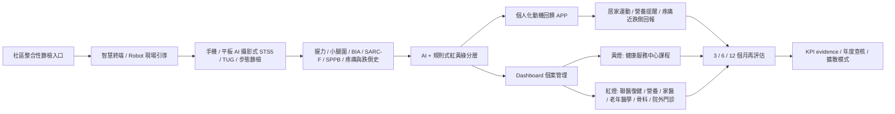

# 子計畫三完整內容分析與跨計畫連結圖

Status: synthesized from copied sources

## Recommendation

2026-06-19 update: use
`sources/deep-cultivation-integrated-v3-kevin-draft-2026-06-19-ai-agent.md`
as the latest integrated proposal-facing source for 子計畫三.

Keep `高齡者 AI 步態與肌少症風險篩檢暨閉環整合照護導流計畫` as the service-policy
source base, and treat the longer
`三年期高齡肌少症智慧篩檢、數位復健與陪伴機器人研究計畫書` as the research
methods and validation appendix.

Reason:

The first draft is closer to Health Taiwan deep-cultivation proposal logic:
community integrated screening, AI stratification, smart terminal / Robot
workflow support, APP follow-up, health-service-center course routing,
multidisciplinary Taipei City Hospital routing, KPI, governance, and a
service-ready NT$17.5M/year budget. The longer research plan is valuable, but
it reads more like a research grant, with heavier model validation,
intervention study, Call Center / green-channel detail, and a third-year
companion robot validation layer.

## Copied Source Set

| Source | Copied repo file | Strategic use |
| --- | --- | --- |
| 深耕計畫整合版 v3 | `sources/deep-cultivation-integrated-v3-kevin-draft-2026-06-19-ai-agent.md` | Latest integrated proposal-facing draft shared on 2026-06-19. Use for current title, budget, KPI, APP / Dashboard, smart terminal / Robot, cloud-platform governance, and procurement-neutral wording. |
| 高齡者 AI 步態與肌少症風險篩檢暨閉環整合照護導流計畫 | `sources/older-adult-ai-gait-sarcopenia-closed-loop-care-plan.md` | Main service-policy proposal body. Use for title, budget, KPI, closed-loop workflow, red/yellow/green routing, governance, and parent-proposal integration. |
| 三年期高齡肌少症智慧篩檢、數位復健與陪伴機器人研究計畫書 | `sources/sarcopenia-smart-screening-rehab-robot-research-plan.md` | Methods appendix. Use for STS5 AI validation, AWGS reference standard, COM-B intervention, sample sizes, model metrics, companion robot safety, and research outputs. |
| AI Robot and Agent 在醫療臨床的應用 | `sources/ai-robot-tch-2026-06-10-machine-readable.md` | Vendor / technology precedent. Use for Robot / smart terminal capability options, digital-labor framing, smart health pod, physiological data architecture, and workflow automation language. |

## One-Line Project Thesis

子計畫三建立一條可落地的高齡肌肉健康閉環服務線：社區整合性篩檢作為入口，手機/平板影像 AI 進行 STS5/TUG/步態與肌少症風險分層，智慧終端或 Robot 標準化現場引導與動機回饋，APP 與 Dashboard 支援居家追蹤和個管，健康服務中心與聯醫多專業團隊承接紅黃燈導流，最後以再評估、KPI 與資料治理形成可查核的智慧健康城市示範模式。

## Core Architecture



## What The Three Sources Contribute

### 1. 2026-06-19 Integrated v3 Draft

`deep-cultivation-integrated-v3-kevin-draft-2026-06-19-ai-agent.md` is the
latest consolidated proposal source.

Key contribution:

- Keeps the title `高齡者 AI 步態與肌少症風險篩檢暨閉環整合照護導流計畫`.
- Preserves the three-year NT$17.5M/year and NT$52.5M total budget signal.
- Integrates AI dynamic image screening, APP home tracking, case-management
  Dashboard, health-service-center course routing, multidisciplinary Taipei
  City Hospital routing, smart terminal / Robot scope, and cloud platform /
  data-governance language.
- Adds procurement-neutral wording for cloud platform, smart terminal, Robot,
  and equipment selection.
- Records APP / Dashboard and case-management workflow as part of the closed
  loop, with governance and access-control work still required before live
  deployment.

### 2. Service-Policy Draft

`older-adult-ai-gait-sarcopenia-closed-loop-care-plan.md` gives the strongest
proposal-facing structure.

Key contribution:

- Project title and identity.
- Three-year period from 116 to 118.
- Annual budget of NT$17,500,000 and three-year total NT$52,500,000.
- Core workflow:

```text
社區整篩 -> AI 分層 -> 智慧終端 / Robot 現場回饋 -> APP 居家追蹤 -> 健康服務中心課程 -> 聯醫多專業照護導流 -> 再評估
```

- Conservative KPI design: at least 28 screening events, at least 1,000
  screened participants over three years, at least 100 red/high-risk or
  abnormal cases entering case-management and multidisciplinary routing.
- Red/yellow/green routing:
  - green: APP maintenance and 6-12 month rescreening;
  - yellow: APP or alternative follow-up plus health-service-center nutrition,
    exercise, weight-management, fall-prevention, or older-adult health course;
  - red: Dashboard notification and 30-day routing to Taipei City Hospital
    rehabilitation, nutrition, family medicine / geriatrics, orthopedics,
    outpatient branch, or long-term-care resources.
- Governance posture: AI risk grading supports screening and routing, not
  diagnosis or treatment replacement.

### 3. Research / Validation Plan

`sarcopenia-smart-screening-rehab-robot-research-plan.md` gives the methods
depth needed for reviewers who ask whether the AI and intervention claims are
credible.

Key contribution:

- Annual budget of NT$18,000,000 and three-year total NT$54,000,000.
- Explicit three-year progression:
  - year 1: IRB, needs analysis, SOP, database, AI prototype, APP prototype;
  - year 2: external validation, APP validity, mobile screening scale-up,
    Call Center and green-channel integration;
  - year 3: COM-B intervention evaluation, companion robot deployment,
    long-term follow-up, publications, and mode diffusion.
- STS5 method:
  - phone/tablet camera;
  - pose estimation;
  - sit-stand event segmentation;
  - timing, trunk angle, hip/knee change, incomplete standing/sitting,
    hand assistance, imbalance, and fatigue trend.
- Clinical validation boundary:
  - STS5 does not replace BIA or grip strength for diagnosis;
  - it is a functional outcome, AI predictor, and repeatable tracking measure;
  - AWGS 2025-style low muscle mass plus low strength is the reference-standard
    framing.
- Research sample logic:
  - 200 AI training participants;
  - 50 independent validation participants;
  - 50-80 APP function-validation participants;
  - 100-120 high-risk intervention participants;
  - at least 60 companion-robot users.
- Model metrics:
  - AUC, sensitivity, specificity, PPV, NPV, Brier score, calibration,
    decision-curve logic, subgroup analysis, and drift monitoring.
- Robot safety design:
  - knowledge-base-limited answers;
  - no diagnosis, medication adjustment, or acute-care delay;
  - red-flag routing and expert audit.

### 4. AI Robot / Agent Deck

`ai-robot-tch-2026-06-10-machine-readable.md` supplies a technology and vendor
capability context.

Key contribution:

- Strong positioning phrase: AI robots as healthcare digital workforce, not only
  smart-hospital IT.
- ORber AI Robot operations system and ORber FMS fleet dispatch platform.
- iMRobot control center for heterogeneous robot / fleet management.
- AMR use cases in medical logistics, disinfection, specimen transport, ward
  support, long-term-care assistance, patient interaction, rehabilitation, and
  inventory support.
- Care-collaboration robot roadmap:
  - 2027 care-preparation stage: posture recognition, voice SOP, safety
    monitoring;
  - 2028 turning-care stage: human-robot collaboration, side-lying support, and
    transfer assistance.
- Smart health pod / physiological data architecture:
  - HIS;
  - cloud health management platform;
  - device management platform;
  - long-term-care institution;
  - smart health pod, all-in-one device, desktop device, and mobile measurement
    kit.

Proposal use:

The deck should support the feasibility of a smart terminal / Robot module and
future infrastructure pathway. It should not become the clinical evidence for
sarcopenia AI validity.

### 5. Cloud Collaboration And Case-Management App Signal

The 2026-06-19 LINE update clarifies that cloud collaboration platform wording
is a future function available after contract and governance activation with
聯醫. Other medical-center apps, including case-management apps, support the
proposal logic for APP / Dashboard / case-management workflow design.

Proposal use:

- Write the cloud platform as readiness, architecture, and procurement-governed
  activation.
- Keep platform naming neutral unless a source-backed Microsoft/Azure decision
  is confirmed.
- Use other medical-center app precedents as feasibility context, not as
  evidence that 子計畫三 has current production deployment.

## Recommended Proposal Structure

| Section | Recommended content | Source base |
| --- | --- | --- |
| Title / abstract | `高齡者 AI 步態與肌少症風險篩檢暨閉環整合照護導流計畫` | Integrated v3 + service-policy draft |
| Problem | One-time community screening lacks follow-up; sarcopenia, gait instability, fall risk, and musculoskeletal decline need continuous routing | Both plans |
| Service workflow | Screening -> AI stratification -> Robot / terminal feedback -> APP -> course / clinical routing -> reassessment | Integrated v3 + service-policy draft |
| Technical method | STS5/TUG video, pose estimation, BIA/grip/reference standard, model validation | Research plan |
| Behavior intervention | COM-B APP, motivation feedback, family/support, adherence | Research plan + service-policy draft |
| Robot scope | Start with smart terminal / Robot field guidance; keep companion robot as later validated layer | Integrated v3 + AI Robot deck + meeting analysis |
| Cloud / APP / Dashboard | Future contract-enabled cloud collaboration, APP tracking, and case-management Dashboard with access control and auditability | Integrated v3 + 2026-06-19 LINE update |
| KPI | Screening events, screened participants, high-risk routing, follow-up, APP/alternative tracking, satisfaction, data completeness, governance | Integrated v3 + service-policy draft |
| Budget | Use NT$17.5M/year as current LINE filename and service-policy draft signal; preserve NT$18M/year as alternate research-plan estimate | Both plans |
| Governance | IRB, consent, image privacy, AI not diagnosis, Robot safety, digital-divide fallback, security | Both plans |
| Parent connection | Shared Health Taiwan smart-healthcare and service-continuity logic with the current urology AI-only package and historical / parent-owned PSA follow-up context | This repo |

## Budget Reconciliation

There are two budget signals:

| Budget signal | Source | Interpretation |
| --- | --- | --- |
| NT$17,500,000 per year; NT$52,500,000 total | Service-policy draft and LINE filename | Current proposal-facing budget signal. Use this unless the owner confirms a different number. |
| NT$18,000,000 per year; NT$54,000,000 total | Research-plan draft | Expanded research estimate. Preserve as an alternate methods-heavy version. |

Recommendation:

Use NT$17.5M/year for the parent proposal table because it appears in the
expanded proposal title and is closer to the LINE attachment signal. Keep the
NT$18M/year plan as an internal costing reserve or research-version variant.

## Robot Scope Reconciliation

There are three Robot maturity levels across the sources:

| Level | Description | Recommended placement |
| --- | --- | --- |
| Simple smart terminal | Tablet/touchscreen/camera/speaker/mic/mobile stand for onsite guidance and feedback | Year 1 baseline; lowest-risk proposal deliverable. |
| Service Robot / AMR / smart health pod | Vendor-enabled robot, fleet, smart health pod, or field module from AI Robot deck | Optional procurement-dependent expansion; use as feasibility pathway. |
| Companion robot | Daily exercise reminder, education, conversation, safety prompts, and adherence support | Year 3 validation layer after knowledge-base and safety governance. |

Recommendation:

Write the formal proposal as:

```text
簡易互動式智慧終端 / Robot as the funded onsite workflow module,
with third-year companion robot validation after safety and knowledge-base governance.
```

This preserves innovation while keeping procurement and safety claims
reviewable.

## Strong Connections To Other Repo Lanes

### Connection To Urology AI-Only Package And Parent PSA Context

The two lanes should remain clinically separate but architecturally connected.

| Shared architecture | 子計畫三 sarcopenia lane | Current urology AI-only package / parent PSA context |
| --- | --- | --- |
| Screening as entrypoint | Community sarcopenia / gait / fall-risk screening | Urology previsit intake; PSA active screening only as parent-owned context |
| AI as workflow support | AI risk stratification and movement-quality measurement | AI previsit symptom collection and clinician-review summary |
| Follow-up backbone | Dashboard, APP, course routing, multidisciplinary routing | AI-only package stops at clinician-review summary; parent-owned follow-up can be linked only if assigned |
| Human ownership | Professional confirmation for red/yellow/green routing | Clinician-owned diagnosis, treatment, and follow-up decisions |
| KPI evidence | Screening, follow-up, APP/alternative tracking, red-case routing | Summary usefulness, source labels, missing-field visibility, governance; PSA/CRM KPI only if parent-owned |
| Governance | IRB, image privacy, model validation, Robot safety | Privacy, procurement, cybersecurity, data route, AI safety |

Practical connection:

The parent proposal can say the hospital is building a repeatable service
operating model:

```text
case finding -> AI-supported structured intake / measurement -> human-reviewed routing -> dashboard or parent-owned follow-up -> KPI evidence
```

The current urology package proves the AI 問診 / clinician-review summary layer.
Parent-owned PSA/CRM follow-up can remain contextual if proposal owners assign
it. 子計畫三 proves the same operating logic in high-age functional health and
sarcopenia prevention.

### Connection To 三高防治888 / 大公衛 Policy Frame

The 888 logic can connect to 子計畫三 as a public-health operating pattern:

| 888-style policy layer | 子計畫三 expression |
| --- | --- |
| 找得出 | Community integrated screening, STS5/TUG, grip, calf circumference, BIA, SARC-F, SPPB |
| 要介入 | Red/yellow/green routing, APP tasks, health-service-center courses, multidisciplinary referral |
| 有改善 | 3/6/12 month reassessment, function metrics, adherence, follow-up completion, KPI evidence |
| Digital tracking | APP, Dashboard, smart terminal / Robot, data governance |
| Program management | Health-service-center courses, Taipei City Hospital routing, annual reports |

This lets the parent proposal present urology AI-only intake support,
parent-owned PSA follow-up if assigned, and sarcopenia/Robot as coherent
public-health service-system upgrades.

### Connection To Health Taiwan Deep-Cultivation Categories

| Category | Fit |
| --- | --- |
| 範疇三：導入智慧科技醫療 | Primary fit: AI camera screening, APP, Dashboard, smart terminal / Robot, data platform, model governance. |
| 範疇一：優化醫療工作條件 | Secondary fit: smart terminal reduces repeated explanation, Dashboard supports case managers, AI measurement reduces manual scoring burden. |
| 範疇二：多元人才培育 | Optional fit: cross-disciplinary training across rehabilitation, nutrition, geriatrics, public health, AI, data governance, and robotics. |
| 範疇四：社會責任醫療永續 | Optional fit: community access, older-adult equity, health-service-center linkage, scalable city-level prevention. |

### Connection To Prior ESG / Carbon 子計畫三 Signal

Earlier 5/19 notes framed 子計畫三 as ESG / carbon accounting / new-site
management. The new LINE group and attachments give a different, stronger
clinical-service 子計畫三: AI gait, sarcopenia, digital rehabilitation, and Robot.

Recommended handling:

- Treat the Wu + Chiang lane as the active clinical-service 子計畫三 candidate.
- Keep ESG / carbon accounting as a possible parent-proposal support layer, not
  as the default content of this lane.
- Ask the parent proposal owner whether the old ESG 子計畫三 is replaced,
  downgraded, or moved to another category.

## Claim-Evidence Controls

Use confident but claim-gated language:

| Claim area | Supported wording | Avoid |
| --- | --- | --- |
| STS5 AI | `AI-supported sarcopenia risk screening and functional-tracking support` | `AI diagnoses sarcopenia` |
| Robot | `smart terminal / Robot supports onsite guidance, reminders, education, and engagement` | `Robot replaces staff or provides autonomous care` |
| Routing | `red/yellow/green routing supports professional follow-up and course/clinical navigation` | `automatic medical triage` |
| Outcomes | `follow-up, adherence, function metrics, and routing completion will be measured` | `will reduce falls` as a hard primary KPI before validation |
| Data | `governed image and health-data workflow with IRB, consent, de-identification, and access control` | broad unscoped patient-data platform claims |

## Immediate Next Decisions

2026-06-11 meeting update:

Use `meeting-analysis-2026-06-11.md` as the current post-meeting refinement.
The meeting keeps this analysis valid, but narrows Robot to onsite/community
support first, adds KPI throughput scenarios, and flags high-risk recruitment
as a model-validation requirement.

1. Confirm the formal title and whether the `v0.2` service-policy draft is the
   source of truth.
2. Confirm the budget: NT$17.5M/year or NT$18M/year.
3. Confirm whether this lane replaces the earlier ESG / carbon 子計畫三.
4. Confirm whether the Robot deliverable should be written as smart terminal,
   service Robot, companion robot, or phased combination.
5. Confirm whether APP / Dashboard / case-management components reuse only
   governance patterns, or connect to parent-owned PSA/CRM context without
   changing the current urology AI-only package.
6. Confirm data route: research IRB, QI/service improvement, city public-health
   service, or mixed.
7. Build a parent-proposal crosswalk table once the above are settled.
