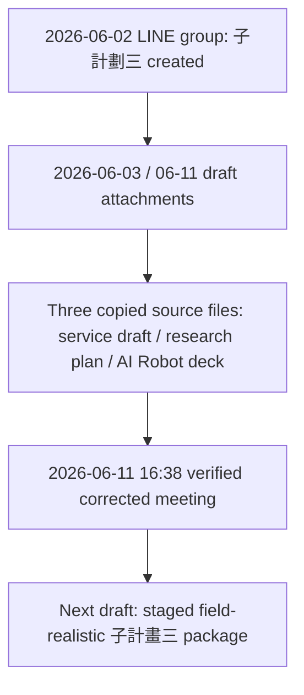
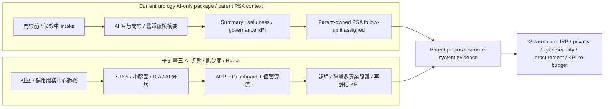

# 2026-06-11 子計畫三會議分析與文件連結

Status: synthesized from verified corrected meeting records

## Recommendation

The 2026-06-11 meeting turns 子計畫三 from a broad AI gait / sarcopenia /
Robot concept into a staged, owner-reviewable service system:

```text
Year 1 baseline:
health-service-center / community-site screening support
+ STS5 and calf-circumference-first simplification
+ smart terminal / Robot onsite guidance
+ APP / Dashboard follow-up
+ human case-management routing

Later validation:
home companion robot, larger intervention, and stronger longitudinal outcomes
after function, price, maintenance, data governance, and user-retrieval risk are clarified.
```

This meeting strengthens the prior recommendation: use the NT$17.5M/year
service-policy draft as the proposal-facing source, use the research-heavy
NT$18M/year plan as methods support, and revise the next version around
feasible field operations, staffing, Robot procurement, and KPI baselines.

2026-06-19 continuation: Kevin shared the v3 integrated draft and reported that
慧誠智醫 material had been added. The v3 draft should now be treated as the
latest integrated proposal source, while this meeting analysis remains the
scope-control layer for Robot staging, KPI scenarios, high-risk enrichment,
budget realism, and cloud/platform governance.

## Copied Meeting Sources

| Copied file | Original filename | Role |
| --- | --- | --- |
| `sources/meeting-transcript-2026-06-11-verified-corrected.md` | `transcript_260611_1638_深耕子計劃三_verified_corrected.md` | Verified corrected transcript, preserving time stamps and spoken sequence. |
| `sources/meeting-integrated-2026-06-11-verified-corrected-machine-readable.md` | `deep_cultivation_subproject3_verified_corrected_machine_readable.md` | Integrated evidence file with transcript, source manifest, external verification, correction table, decisions, action items, and appended source content. |

## Meeting Position

The meeting sits after the LINE group setup and after the three machine-readable
draft attachments:



## Meeting-Level Decisions

| Decision | Meaning for the next draft |
| --- | --- |
| Robot starts in health-service-center or community-center context | Write Robot first as onsite workflow support, demo-site capability, and standardized guidance. Avoid promising one robot per home participant. |
| Home companion robot remains a later phase | Keep home companion care as year-3 or second-stage validation after function, price, rental/return, repair, and maintenance are confirmed with 慧誠智醫. |
| KPI starts from per-event feasible throughput | Keep 30 people/event as a working scenario, but prepare lower scenarios such as 10 people/event and 10-15 events/year for 美如主任 review. |
| High-risk model validation needs enough positive cases | Community screening alone may under-sample true sarcopenia. Add nursing-home / long-term-care / high-risk recruitment path for high-risk cases. |
| Simplify home measurement | Do not lead with 5-meter walking at home. STS5 plus calf circumference is the cleaner baseline; TUG / gait can remain site-based or later. |
| APP and Dashboard are not optional decoration | The service loop needs frontend UI, app-store or deployment path, data return, server/cloud storage, reminders, and case-manager dashboard. |
| Budget needs rebalancing | Raise personnel and Robot integration room; lower IRB estimate, patent/motivation engine, training/consulting, and administrative contingency where appropriate. |
| Microsoft/Azure private cloud is a possible route, not automatic compliance | The proposal can evaluate Microsoft/Azure, but still needs project-level IRB, access control, de-identification, retention, audit, and risk assessment. |

## KPI Implications

The meeting clarifies that KPI quality depends on the first denominator:

```text
How many people can complete the workflow per event?
```

Recommended KPI scenario table for the next draft:

| Scenario | Per event | Events/year | Annual screened | Three-year screened | Use |
| --- | ---: | ---: | ---: | ---: | --- |
| Conservative | 10 | 10-15 | 100-150 | 300-450 | If health-service-center throughput is low or workflow is slow. |
| Working draft | 30 | 10-12 | 300-360 | 900-1,080 | Current proposal-facing middle path. |
| Expanded field capacity | 40-50 | 10-12 | 400-600 | 1,200-1,800 | Use only if 美如主任 or field evidence confirms feasibility. |

Downstream KPI should be ratios derived from the chosen denominator:

- APP or alternative follow-up enrollment.
- Red/yellow/green classification completion.
- Red-case case-manager contact.
- Health-service-center course routing.
- Taipei City Hospital multidisciplinary routing.
- 3/6/12 month follow-up completion.
- Core data field completeness.
- Smart terminal / Robot satisfaction.

## Model-Validation Implications

The meeting adds a critical model-design control:

```text
If the model needs high-risk vs low-risk classification, each class needs enough cases.
```

The meeting discussion suggested that at least about 100 cases per class is a
more stable target for high/low risk model development or validation. True
high-risk sarcopenia cases may be less common in ordinary community screening
because severely affected older adults may be less likely to attend. The next
draft should therefore add a high-risk enrichment route:

- long-term-care centers;
- nursing homes;
- day-care centers;
- rehabilitation or geriatric referral sources;
- prior fall / low mobility / frailty candidate lists, if governance allows.

This supports the claim-evidence boundary:

```text
STS5 AI supports screening and risk stratification after validation;
it does not diagnose sarcopenia by itself.
```

## Robot Scope After Meeting

The meeting separates Robot into three layers:

| Layer | Meeting interpretation | Proposal wording |
| --- | --- | --- |
| Onsite smart terminal / Robot | Feasible first; guides STS5, gives voice prompts, supports APP binding and feedback at health-service center or community center. | Year-1 / Year-2 baseline deliverable. |
| Demo-site companion experience | Can exist at health-service center as demonstration and engagement point. | Innovation and user-engagement layer, not home deployment promise. |
| Home companion robot | Higher cost and higher risk: purchase/rental, loss, damage, repair, return, scale, and support. | Year-3 or later validation after 慧誠 confirms function and price. |

Action connection:

- Ask 慧誠智醫 about actual ready functions and pricing.
- Reserve/coordinate 2026-06-22 16:30 discussion with 慧誠余總.

## Budget Implications

The meeting does not finalize budget, but it gives concrete revision direction.

| Budget area | Meeting signal | Draft action |
| --- | --- | --- |
| Personnel | Needs to be raised; case management, app/dashboard operation, data follow-up, field operation, and reporting require people. | Increase personnel line and justify with closed-loop follow-up workload. |
| Robot integration | Needs enough room for vendor integration, rental/procurement, maintenance, and demo-site setup. | Keep Robot line but define staged scope. |
| IRB | Initial NT$300k likely too high; meeting suggests around NT$50k. | Reduce direct IRB fee, keep broader governance work elsewhere if needed. |
| Patent / motivation feedback | NT$1M likely can be reduced to around NT$500k unless new IP work is explicit. | Reframe as rule/script/persona integration and optional extension. |
| Training / consulting / admin contingency | Can be trimmed to fund personnel. | Keep enough for field training and expert review; avoid inflated generic lines. |
| BIA / equipment | Needs specification: research-grade vs field-grade vs hospital-owned equipment. | Confirm with clinical team; do not overbuy before validation path is fixed. |

The prior NT$17.5M/year budget remains the better proposal-facing number unless
owners explicitly approve the NT$18M/year research variant.

## Data / Cloud / Governance Implications

The meeting mentions Microsoft/Azure private cloud as a possible institutional
route. The integrated source file also marks that Azure healthcare and ISO
evidence can support evaluation, but does not make the project automatically
compliant.

The 2026-06-19 LINE update further clarifies that cloud collaboration platform
functions are written as future capabilities after a contract with 聯醫. Other
medical-center case-management apps can support the feasibility argument for
APP / Dashboard / case-management workflow design, while 子計畫三 still needs its
own owner, access-control, data fields, audit logs, and KPI evidence.

Next draft should state:

- AI/image data, app data, dashboard data, and Robot interaction data require
  IRB/data-governance review.
- Private cloud selection still needs access control, audit logs,
  de-identification, retention period, backup, incident response, and vendor
  responsibility.
- Initial system should avoid direct live hospital-system integration unless a
  separate owner and security route are confirmed.
- Dashboard and case-management functions should be written as service workflow
  support, not unrestricted clinical data access.

## Strong Connections To Existing Files

| Existing file | Connection strengthened by the meeting |
| --- | --- |
| `full-content-analysis-and-connection-map.md` | Meeting confirms staged Robot scope, budget reconciliation, service-policy draft priority, and need for KPI denominator scenarios. |
| `sources/older-adult-ai-gait-sarcopenia-closed-loop-care-plan.md` | Meeting supports this as primary proposal frame, but asks to make KPI and budget more field-realistic. |
| `sources/sarcopenia-smart-screening-rehab-robot-research-plan.md` | Meeting supports the validation logic but pushes model case recruitment to include high-risk enrichment beyond community screening. |
| `sources/ai-robot-tch-2026-06-10-machine-readable.md` | Meeting turns the deck into an action item: verify 慧誠 Robot readiness, price, rental, maintenance, and deployment model. |
| `records/2026-06-11/wu-chiang-subproject-three-line-record.md` | Meeting validates the LINE signal that Robot is active, but narrows it to onsite/demo-first. |
| `records/2026-06-12/wu-yuelin-line-crm-888-record.md` | Both lanes share public-health service-continuity logic: identify, intervene, follow up, and report KPI evidence. |
| `records/2026-06-02/xinyi-integrated-psa-ai-crm-responsibility-record.md` | Both lanes use the same operating architecture: case finding, AI-supported intake/measurement, human-owned routing, dashboard/CRM follow-up, governance, KPI evidence. |

## Updated Cross-Lane Architecture



## Next Draft Checklist

Before producing the next subproject-three proposal draft:

1. Confirm with 美如主任 on 2026-06-23 whether 10, 30, or 40-50 participants per event is realistic.
2. Prepare KPI variants for low / middle / expanded throughput.
3. Ask 慧誠智醫 for Robot function readiness, price, rental, repair, return, and deployment model.
4. Decide whether Robot is written as smart terminal first and companion robot later.
5. Add high-risk enrichment recruitment for model validation.
6. Decide BIA / grip / chair / lighting / camera / fixed site standards before IRB.
7. Rebalance budget toward personnel, case management, Robot integration, and platform follow-up.
8. Define APP / server / Dashboard / cloud architecture without assuming direct hospital-system integration.
9. Preserve claim boundaries: AI supports screening and routing; human professionals own diagnosis, treatment, and clinical decisions.
10. Confirm whether the 2026-06-19 v3 integrated draft is now the source of truth for proposal-facing text.
11. Write 慧誠智醫 as smart terminal / Robot capability context unless formal implementation-partner terms are confirmed.
12. Keep Microsoft/cloud collaboration platform language contract-enabled and governance-controlled until hospital approval and procurement are defined.
